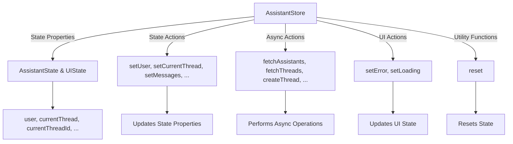

This file is a merged representation of the entire codebase, combined into a single document. The content has been processed where empty lines have been removed, content has been formatted for parsing, security check has been disabled.
Generated by Repomix on: 2025-02-20T08:40:54.542Z

# File Summary

## Purpose
This file contains a packed representation of the entire repository's contents.
It is designed to be easily consumable by AI systems for analysis, code review,
or other automated processes.

## File Format
The content is organized as follows:
1. This summary section
2. Repository information
3. Directory structure
4. Multiple file entries, each consisting of:
  a. A header with the file path (## File: path/to/file)
  b. The full contents of the file in a code block

## Usage Guidelines
- This file should be treated as read-only. Any changes should be made to the
  original repository files, not this packed version.
- When processing this file, use the file path to distinguish
  between different files in the repository.
- Be aware that this file may contain sensitive information. Handle it with
  the same level of security as you would the original repository.

## Notes
- Some files may have been excluded based on .gitignore rules and Repomix's configuration
- Binary files are not included in this packed representation. Please refer to the Repository Structure section for a complete list of file paths, including binary files
- Files matching patterns in .gitignore are excluded
- Files matching default ignore patterns are excluded
- Empty lines have been removed from all files
- Content has been formatted for parsing in markdown style
- Security check has been disabled - content may contain sensitive information

## Additional Info

# Directory Structure
```
app/
  (auth-pages)/
    forgot-password/
      page.tsx
    sign-in/
      page.tsx
    sign-up/
      page.tsx
  api/
    assistant/
      create/
        route.ts
      update/
        route.ts
    auth/
      callback/
        route.ts
      sign-out/
        route.ts
    file/
      create-vector-store/
        route.ts
      upload/
        route.ts
    function/
      eob/
        summary/
          route.ts
      new/
        route.ts
    thread/
      create/
        route.ts
      message/
        attachment/
          route.ts
        route.ts
      run/
        stream/
          route.ts
      route.ts
  protected/
    account/
      page.tsx
    assistants/
      page.tsx
    billing/
      page.tsx
    compliance/
      page.tsx
    documents/
      [id]/
        page.tsx
      page.tsx
    facilities/
      page.tsx
    reset-password/
      page.tsx
    AppLayout.tsx
    layout.tsx
    page.tsx
  actions.ts
  globals.css
  layout.tsx
  page.tsx
components/
  chat/
    Chat.tsx
    EnhancedSubmitButton.tsx
    index.ts
    MessageContent.tsx
    MessageList.tsx
    ThreadList.tsx
  profile/
    UserProfile.tsx
  typography/
    inline-code.tsx
  ui/
    alert.tsx
    badge.tsx
    breadcrumb.tsx
    button.tsx
    checkbox.tsx
    dropdown-menu.tsx
    input.tsx
    label.tsx
    link.tsx
    ReusableModal.tsx
    scroll-area.tsx
    select.tsx
    text.tsx
    textarea.tsx
  dropdown-menu.tsx
  file-upload.tsx
  form-message.tsx
  get-file-icon.tsx
  header-auth.tsx
  hero.tsx
  modal.tsx
  next-logo.tsx
  submit-button.tsx
  supabase-logo.tsx
  theme-switcher.tsx
  user-stats.tsx
lib/
  assistant/
    roster.ts
  chat/
    renderServices.tsx
    roster.ts
    services.ts
  streamingService.ts
  useStreaming.ts
  utils.ts
store/
  clientStore.ts
  documentStore.ts
types/
  api/
    openai/
      assistants.ts
      index.ts
      messages.ts
      runs.ts
      tools.ts
    routes.ts
  database/
    index.ts
  store/
    index.ts
    support.ts
  index.ts
utils/
  supabase/
    check-env-vars.ts
    client.ts
    middleware.ts
    server.ts
  openai.ts
  utils.ts
.env.example
.gitignore
.windsurfrules
assistantStore.md
chartChek - DevSpec.md
components.json
middleware.ts
next.config.ts
package.json
postcss.config.js
README.md
Stakeholders.md
tailwind.config.ts
tsconfig.json
```

# Files

## File: app/(auth-pages)/forgot-password/page.tsx
````typescript
import { forgotPasswordAction } from "@/app/actions";
import { FormMessage, Message } from "@/components/form-message";
import { SubmitButton } from "@/components/submit-button";
import { Input } from "@/components/ui/input";
import { Label } from "@/components/ui/label";
import Link from "next/link";
export default async function ForgotPassword(props: {
  searchParams: Promise<Message>;
}) {
  const searchParams = await props.searchParams;
  return (
    <>
      <form className="flex-1 flex flex-col w-full gap-2 text-foreground [&>input]:mb-6 min-w-64 max-w-64 mx-auto">
        <div>
          <h1 className="text-2xl font-medium">Reset Password</h1>
          <p className="text-sm text-secondary-foreground">
            Already have an account?{" "}
            <Link className="text-primary underline" href="/sign-in">
              Sign in
            </Link>
          </p>
        </div>
        <div className="flex flex-col gap-2 [&>input]:mb-3 mt-8">
          <Label htmlFor="email">Email</Label>
          <Input name="email" placeholder="you@example.com" required />
          <SubmitButton formAction={forgotPasswordAction}>
            Reset Password
          </SubmitButton>
          <FormMessage message={searchParams} />
        </div>
      </form>
    </>
  );
}
````

## File: app/(auth-pages)/sign-in/page.tsx
````typescript
import { signInAction } from "@/app/actions";
import { FormMessage, Message } from "@/components/form-message";
import { SubmitButton } from "@/components/submit-button";
import { Input } from "@/components/ui/input";
import { Label } from "@/components/ui/label";
import Link from "next/link";
export default async function SignInPage(props: { searchParams: Promise<Message> }) {
  const searchParams = await props.searchParams;
  return (
    <div className="flex min-h-full flex-1 flex-col justify-center py-12 sm:px-6 lg:px-8">
      <div className="sm:mx-auto sm:w-full sm:max-w-md">
        
        <h2 className="mt-6 text-center text-2xl/9 font-bold tracking-tight text-gray-900">
          Sign in to your account
        </h2>
      </div>
      <div className="mt-10 sm:mx-auto sm:w-full sm:max-w-[480px]">
        <div className="bg-white px-6 py-12 shadow-sm sm:rounded-lg sm:px-12">
          <form action="#" method="POST" className="space-y-6">
            <div>
              <Label htmlFor="email" className="block text-sm/6 font-medium text-gray-900">
                Email address
              </Label>
              <div className="mt-2">
                <Input
                  id="email"
                  name="email"
                  type="email"
                  required
                  autoComplete="email"
                  className="block w-full rounded-md bg-white px-3 py-1.5 text-base text-gray-900 outline-1 -outline-offset-1 outline-gray-300 placeholder:text-gray-400 focus:outline-2 focus:-outline-offset-2 focus:outline-gray-800 sm:text-sm/6"
                />
              </div>
            </div>
            <div>
              <Label htmlFor="password" className="block text-sm/6 font-medium text-gray-900">
                Password
              </Label>
              <div className="mt-2">
                <Input
                  id="password"
                  name="password"
                  type="password"
                  required
                  autoComplete="current-password"
                  className="block w-full rounded-md bg-white px-3 py-1.5 text-base text-gray-900 outline-1 -outline-offset-1 outline-gray-300 placeholder:text-gray-400 focus:outline-2 focus:-outline-offset-2 focus:outline-gray-800 sm:text-sm/6"
                />
              </div>
            </div>
            <div className="flex items-center justify-between">
              <div className="flex gap-3">
                <div className="flex h-6 shrink-0 items-center">
                  <div className="group grid size-4 grid-cols-1">
                    <input
                      id="remember-me"
                      name="remember-me"
                      type="checkbox"
                      className="col-start-1 row-start-1 appearance-none rounded-sm border border-gray-300 bg-white checked:border-gray-800 checked:bg-gray-800 indeterminate:border-gray-800 indeterminate:bg-gray-800 focus-visible:outline-2 focus-visible:outline-offset-2 focus-visible:outline-gray-800 disabled:border-gray-300 disabled:bg-gray-100 disabled:checked:bg-gray-100 forced-colors:appearance-auto"
                    />
                    <svg
                      fill="none"
                      viewBox="0 0 14 14"
                      className="pointer-events-none col-start-1 row-start-1 size-3.5 self-center justify-self-center stroke-white group-has-disabled:stroke-gray-950/25"
                    >
                      <path
                        d="M3 8L6 11L11 3.5"
                        strokeWidth={2}
                        strokeLinecap="round"
                        strokeLinejoin="round"
                        className="opacity-0 group-has-checked:opacity-100"
                      />
                      <path
                        d="M3 7H11"
                        strokeWidth={2}
                        strokeLinecap="round"
                        strokeLinejoin="round"
                        className="opacity-0 group-has-indeterminate:opacity-100"
                      />
                    </svg>
                  </div>
                </div>
                <Label htmlFor="remember-me" className="block text-sm/6 text-gray-900">
                  Remember me
                </Label>
              </div>
              <div className="text-sm/6">
                <Link href="/forgot-password" className="font-semibold text-gray-800 hover:text-indigo-500">
                  Forgot password?
                </Link>
              </div>
            </div>
            <div>
              <SubmitButton pendingText="Signing In..." formAction={signInAction} className="flex w-full justify-center rounded-md bg-gray-800 px-3 py-1.5 text-sm/6 font-semibold text-white shadow-xs hover:bg-indigo-500 focus-visible:outline-2 focus-visible:outline-offset-2 focus-visible:outline-gray-800">
                Sign in
              </SubmitButton>
            </div>
            <FormMessage message={searchParams} />
          </form>
          <div>
            <div className="relative mt-10">
              <div aria-hidden="true" className="absolute inset-0 flex items-center">
                <div className="w-full border-t border-gray-200" />
              </div>
              <div className="relative flex justify-center text-sm/6 font-medium">
                <span className="bg-white px-6 text-gray-900">Or continue with</span>
              </div>
            </div>
            <div className="mt-6 grid grid-cols-2 gap-4">
              <a
                href="#"
                className="flex w-full items-center justify-center gap-3 rounded-md bg-white px-3 py-2 text-sm font-semibold text-gray-900 ring-1 shadow-xs ring-gray-300 ring-inset hover:bg-gray-50 focus-visible:ring-transparent"
              >
                <svg viewBox="0 0 24 24" aria-hidden="true" className="h-5 w-5">
                  <path
                    d="M12.0003 4.75C13.7703 4.75 15.3553 5.36002 16.6053 6.54998L20.0303 3.125C17.9502 1.19 15.2353 0 12.0003 0C7.31028 0 3.25527 2.69 1.28027 6.60998L5.27028 9.70498C6.21525 6.86002 8.87028 4.75 12.0003 4.75Z"
                    fill="#EA4335"
                  />
                  <path
                    d="M23.49 12.275C23.49 11.49 23.415 10.73 23.3 10H12V14.51H18.47C18.18 15.99 17.34 17.25 16.08 18.1L19.945 21.1C22.2 19.01 23.49 15.92 23.49 12.275Z"
                    fill="#4285F4"
                  />
                  <path
                    d="M5.26498 14.2949C5.02498 13.5699 4.88501 12.7999 4.88501 11.9999C4.88501 11.1999 5.01998 10.4299 5.26498 9.7049L1.275 6.60986C0.46 8.22986 0 10.0599 0 11.9999C0 13.9399 0.46 15.7699 1.28 17.3899L5.26498 14.2949Z"
                    fill="#FBBC05"
                  />
                  <path
                    d="M12.0004 24.0001C15.2404 24.0001 17.9654 22.935 19.9454 21.095L16.0804 18.095C15.0054 18.82 13.6204 19.245 12.0004 19.245C8.8704 19.245 6.21537 17.135 5.2654 14.29L1.27539 17.385C3.25539 21.31 7.3104 24.0001 12.0004 24.0001Z"
                    fill="#34A853"
                  />
                </svg>
                <span className="text-sm/6 font-semibold">Google</span>
              </a>
              <a
                href="#"
                className="flex w-full items-center justify-center gap-3 rounded-md bg-white px-3 py-2 text-sm font-semibold text-gray-900 ring-1 shadow-xs ring-gray-300 ring-inset hover:bg-gray-50 focus-visible:ring-transparent"
              >
                <svg fill="currentColor" viewBox="0 0 20 20" aria-hidden="true" className="size-5 fill-[#24292F]">
                  <path
                    d="M10 0C4.477 0 0 4.484 0 10.017c0 4.425 2.865 8.18 6.839 9.504.5.092.682-.217.682-.483 0-.237-.008-.868-.013-1.703-2.782.605-3.369-1.343-3.369-1.343-.454-1.158-1.11-1.466-1.11-1.466-.908-.62.069-.608.069-.608 1.003.07 1.531 1.032 1.531 1.032.892 1.53 2.341 1.088 2.91.832.092-.647.35-1.088.636-1.338-2.22-.253-4.555-1.113-4.555-4.951 0-1.093.39-1.988 1.029-2.688-.103-.253-.446-1.272.098-2.65 0 0 .84-.27 2.75 1.026A9.564 9.564 0 0110 4.844c.85.004 1.705.115 2.504.337 1.909-1.296 2.747-1.027 2.747-1.027.546 1.379.203 2.398.1 2.651.64.7 1.028 1.595 1.028 2.688 0 3.848-2.339 4.695-4.566 4.942.359.31.678.921.678 1.856 0 1.338-.012 2.419-.012 2.747 0 .268.18.58.688.482A10.019 10.019 0 0020 10.017C20 4.484 15.522 0 10 0z"
                    clipRule="evenodd"
                    fillRule="evenodd"
                  />
                </svg>
                <span className="text-sm/6 font-semibold">GitHub</span>
              </a>
            </div>
          </div>
        </div>
        <p className="mt-10 text-center text-sm/6 text-gray-500">
          Not a member?{' '}
          <Link href="/sign-up" className="font-semibold text-gray-800 hover:text-indigo-500">
            Sign up
          </Link>
        </p>
      </div>
    </div>
  );
}
````

## File: app/(auth-pages)/sign-up/page.tsx
````typescript
import { signUpAction } from "@/app/actions";
import { FormMessage, Message } from "@/components/form-message";
import { SubmitButton } from "@/components/submit-button";
import { Input } from "@/components/ui/input";
import { Label } from "@/components/ui/label";
import Link from "next/link";
export default async function SignUpPage(props: { searchParams: Promise<Message> }) {
  const searchParams = await props.searchParams;
  if ("message" in searchParams) {
    return (
      <div className="w-full flex-1 flex items-center h-screen sm:max-w-md justify-center gap-2 p-4">
        <FormMessage message={searchParams} />
      </div>
    );
  }
  return (
    <div className="flex min-h-full flex-1 flex-col justify-center py-12 sm:px-6 lg:px-8">
      <div className="sm:mx-auto sm:w-full sm:max-w-md">
        
        <h2 className="mt-6 text-center text-2xl/9 font-bold tracking-tight text-gray-900">
          Create your account
        </h2>
      </div>
      <div className="mt-10 sm:mx-auto sm:w-full sm:max-w-[480px]">
        <div className="bg-white px-6 py-12 shadow-sm sm:rounded-lg sm:px-12">
          <form className="space-y-6">
            <div>
              <Label htmlFor="email" className="block text-sm/6 font-medium text-gray-900">
                Email address
              </Label>
              <div className="mt-2">
                <Input
                  id="email"
                  name="email"
                  type="email"
                  required
                  autoComplete="email"
                  className="block w-full rounded-md bg-white px-3 py-1.5 text-base text-gray-900 outline-1 -outline-offset-1 outline-gray-300 placeholder:text-gray-400 focus:outline-2 focus:-outline-offset-2 focus:outline-gray-800 sm:text-sm/6"
                />
              </div>
            </div>
            <div>
              <Label htmlFor="password" className="block text-sm/6 font-medium text-gray-900">
                Password
              </Label>
              <div className="mt-2">
                <Input
                  id="password"
                  name="password"
                  type="password"
                  required
                  autoComplete="new-password"
                  className="block w-full rounded-md bg-white px-3 py-1.5 text-base text-gray-900 outline-1 -outline-offset-1 outline-gray-300 placeholder:text-gray-400 focus:outline-2 focus:-outline-offset-2 focus:outline-gray-800 sm:text-sm/6"
                />
              </div>
            </div>
            <div>
              <SubmitButton formAction={signUpAction} pendingText="Signing up..." className="flex w-full justify-center rounded-md bg-gray-800 px-3 py-1.5 text-sm/6 font-semibold text-white shadow-xs hover:bg-indigo-500 focus-visible:outline-2 focus-visible:outline-offset-2 focus-visible:outline-gray-800">
                Sign up
              </SubmitButton>
            </div>
            <FormMessage message={searchParams} />
          </form>
          <p className="mt-10 text-center text-sm/6 text-gray-500">
            Already have an account?{' '}
            <Link href="/sign-in" className="font-semibold text-gray-800 hover:text-indigo-500">
              Sign in
            </Link>
          </p>
        </div>
      </div>
    </div>
  );
}
````

## File: app/api/assistant/create/route.ts
````typescript
import { NextRequest } from 'next/server'
import { createServer } from '@/utils/supabase/server'
import { openai as awaitOpenai } from '@/utils/openai'
import type { AssistantCreateRequest, AssistantCreateResponse, ApiResponse } from '@/types/api/routes'
import type { UserAssistant } from '@/types/database'
import type { Assistant } from '@/types/api/openai'
export async function POST(request: NextRequest): Promise<Response> {
  try {
    const supabase = await createServer()
    const openai = await awaitOpenai()
    // Verify user is authenticated
    const { data: { user }, error: authError } = await supabase.auth.getUser()
    if (authError || !user) {
      return new Response(JSON.stringify({ error: 'Unauthorized', code: 'AUTH_REQUIRED' }), {
        status: 401,
        headers: { 'Content-Type': 'application/json' }
      })
    }
    const formData = await request.formData()
    const requestData: AssistantCreateRequest = {
      name: formData.get('name') as string,
      instructions: formData.get('instructions') as string,
      tools: JSON.parse(formData.get('tools') as string),
      model: formData.get('model') as string,
      description: formData.get('description') as string || undefined,
      metadata: formData.get('metadata') ? JSON.parse(formData.get('metadata') as string) : undefined,
      tool_resources: formData.get('tool_resources') ? JSON.parse(formData.get('file_ids') as string) : undefined
    }
    // Validate required fields
    if (!requestData.name || !requestData.instructions || !requestData.tools || !requestData.model) {
      return new Response(JSON.stringify({ 
        error: 'Missing required fields', 
        code: 'INVALID_REQUEST' 
      }), {
        status: 400,
        headers: { 'Content-Type': 'application/json' }
      })
    }
    // Check if assistant already exists for this user
    const { data: existingAssistant, error: queryError } = await supabase
      .from('user_assistants')
      .select('*')
      .eq('user_id', user.id)
      .eq('name', requestData.name)
      .eq('is_active', true)
      .single()
    if (queryError && queryError.code !== 'PGRST116') { // PGRST116 is "not found" error
      throw queryError
    }
    if (existingAssistant) {
      const assistant = await openai.beta.assistants.retrieve(existingAssistant.assistant_id)
      const response: ApiResponse<AssistantCreateResponse> = {
        assistant: {
          id: assistant.id,
          object: 'assistant',
          name: assistant.name,
          description: assistant.description,
          model: assistant.model,
          instructions: assistant.instructions,
          tools: assistant.tools,
          vector_store_id: assistant.tool_resources?.file_search?.vector_store_ids,
          metadata: assistant.metadata
        } as Assistant,
        userAssistant: existingAssistant as UserAssistant
      }
      return new Response(JSON.stringify(response), {
        status: 200,
        headers: { 'Content-Type': 'application/json' }
      })
    }
    // Create new assistant
    const assistant = await openai.beta.assistants.create({
      name: requestData.name,
      instructions: requestData.instructions,
      model: requestData.model,
      description: requestData.description,
      metadata: requestData.metadata,
    })
    // Store assistant in database
    const userAssistant: Omit<UserAssistant, 'id' | 'created_at' | 'updated_at'> = {
      user_id: user.id,
      assistant_id: assistant.id,
      name: assistant.name || requestData.name,
      description: assistant.description || requestData.description,
      instructions: assistant.instructions || requestData.instructions,
      model: assistant.model,
      metadata: assistant.metadata || requestData.metadata,
      is_active: true
    }
    const { data: insertedAssistant, error: insertError } = await supabase
      .from('user_assistants')
      .insert(userAssistant)
      .select()
      .single()
    if (insertError) {
      // Clean up OpenAI assistant if database insert fails
      await openai.beta.assistants.del(assistant.id)
      throw insertError
    }
    const response: ApiResponse<AssistantCreateResponse> = {
      assistant: {
        id: assistant.id,
        object: 'assistant',
        name: assistant.name,
        description: assistant.description,
        model: assistant.model,
        instructions: assistant.instructions,
        tools: assistant.tools,
        vector_store_id: assistant.tool_resources?.file_search?.vector_store_ids,
        metadata: assistant.metadata
      } as Assistant,
      userAssistant: insertedAssistant as UserAssistant
    }
    return new Response(JSON.stringify(response), {
      status: 200,
      headers: { 'Content-Type': 'application/json' }
    })
  } catch (error) {
    console.error('[/api/assistant/create] Error:', error)
    return new Response(JSON.stringify({ 
      error: error instanceof Error ? error.message : 'Failed to create assistant',
      code: 'INTERNAL_ERROR',
      status: 500
    }), {
      status: 500,
      headers: { 'Content-Type': 'application/json' }
    })
  }
}
````

## File: app/api/assistant/update/route.ts
````typescript
import { NextRequest } from 'next/server'
import { createServer } from '@/utils/supabase/server'
import { openai as awaitOpenai } from '@/utils/openai'
import type { AssistantUpdateRequest, AssistantUpdateResponse, ApiResponse } from '@/types/api/routes'
import type { UserAssistant } from '@/types/database'
import { Tool } from '@/types/api/openai'
export async function POST(request: NextRequest): Promise<Response> {
  try {
    const supabase = await createServer()
    const openai = await awaitOpenai()
    // Verify user is authenticated
    const { data: { user }, error: authError } = await supabase.auth.getUser()
    if (authError || !user) {
      return new Response(JSON.stringify({ error: 'Unauthorized', code: 'AUTH_REQUIRED' }), {
        status: 401,
        headers: { 'Content-Type': 'application/json' }
      })
    }
    const formData = await request.formData()
    const requestData: AssistantUpdateRequest = {
      assistant_id: formData.get('assistant_id') as string,
      tool_resources: formData.get('tool_resources') ? JSON.parse(formData.get('tool_resources') as string) : undefined,
      tools: formData.get('tools') ? JSON.parse(formData.get('tools') as string) : undefined,
      name: formData.get('name') as string || undefined,
      description: formData.get('description') as string || undefined,
      instructions: formData.get('instructions') as string || undefined,
      model: formData.get('model') as string || undefined,
      metadata: formData.get('metadata') ? JSON.parse(formData.get('metadata') as string) : undefined,
      is_active: formData.get('is_active') ? formData.get('is_active') === 'true' : undefined
    }
    if (!requestData.assistant_id) {
      return new Response(JSON.stringify({ 
        error: 'Missing required field: assistant_id', 
        code: 'INVALID_REQUEST' 
      }), {
        status: 400,
        headers: { 'Content-Type': 'application/json' }
      })
    }
    // Verify user owns this assistant
    const { data: existingAssistant, error: queryError } = await supabase
      .from('user_assistants')
      .select('*')
      .eq('user_id', user.id)
      .eq('assistant_id', requestData.assistant_id)
      .single()
    if (queryError || !existingAssistant) {
      return new Response(JSON.stringify({ 
        error: 'Assistant not found or unauthorized', 
        code: 'NOT_FOUND' 
      }), {
        status: 404,
        headers: { 'Content-Type': 'application/json' }
      })
    }
    // Update OpenAI assistant
    const updateData: any = {}
    if (requestData.name) updateData.name = requestData.name
    if (requestData.description) updateData.description = requestData.description
    if (requestData.instructions) updateData.instructions = requestData.instructions
    if (requestData.tools) updateData.tools = requestData.tools
    if (requestData.model) updateData.model = requestData.model
    if (requestData.metadata) updateData.metadata = requestData.metadata
    if (requestData.tool_resources) {
      updateData.file_ids = existingAssistant.file_ids
      const retrievalTool: Tool = {
        type: "file_search"
      }
      updateData.tools = [
        ...(existingAssistant.tools || []).filter((t: Tool) => t.type !== 'file_search'),
        retrievalTool
      ]
      updateData.tool_resources = {
        file_search: {
          vector_store_ids: [requestData.tool_resources[0].file_search.vector_store_ids[0]]
        }
      }
    }
    const assistant = await openai.beta.assistants.update(
      requestData.assistant_id,
      updateData
    )
    // Update database record
    const userAssistantUpdate: Partial<UserAssistant> = {
      ...updateData,
      updated_at: new Date().toISOString()
    }
    if (requestData.is_active !== undefined) {
      userAssistantUpdate.is_active = requestData.is_active
    }
    const { data: updatedAssistant, error: updateError } = await supabase
      .from('user_assistants')
      .update(userAssistantUpdate)
      .eq('assistant_id', requestData.assistant_id)
      .select()
      .single()
    if (updateError) {
      throw updateError
    }
    const response: ApiResponse<AssistantUpdateResponse> = {
      success: true,
      assistant: updatedAssistant
    }
    return new Response(JSON.stringify(response), {
      status: 200,
      headers: { 'Content-Type': 'application/json' }
    })
  } catch (error: any) {
    console.error('[/api/assistant/update] Error:', error)
    return new Response(JSON.stringify({ 
      error: error.message || 'Internal server error',
      code: error.code || 'UNKNOWN_ERROR'
    }), {
      status: error.status || 500,
      headers: { 'Content-Type': 'application/json' }
    })
  }
}
````

## File: app/api/auth/callback/route.ts
````typescript
import { createServer } from "@/utils/supabase/server";
import { NextResponse } from "next/server";
export async function GET(request: Request) {
  // The `/auth/callback` route is required for the server-side auth flow implemented
  // by the SSR package. It exchanges an auth code for the user's session.
  // https://supabase.com/docs/guides/auth/server-side/nextjs
  const requestUrl = new URL(request.url);
  const code = requestUrl.searchParams.get("code");
  const origin = requestUrl.origin;
  const redirectTo = requestUrl.searchParams.get("redirect_to")?.toString();
  if (code) {
    const supabase = await createServer();
    await supabase.auth.exchangeCodeForSession(code);
  }
  if (redirectTo) {
    return NextResponse.redirect(`${origin}${redirectTo}`);
  }
  // URL to redirect to after sign up process completes
  return NextResponse.redirect(`${origin}/protected`);
}
````

## File: app/api/auth/sign-out/route.ts
````typescript
import { createServer } from "@/utils/supabase/server";
import { NextResponse } from "next/server";
export async function POST() {
  const supabase = await createServer();
  await supabase.auth.signOut();
  return NextResponse.json({ message: "Signed out successfully" }, { status: 200 });
}
````

## File: app/api/file/create-vector-store/route.ts
````typescript
import { openai as awaitOpenai } from '@/utils/openai';
import { createServer } from '@/utils/supabase/server';
export async function POST(req: Request) {
  const supabase = await createServer();
  const openai = await awaitOpenai();
  const { fileId } = await req.json();
  try {
    const vectorStore = await openai.beta.vectorStores.create({
      file_ids: [fileId],
    });
    const vectorLogged = await supabase
      .from('documents')
      .upsert({
        vector_store_id: vectorStore.id,
      })
      .eq('file_id', fileId)
      .single();
    console.log('[FileCreateVectorStore] Vector store logged in supabase:', vectorLogged)
    return new Response(JSON.stringify(vectorStore), {
      status: 200,
      headers: { 'Content-Type': 'application/json' },
    });
  } catch (error) {
    console.error(error);
    return new Response(JSON.stringify(error), {
      status: 500,
      headers: { 'Content-Type': 'application/json' },
    });
  }
}
````

## File: app/api/file/upload/route.ts
````typescript
import { openai as awaitOpenai } from "@/utils/openai";
import { createServer } from "@/utils/supabase/server";
export async function POST(req: Request) {
    const openai = await awaitOpenai();
    try {
        console.log('[FileUpload] Starting file upload process')
        const supabase = await createServer();
        const user = await supabase.auth.getUser();
        if (!user) {
            console.log('[FileUpload] Unauthorized: No user found')
            return new Response("Unauthorized", { status: 401 })
        }
        console.log('[FileUpload] User authenticated:', user.data.user?.id)
        const formData = await req.formData();
        const files = formData.getAll('files') as File[];
        const threadId = formData.get('thread_id') as string;
        // here we must iterate through file.type for each File[] and store for the supabase update
        if (files.length === 0) {
            console.log('[FileUpload] Error: No files provided in form data')
            return new Response("No files provided", { status: 400 });
        }
        console.log('[FileUpload] Files received:', files.map(file => ({ name: file.name, size: file.size, type: file.type })))
        // Upload files to OpenAI and collect file IDs
        console.log('[FileUpload] Uploading files to OpenAI...')
        const fileIds: string[] = [];
        for (const file of files) {
            const fileUpload = await openai.files.create({
                file: file,
                purpose: "assistants",
            });
            fileIds.push(fileUpload.id);
        }
        // Handle single file upload
        if (fileIds.length === 1) {
            return new Response(JSON.stringify({
                file_id: fileIds[0],
                vector_store_id: "vs_single_file_id_placeholder"
            }), { status: 200 });
        }
        // Create a file batch
        const timestamp = new Date().toISOString();
        const myVectorStoreFileBatch = await openai.beta.vectorStores.fileBatches.create(
            `${user.data.user?.id}-${threadId}-${timestamp}`,
            {
                file_ids: fileIds
            }
        );
        console.log(myVectorStoreFileBatch);
        const { data, error } = await supabase
            .from('documents')
            .insert(files.map((file, index) => ({
                user_id: user.data.user?.id,
                filename: file.name,
                file_id: fileIds[index],
                file_type: file.type,
                thread_id: threadId
            })));
        if (error) {
            console.error('[FileUpload] Supabase insert error:', error)
            throw error;
        }
        return new Response(JSON.stringify({
            file_ids: fileIds,
            vector_store_batch_id: myVectorStoreFileBatch.id,
        }), { status: 200 });
    } catch (error) {
        console.error('[FileUpload] Error:', error);
        return new Response("Internal Server Error", { status: 500 });
    }
}
````

## File: app/api/function/eob/summary/route.ts
````typescript
import { createServer } from "@/utils/supabase/server";
import { NextResponse } from "next/server";
export async function POST(request: Request) {
const supabase = await createServer();
    try {
      // Parse the incoming JSON data
      const body = await request.json();
      // Optionally, validate that the required fields are set. (A more robust validation can be implemented.)
      const requiredFields = [
        'patient_name',
        'policy_number',
        'auth_days_requested',
        'auth_days_approved',
        'amount_billed',
        'amount_awarded',
        'time_period'
      ];
      const missingFields = requiredFields.filter(field => body[field] === undefined);
      if (missingFields.length > 0) {
        return NextResponse.json(
          { error: `Missing required fields: ${missingFields.join(', ')}` },
          { status: 400 }
        );
      }
      // Insert the data into the Supabase table.
      const { data, error } = await supabase
        .from('summarize_eob_payouts')
        .insert([
          {
            patient_name: body.patient_name,
            policy_number: body.policy_number,
            auth_days_requested: body.auth_days_requested,
            auth_days_approved: body.auth_days_approved,
            amount_billed: body.amount_billed,
            amount_awarded: body.amount_awarded,
            time_period: body.time_period
          }
        ]);
      // Handle possible insertion errors
      if (error) {
        return NextResponse.json({ error: error.message }, { status: 500 });
      }
      return NextResponse.json({ message: 'Data inserted successfully', data }, { status: 200 });
    } catch (err: any) {
      return NextResponse.json({ error: err.message || 'Unexpected error occurred' }, { status: 500 });
    }
  }
````

## File: app/api/function/new/route.ts
````typescript
import { NextRequest } from 'next/server';
import { createServer } from "@/utils/supabase/server";
import { openai as awaitOpenai } from '@/utils/openai';
import type { ApiResponse } from '@/types/api/routes';
export async function POST(req: NextRequest): Promise<Response> {
  const openai = await awaitOpenai();
  try {
    const supabase = await createServer();
    const { data: { user }, error: authError } = await supabase.auth.getUser();
    if (authError || !user) {
      return new Response(JSON.stringify({ 
        error: 'Unauthorized',
        code: 'AUTH_REQUIRED'
      }), { 
        status: 401, 
        headers: { 'Content-Type': 'application/json' } 
      });
    }
    const { Function, Type, Components, Agency, Additional } = await req.json();
    const { data, error } = await supabase
      .from('store_new_function')
      .insert({
        function_name: Function,
        type: Type,
        components: Components,
        agency: Agency,
        additional: Additional
      });
    if (error) {
      console.error('Insert error:', error);
      return new Response(JSON.stringify({ 
        message: 'Error storing new function', 
        error: error.message 
      }), { status: 500, headers: { 'Content-Type': 'application/json' } });
    }
    return new Response(JSON.stringify({ message: 'New function stored successfully', data }), { 
      status: 200, 
      headers: { 'Content-Type': 'application/json' } 
    });
  } catch (err) {
    console.error('Unexpected error:', err);
    return new Response(JSON.stringify({ 
      error: err instanceof Error ? err.message : 'Unexpected server error',
      code: 'INTERNAL_ERROR'
    }), {
      status: 500,
      headers: { 'Content-Type': 'application/json' }
    });
  }
}
````

## File: app/api/thread/create/route.ts
````typescript
import { NextRequest } from 'next/server'
import { createServer } from '@/utils/supabase/server'
import { openai as awaitOpenAi } from '@/utils/openai'
import type { ThreadCreateRequest, ThreadCreateResponse, ApiResponse } from '@/types/api/routes'
import type { ChatThread, ChatMessage } from '@/types/database'
export async function POST(request: NextRequest): Promise<Response> {
  const openai = await awaitOpenAi();
  try {
    const supabase = await createServer()
    // Verify user is authenticated
    const { data: { user }, error: authError } = await supabase.auth.getUser()
    if (authError || !user) {
      return new Response(JSON.stringify({ 
        error: 'Unauthorized',
        code: 'AUTH_REQUIRED'
      }), {
        status: 401,
        headers: { 'Content-Type': 'application/json' }
      })
    }
    const json = await request.json();
    const requestData: ThreadCreateRequest = {
      user_id: user.id,
      assistant_id: json.assistantId,
      title: json.title,
      metadata: json.metadata,
      initial_message: json.initial_message
    };
    // Debugging: Log the openai instance to inspect its structure
    // Create thread with OpenAI
    const thread = await openai.beta.threads.create(requestData.initial_message ? {
      messages: [{
        role: "user",
        content: requestData.initial_message
      }]
    } : undefined)
    console.log('[API] Created thread:', thread.id)
    const threadId = thread.id
    if (!requestData.initial_message) {
    return new Response(JSON.stringify({ thread_id: threadId}))
    }
    // Store thread in database
    const chatThread: Omit<ChatThread, 'id' | 'created_at' | 'updated_at'> = {
      user_id: user.id,
      thread_id: thread.id,
      assistant_id: requestData.assistant_id,
      title: requestData.title || 'New Chat',
      last_message_at: new Date().toISOString(),
      is_active: true,
      metadata: requestData.metadata
    }
    const { data: insertedThread, error: threadError } = await supabase
      .from('chat_threads')
      .insert(chatThread)
      .select()
      .single()
    if (threadError) {
      // Clean up OpenAI thread if database insert fails
      await openai.beta.threads.del(thread.id)
      throw threadError
    }
    let initialMessage: ChatMessage | undefined
    if (requestData.initial_message) {
      // Store initial message in database
      const { data: message, error: messageError } = await supabase
        .from('chat_messages')
        .insert({
          user_id: user.id,
          thread_id: thread.id,
          role: 'user',
          content: requestData.initial_message,
          metadata: requestData.metadata
        })
        .select()
        .single()
      if (messageError) {
        throw messageError
      }
      initialMessage = message as ChatMessage
    }
    const response: ApiResponse<ThreadCreateResponse> = {
      thread: insertedThread as ChatThread,
      message: initialMessage
    }
    return new Response(JSON.stringify(response), {
      status: 200,
      headers: { 'Content-Type': 'application/json' }
    })
  } catch (error) {
    console.error('[/api/thread/create] Error:', error)
    return new Response(JSON.stringify({ 
      error: error instanceof Error ? error.message : 'Failed to create thread',
      code: 'INTERNAL_ERROR'
    }), {
      status: 500,
      headers: { 'Content-Type': 'application/json' }
    })
  }
}
````

## File: app/api/thread/message/attachment/route.ts
````typescript
import { NextRequest } from 'next/server'
import { createServer } from "@/utils/supabase/server"
import { openai as awaitOpenai  } from '@/utils/openai'
import type { ThreadMessageAttachmentRequest, ThreadMessageAttachmentResponse, ApiResponse } from '@/types/api/routes'
import type { Document } from '@/types/database'
const ALLOWED_FILE_TYPES = [
  'text/plain',
  'text/markdown',
  'text/csv',
  'application/pdf',
  'application/json',
  'application/msword',
  'application/vnd.openxmlformats-officedocument.wordprocessingml.document'
]
const MAX_FILE_SIZE = 512 * 1024 * 1024 // 512MB
export async function POST(request: NextRequest): Promise<Response> {
  try {
    const openai = await awaitOpenai();
    const supabase = await createServer()
    // Authenticate user
    const { data: { user }, error: authError } = await supabase.auth.getUser()
    if (authError || !user) {
      return new Response(JSON.stringify({
        error: 'Unauthorized',
        code: 'AUTH_REQUIRED'
      }), {
        status: 401,
        headers: { 'Content-Type': 'application/json' }
      })
    }
    const formData = await request.formData()
    const file = formData.get('file') as File
    const requestData: ThreadMessageAttachmentRequest = {
      thread_id: formData.get('thread_id') as string,
      message_id: formData.get('message_id') as string,
      file_id: formData.get('file_id') as string
    }
    // Validate required fields
    if (!requestData.thread_id || !requestData.message_id || !file) {
      return new Response(JSON.stringify({
        error: 'Missing required fields',
        code: 'INVALID_REQUEST'
      }), {
        status: 400,
        headers: { 'Content-Type': 'application/json' }
      })
    }
    // Validate file type
    if (!ALLOWED_FILE_TYPES.includes(file.type)) {
      return new Response(JSON.stringify({
        error: 'Invalid file type. Allowed types: ' + ALLOWED_FILE_TYPES.join(', '),
        code: 'INVALID_FILE_TYPE'
      }), {
        status: 400,
        headers: { 'Content-Type': 'application/json' }
      })
    }
    // Validate file size
    if (file.size > MAX_FILE_SIZE) {
      return new Response(JSON.stringify({
        error: `File too large. Maximum size: ${MAX_FILE_SIZE / (1024 * 1024)}MB`,
        code: 'FILE_TOO_LARGE'
      }), {
        status: 400,
        headers: { 'Content-Type': 'application/json' }
      })
    }
    // Verify user owns this thread
    const { data: thread, error: threadError } = await supabase
      .from('chat_threads')
      .select('*')
      .eq('user_id', user.id)
      .eq('thread_id', requestData.thread_id)
      .single()
    if (threadError || !thread) {
      return new Response(JSON.stringify({
        error: 'Thread not found or unauthorized',
        code: 'NOT_FOUND'
      }), {
        status: 404,
        headers: { 'Content-Type': 'application/json' }
      })
    }
    // Upload file to OpenAI
    const openAIFile = await openai.files.create({
      file,
      purpose: 'assistants'
    })
    // Store file in database
    const { data: document, error: dbError } = await supabase
      .from('documents')
      .insert({
        user_id: user.id,
        thread_id: requestData.thread_id,
        message_id: requestData.message_id,
        file_id: openAIFile.id,
        purpose: 'assistants',
        name: file.name,
        type: file.type,
        size: file.size,
        metadata: {
          original_name: file.name,
          content_type: file.type
        }
      })
      .select()
      .single()
    if (dbError) {
      // Clean up OpenAI file if database insert fails
      await openai.files.del(openAIFile.id)
      throw dbError
    }
    // Create a new message with the file content
    const newMessage = await openai.beta.threads.messages.create(
      requestData.thread_id,
      {
        role: "user",
        content: `[File Attached: ${file.name}]`,
        attachments: [{ file_id: openAIFile.id }]
      }
    )
    // Store the new message in database
    const { error: messageError } = await supabase
      .from('chat_messages')
      .insert({
        user_id: user.id,
        thread_id: requestData.thread_id,
        message_id: newMessage.id,
        role: 'user',
        content: `[File Attached: ${file.name}]`,
        attachments: [openAIFile.id]
      })
    if (messageError) {
      console.error('[API] Failed to store message:', messageError)
    }
    const response: ApiResponse<ThreadMessageAttachmentResponse> = {
      success: true,
      document: document as Document
    }
    return new Response(JSON.stringify(response), {
      status: 200,
      headers: { 'Content-Type': 'application/json' }
    })
  } catch (error) {
    console.error("[API] Error adding attachment to message:", error)
    return new Response(JSON.stringify({
      error: error instanceof Error ? error.message : "Unknown error",
      code: 'INTERNAL_ERROR'
    }), {
      status: 500,
      headers: { 'Content-Type': 'application/json' }
    })
  }
}
````

## File: app/api/thread/message/route.ts
````typescript
import { NextRequest } from 'next/server'
import { createServer } from "@/utils/supabase/server"
import { openai as awaitOpenai } from '@/utils/openai'
import type { ThreadMessageRequest, ThreadMessageResponse, ApiResponse } from '@/types/api/routes'
import type { FileAttachment, MessageFileAttachment } from '@/types/api/openai/tools'
import type { MessageRole } from '@/types/api/openai/messages'
import type { ChatMessage } from '@/types/database'
export async function POST(request: NextRequest): Promise<Response> {
  console.log('[/thread/message/route] POST request received');
  const openai = await awaitOpenai();
  try {
    const supabase = await createServer()
    const { data: { user }, error: authError } = await supabase.auth.getUser()
    if (authError || !user) {
      console.error('[/thread/message/route] Error:', authError || 'Unauthorized access');
      return new Response(JSON.stringify({ error: 'Unauthorized', code: 'AUTH_REQUIRED' }), {
        status: 401,
        headers: { 'Content-Type': 'application/json' }
      })
    }
    const formData = await request.formData()
    const fileQueue = formData.get('file_queue');
    const attachments = fileQueue && (fileQueue as string).trim() !== '' ? (fileQueue as string).split(',').map(fileId => ({
      file_id: fileId,
    })) : undefined;
    const threadId = formData.get('thread_id') as string;
    const role = formData.get('role') as MessageRole;
    const content = formData.get('content') as string;
    const annotations = formData.get('annotations') as string;
    console.log('[API] Form data extracted:', { threadId, role, content, annotations });
    const requestData = {
      user_id: user.id,
      thread_id: threadId,
      role: role,
      content: content,
      attachments: attachments,
      annotations: annotations
    }
    if (!requestData.thread_id) {
      console.error('[API] Missing required field: thread_id');
      return new Response(JSON.stringify({
        error: 'Missing required field: thread_id',
        code: 'INVALID_REQUEST'
      }), {
        status: 400,
        headers: { 'Content-Type': 'application/json' }
      })
    }
    // Add message to OpenAI thread
    const threadMessage = await openai.beta.threads.messages.create(
      requestData.thread_id,
      {
        role: requestData.role === 'assistant' ? 'user' : requestData.role,
        content: requestData.content,
     //     tools: attachment.tools
      }
    )
    console.log('[/thread/message/route] Created message with: ', requestData);
    if (!threadMessage?.id) {
      throw new Error("Failed to create message with OpenAI")
    }
    // Add message to database
    const chatMessage = {
      user_id: user.id,
      thread_id: requestData.thread_id,
      message_id: threadMessage.id,
      role: requestData.role,
      content: {
        text: {
          value: requestData.content,
          annotations: requestData.annotations
        }
      },
    }
    const { data: savedMessage, error: insertError } = await supabase
      .from('chat_messages')
      .insert(chatMessage)
      .select()
      .single()
    if (insertError) {
      throw insertError
    }
    // Update the chat_threads table with the created_at timestamp
    const { error: updateError } = await supabase
      .from('chat_threads')
      .update({ updated_at: savedMessage.created_at })
      .eq('thread_id', requestData.thread_id)
    if (updateError) {
      throw updateError
    }
    const response: ApiResponse<ThreadMessageResponse> = {
      message: savedMessage
    }
    return new Response(JSON.stringify(response), {
      status: 200,
      headers: { 'Content-Type': 'application/json' }
    })
  } catch (error: any) {
    console.error('[/api/thread/message] Error:', error)
    return new Response(JSON.stringify({
      error: error.message || 'Internal server error',
      code: error.code || 'UNKNOWN_ERROR'
    }), {
      status: error.status || 500,
      headers: { 'Content-Type': 'application/json' }
    })
  }
}
````

## File: app/api/thread/run/stream/route.ts
````typescript
import { createServer } from "@/utils/supabase/server";
import { openai as awaitOpenai } from '@/utils/openai'
export const maxDuration = 60;
export async function POST(req: Request) {
  const openai = await awaitOpenai();
  const supabase = await createServer();
  // Authenticate user
  const { data: { user }, error: authError } = await supabase.auth.getUser();
  if (authError || !user) {
    console.error('[API] Unauthorized access', authError);
    return new Response(
      JSON.stringify({ success: false, error: "Unauthorized" }),
      { status: 401, headers: { 'Content-Type': 'application/json' } }
    );
  }
  try {
    const { thread_id } = await req.json();
    const { data, error } = await supabase.from('chat_threads').select('assistant_id').eq('thread_id', thread_id).single();
    if (error || !data) {
      console.error('[API] Error fetching assistant_id:', error);
      return new Response('Error fetching assistant_id', { status: 500 });
    }
    const assistant_id = data.assistant_id;
    console.log('[API] Starting stream:', { thread_id, assistant_id });
    if (!thread_id || !assistant_id) {
      console.error('[API] Missing required parameters:', { thread_id, assistant_id });
      return new Response(
        JSON.stringify({ success: false, error: "Missing required parameters" }),
        { status: 400, headers: { 'Content-Type': 'application/json' } }
      );
    }
    // Create a new ReadableStream for SSE events.
    const stream = new ReadableStream({
      async start(controller) {
        console.log('[API]', new Date().toISOString(), 'Stream started');
        try {
          let currentRunId: string | null = null;
          let lastStepId: string | null = null;
          const run = openai.beta.threads.runs.stream(thread_id, {
            assistant_id: assistant_id,
            stream: true
          });
          // Text event: textCreated
          run.on('textCreated', (text) => {
             controller.enqueue(`data: ${JSON.stringify({
              type: 'textCreated',
              data: text
            })}\n\n`);
          });
          // Text event: textDelta
          run.on('textDelta', (textDelta, snapshot) => {
             controller.enqueue(`data: ${JSON.stringify({
              type: 'textDelta',
              data: { delta: textDelta, snapshot }
            })}\n\n`);
          });
          // Tool call event: toolCallCreated
          run.on('toolCallCreated', async (toolCall: any) => {
            console.log('[API]', new Date().toISOString(), 'Event received: toolCallCreated', toolCall);
            if (!currentRunId && toolCall.run_id) {
              currentRunId = toolCall.run_id;
              console.log('[API]', new Date().toISOString(), 'Set currentRunId:', currentRunId);
            }
            controller.enqueue(`data: ${JSON.stringify({
              type: 'toolCallCreated',
              data: toolCall
            })}\n\n`);
            // Fetch and stream run step details
            if (currentRunId) {
              try {
                const steps = await openai.beta.threads.runs.steps.list(
                  thread_id,
                  currentRunId,
                  { limit: 1, order: 'desc' }
                );
                if (steps.data[0] && steps.data[0].id !== lastStepId) {
                  lastStepId = steps.data[0].id;
                  console.log('[API]', new Date().toISOString(), 'New run step created:', steps.data[0]);
                  controller.enqueue(`data: ${JSON.stringify({
                    type: 'stepCreated',
                    data: steps.data[0]
                  })}\n\n`);
                }
              } catch (error) {
                console.error('[API]', new Date().toISOString(), 'Error fetching run steps:', error);
              }
            }
          });
          // Tool call event: toolCallDelta
          run.on('toolCallDelta', (toolCallDelta, snapshot) => {
            controller.enqueue(`data: ${JSON.stringify({
              type: 'toolCallDelta',
              data: { delta: toolCallDelta, snapshot }
            })}\n\n`);
            // If code interpreter event, include input and outputs
            if (toolCallDelta.type === 'code_interpreter' && toolCallDelta.code_interpreter) {
              const codeInterpreter = toolCallDelta.code_interpreter;
              if (codeInterpreter.input) {
                console.log('[API]', new Date().toISOString(), 'Code interpreter input:', codeInterpreter.input);
                controller.enqueue(`data: ${JSON.stringify({
                  type: 'codeInput',
                  data: codeInterpreter.input
                })}\n\n`);
              }
              if (codeInterpreter.outputs) {
                console.log('[API]', new Date().toISOString(), 'Code interpreter outputs:', codeInterpreter.outputs);
                controller.enqueue(`data: ${JSON.stringify({
                  type: 'codeOutput',
                  data: codeInterpreter.outputs
                })}\n\n`);
              }
            }
          });
          // Error handling for the stream
          run.on('error', async (error: Error) => {
            console.error('[API]', new Date().toISOString(), 'Run event error:', error);
            if (currentRunId) {
              await supabase
                .from("runs")
                .update({ status: 'failed', error: error.message })
                .eq('run_id', currentRunId);
              console.log('[API]', new Date().toISOString(), 'Updated run status to failed for run_id:', currentRunId);
            }
            controller.enqueue(`data: ${JSON.stringify({
              type: 'error',
              data: error.message
            })}\n\n`);
            controller.close();
          });
          // End event handling
          run.on('end', async () => {
            console.log('[API]', new Date().toISOString(), 'Run event: end received');
            if (currentRunId) {
              await supabase
                .from("runs")
                .update({ status: 'completed', completed_at: new Date().toISOString() })
                .eq('run_id', currentRunId);
              console.log('[API]', new Date().toISOString(), 'Updated run status to completed for run_id:', currentRunId);
              try {
                const finalSteps = await openai.beta.threads.runs.steps.list(thread_id, currentRunId);
                console.log('[API]', new Date().toISOString(), 'Final run steps fetched:', finalSteps.data);
                controller.enqueue(`data: ${JSON.stringify({
                  type: 'finalSteps',
                  data: finalSteps.data
                })}\n\n`);
              } catch (error) {
                console.error('[API]', new Date().toISOString(), 'Error fetching final run steps:', error);
              }
            }
            console.log('[API]', new Date().toISOString(), 'Enqueuing end event');
            controller.enqueue(`data: ${JSON.stringify({ type: 'end' })}\n\n`);
            controller.close();
          });
          // Wait for completion (or error)
          await new Promise((resolve, reject) => {
            run.on('end', () => resolve(null));
            run.on('error', (error) => reject(error));
          });
        } catch (error) {
          console.error('[API]', new Date().toISOString(), 'Error in stream start:', error);
          controller.enqueue(`data: ${JSON.stringify({
            type: 'error',
            data: error instanceof Error ? error.message : 'Unknown error occurred'
          })}\n\n`);
          controller.close();
        }
      }
    });
    return new Response(stream, {
      headers: {
        'Content-Type': 'text/event-stream',
        'Cache-Control': 'no-cache',
        'Connection': 'keep-alive',
      }
    });
  } catch (error) {
    console.error("[API]", new Date().toISOString(), "Error:", error);
    return new Response(
      JSON.stringify({
        success: false,
        error: error instanceof Error ? error.message : "Unknown error occurred"
      }),
      { status: 500, headers: { 'Content-Type': 'application/json' } }
    );
  }
}
````

## File: app/api/thread/route.ts
````typescript
import { NextRequest } from 'next/server'
import { createServer } from "@/utils/supabase/server"
import { openai as awaitOpenai } from '@/utils/openai'
import type { ThreadListResponse, ApiResponse } from '@/types/api/routes'
import type { ChatThread } from '@/types/database'
export async function GET(request: NextRequest): Promise<Response> {
  const openai = await awaitOpenai();
  try {
    const supabase = await createServer()
    const { data: { user }, error: authError } = await supabase.auth.getUser()
    if (authError || !user) {
      return new Response(JSON.stringify({ 
        error: 'Unauthorized',
        code: 'AUTH_REQUIRED'
      }), { 
        status: 401, 
        headers: { 'Content-Type': 'application/json' } 
      })
    }
    // Get pagination params
    const searchParams = request.nextUrl.searchParams
    const page = parseInt(searchParams.get('page') || '1')
    const pageSize = parseInt(searchParams.get('pageSize') || '20')
    const offset = (page - 1) * pageSize
    // Get threads from database
    const { data: threads, error: threadsError, count } = await supabase
      .from('chat_threads')
      .select('*', { count: 'exact' })
      .eq('user_id', user.id)
      .order('last_message_at', { ascending: false })
      .range(offset, offset + pageSize - 1)
    if (threadsError) {
      throw threadsError
    }
    const response: ApiResponse<ThreadListResponse> = {
      threads: threads as ChatThread[],
      pagination: {
        page,
        pageSize,
        totalItems: count || 0,
        totalPages: count ? Math.ceil(count / pageSize) : 0
      }
    }
    return new Response(JSON.stringify(response), { 
      status: 200, 
      headers: { 'Content-Type': 'application/json' } 
    })
  } catch (error) {
    console.error('[/api/thread] Error:', error)
    return new Response(JSON.stringify({ 
      error: error instanceof Error ? error.message : 'Failed to list threads',
      code: 'INTERNAL_ERROR'
    }), {
      status: 500,
      headers: { 'Content-Type': 'application/json' }
    })
  }
}
````

## File: app/protected/account/page.tsx
````typescript
'use client'
export default function AccountPage() {
    return (
        <div>
            Account
        </div>
    )
}
````

## File: app/protected/assistants/page.tsx
````typescript
'use client'
import { PlusIcon } from '@heroicons/react/20/solid';
import { assistantRoster } from '@/lib/assistant/roster';
interface Assistant {
  name: string;
  instructions: string;
}
const AssistantCard = ({ assistant }: { assistant: Assistant }) => {
  return (
    <li className="flex flex-col py-4">
      <div className="flex items-center justify-between">
        <p className="text-sm font-medium text-gray-900">{assistant.name}</p>
        <button
          type="button"
          className="inline-flex items-center gap-x-1.5 text-sm/6 font-semibold text-gray-900"
        >
          <PlusIcon aria-hidden="true" className="size-5 text-gray-400" />
          Create <span className="sr-only">{assistant.name}</span>
        </button>
      </div>
    </li>
  );
};
export default function AssistantsPage() {
  return (
    <div className="mx-auto max-w-lg">
      <div>
        <div className="text-center">
          <svg
            fill="none"
            stroke="currentColor"
            viewBox="0 0 48 48"
            aria-hidden="true"
            className="mx-auto size-12 text-gray-400"
          >
            <path
              d="M34 40h10v-4a6 6 0 00-10.712-3.714M34 40H14m20 0v-4a9.971 9.971 0 00-.712-3.714M14 40H4v-4a6 6 0 0110.713-3.714M14 40v-4c0-1.313.253-2.566.713-3.714m0 0A10.003 10.003 0 0124 26c4.21 0 7.813 2.602 9.288 6.286M30 14a6 6 0 11-12 0 6 6 0 0112 0zm12 6a4 4 0 11-8 0 4 4 0 018 0zm-28 0a4 4 0 11-8 0 4 4 0 018 0z"
              strokeWidth={2}
              strokeLinecap="round"
              strokeLinejoin="round"
            />
          </svg>
          <h2 className="mt-2 text-base font-semibold text-gray-900">Assistants Overview</h2>
          <p className="mt-1 text-sm text-gray-500">
            Here are the available assistants to help you with compliance and accreditation queries.
          </p>
        </div>
        <div className="mt-10">
          <h3 className="text-sm font-medium text-gray-500">Available Assistants</h3>
          <ul role="list" className="mt-4 divide-y divide-gray-200 border-t border-b border-gray-200">
            {assistantRoster.map((assistant, index) => (
              <AssistantCard key={index} assistant={assistant} />
            ))}
          </ul>
        </div>
      </div>
    </div>
  );
}
````

## File: app/protected/billing/page.tsx
````typescript
'use client'
import { Chat } from "@/components/chat/Chat"
export default function BillingPage() {
    return (
        <div className="py-2 sm:px-6 lg:px-8 lg:py-3 overflow-hidden">
        <Chat assistantId="asst_7rzhAUWAamYufZJjZeKYkX1t" />
        </div>
    )
}
````

## File: app/protected/compliance/page.tsx
````typescript
'use client'
import { Chat } from "@/components/chat/Chat"
export default function CompliancePage() {
    return (
        <div className="py-2 sm:px-6 lg:px-8 lg:py-3 overflow-hidden">
        <Chat assistantId='asst_9RqcRDt3vKUEFiQeA0HfLC08' />
        </div>
    )
}
````

## File: app/protected/documents/[id]/page.tsx
````typescript
'use client'
import { PaperClipIcon } from '@heroicons/react/20/solid';
import { EllipsisVerticalIcon } from '@heroicons/react/20/solid';
import { useEffect } from 'react';
import { useRouter, useParams } from 'next/navigation';
import { useDocumentStore } from '@/store/documentStore';
import Breadcrumb from '@/components/ui/breadcrumb';
import { Document, ProcessingStatus } from '@/types/database';
import { Menu, MenuButton, MenuItem, MenuItems } from '@headlessui/react';
export default function DocumentDetail() {
  const { id } = useParams();
  const { documents, fetchDocuments, isLoading, error, createVectorStore, setVectorStoreId } = useDocumentStore();
  useEffect(() => {
    fetchDocuments();
  }, [fetchDocuments]);
  if (isLoading) return <div>Loading...</div>;
  if (error) return <div>Error: {error}</div>;
  const document = documents.find((doc) => doc.id === id);
  if (!document) return <div>Document not found</div>;
  const fileId = document.file_id;
  const vectorStoreId = document.vector_store_id;
  console.log('vectorStoreId: ', vectorStoreId, 'fileId: ', fileId);
  const breadcrumbPages = [
    { name: 'Documents', href: '/protected/documents', current: false },
    { name: document.filename, href: `#`, current: true },
  ];
  const handleCreateVector = async () => {
    const vectorStoreId = await createVectorStore(fileId);
  };
  const createThreadWithVectorStore = async () => {
    if (!vectorStoreId) {
      await createVectorStore(fileId);
      console.error('Missing vectorStoreId or fileId');
      return;
    }
  };
  return (
    <div>
      <div className="px-4 sm:px-0">
        <h3 className="text-base/7 font-semibold text-gray-900">{document.filename}</h3>
        <p className="mt-1 max-w-2xl text-sm/6 text-gray-500">Details and metadata of the document.</p>
      </div>
      <div className="mt-6">
        <dl className="grid grid-cols-1 sm:grid-cols-2">
          <div className="border-t border-gray-100 px-4 py-6 sm:col-span-1 sm:px-0">
            <dt className="text-sm/6 font-medium text-gray-900">Category</dt>
            <dd className="mt-1 text-sm/6 text-gray-700 sm:mt-2">{document.category || 'No category'}</dd>
          </div>
          <div className="border-t border-gray-100 px-4 py-6 sm:col-span-1 sm:px-0">
            <dt className="text-sm/6 font-medium text-gray-900">File Type</dt>
            <dd className="mt-1 text-sm/6 text-gray-700 sm:mt-2">{document.file_type}</dd>
          </div>
          <div className="border-t border-gray-100 px-4 py-6 sm:col-span-2 sm:px-0">
            <dt className="text-sm/6 font-medium text-gray-900">Description</dt>
            <dd className="mt-1 text-sm/6 text-gray-700 sm:mt-2">
              {document.description || 'No description available.'}
            </dd>
          </div>
          <div className="border-t border-gray-100 px-4 py-6 sm:col-span-2 sm:px-0">
            <dt className="text-sm/6 font-medium text-gray-900">Attachments</dt>
            <dd className="mt-2 text-sm text-gray-900">
              <ul role="list" className="divide-y divide-gray-100 rounded-md border border-gray-200">
              </ul>
            </dd>
          </div>
        </dl>
      </div>
      <div className="mx-auto flex items-center justify-between gap-x-8 lg:mx-0">
        <div className="flex items-center gap-x-6">
          
          <h1>
            <div className="text-sm/6 text-gray-500">
              Document <span className="text-gray-700">#{document.id}</span>
            </div>
            <div className="mt-1 text-base font-semibold text-gray-900">{document.filename}</div>
            <div className="mt-1 text-sm text-gray-600">Type: {document.file_type}</div>
            {document.vector_store_id && <div className="badge">In Vector Store</div>}
          </h1>
        </div>
        <div className="flex items-center gap-x-4 sm:gap-x-6">
          <button
            type="button"
            onClick={handleCreateVector}
            className={`rounded-md px-3 py-2 text-sm font-semibold text-white shadow-xs focus-visible:outline-2 focus-visible:outline-offset-2 ${document.vector_store_id ? 'bg-green-600 hover:bg-green-500 focus-visible:outline-green-600' : 'bg-red-600 hover:bg-red-500 focus-visible:outline-red-600'}`}
            disabled={!!document.vector_store_id}
          >
            {document.vector_store_id ? 'Vector' : 'Create'}
          </button>
          <button
            type="button"
            onClick={() => createThreadWithVectorStore()}
            className="rounded-md bg-blue-600 px-3 py-2 text-sm font-semibold text-white shadow-xs hover:bg-blue-500 focus-visible:outline-2 focus-visible:outline-offset-2 focus-visible:outline-blue-600"
            disabled={!document.vector_store_id}
          >
            Send
          </button>
          <Menu as="div" className="relative sm:hidden">
            <MenuButton className="-m-3 block p-3">
              <span className="sr-only">More</span>
              <EllipsisVerticalIcon aria-hidden="true" className="size-5 text-gray-500" />
            </MenuButton>
            <MenuItems
              transition
              className="absolute right-0 z-10 mt-0.5 w-32 origin-top-right rounded-md bg-white py-2 ring-1 shadow-lg ring-gray-900/5 transition focus:outline-hidden data-closed:scale-95 data-closed:transform data-closed:opacity-0 data-enter:duration-100 data-enter:ease-out data-leave:duration-75 data-leave:ease-in"
            >
              <MenuItem>
                <button
                  type="button"
                  className="block w-full px-3 py-1 text-left text-sm/6 text-gray-900 data-focus:bg-gray-50 data-focus:outline-hidden"
                >
                  Copy URL
                </button>
              </MenuItem>
              <MenuItem>
                <button
                  type="button"
                  className="block w-full px-3 py-1 text-left text-sm/6 text-gray-900 data-focus:bg-gray-50 data-focus:outline-hidden"
                >
                  Edit
                </button>
              </MenuItem>
              <MenuItem>
                <button
                  type="button"
                  onClick={() => createThreadWithVectorStore()}
                  className="block w-full px-3 py-1 text-left text-sm/6 text-gray-900 data-focus:bg-gray-50 data-focus:outline-hidden"
                >
                  Create Thread
                </button>
              </MenuItem>
            </MenuItems>
          </Menu>
        </div>
      </div>
    </div>
  );
}
````

## File: app/protected/documents/page.tsx
````typescript
'use client'
import { ChevronRightIcon } from '@heroicons/react/20/solid';
import { ScrollArea } from '@/components/ui/scroll-area';
import { useEffect } from 'react';
import { useDocumentStore } from '@/store/documentStore';
export default function DocumentsPage() {
  const { documents, isLoading, error, fetchDocuments } = useDocumentStore();
  useEffect(() => {
    fetchDocuments();
  }, [fetchDocuments]);
  if (isLoading) return <div>Loading...</div>;
  if (error) return <div>Error: {error}</div>;
  return (
    <div className="px-4 sm:px-6 lg:px-8">
      <div className="sm:flex sm:items-center">
        <div className="sm:flex-auto">
          <h1 className="text-base font-semibold text-gray-900">Documents</h1>
          <p className="mt-2 text-sm text-gray-700">
            A list of all the documents in your account including their name, type, and additional metadata.
          </p>
        </div>
        <div className="mt-4 sm:mt-0 sm:ml-16 sm:flex-none">
          <button
            type="button"
            className="block rounded-md bg-indigo-600 px-3 py-2 text-center text-sm font-semibold text-white shadow-xs hover:bg-indigo-500 focus-visible:outline-2 focus-visible:outline-offset-2 focus-visible:outline-indigo-600"
          >
            Add document
          </button>
        </div>
      </div>
      <ScrollArea className="-mx-4 mt-8 sm:-mx-0">
        <table className="min-w-full divide-y divide-gray-300">
          <thead>
            <tr>
              <th scope="col" className="py-3.5 pr-3 pl-4 text-left text-sm font-semibold text-gray-900 sm:pl-0">
                Filename
              </th>
              <th
                scope="col"
                className="hidden px-3 py-3.5 text-left text-sm font-semibold text-gray-900 lg:table-cell"
              >
                File Type
              </th>
              <th scope="col" className="relative py-3.5 pr-4 pl-3 sm:pr-0">
                <span className="sr-only">Edit</span>
              </th>
            </tr>
          </thead>
          <tbody className="divide-y divide-gray-200 bg-white">
            {documents.map((document) => (
              <tr key={document.id}>
                <td className="w-full max-w-0 py-4 pr-3 pl-4 text-sm font-medium text-gray-900 sm:w-auto sm:max-w-none sm:pl-0">
                  <a href={`/protected/documents/${document.id}`} className="hover:underline">
                    {document.filename}
                  </a>
                </td>
                <td className="hidden px-3 py-4 text-sm text-gray-500 lg:table-cell">{document.file_type}</td>
                <td className="py-4 pr-4 pl-3 text-right text-sm font-medium sm:pr-0">
                  <a href={`/protected/documents/${document.id}`} className="text-indigo-600 hover:text-indigo-900">
                    Edit<span className="sr-only">, {document.filename}</span>
                  </a>
                </td>
              </tr>
            ))}
          </tbody>
        </table>
      </ScrollArea>
    </div>
  );
}
````

## File: app/protected/facilities/page.tsx
````typescript
'use client'
export default function AssistantsPage() {
    return (
        <div>
            Facilities
        </div>
    )
}
````

## File: app/protected/reset-password/page.tsx
````typescript
import { resetPasswordAction } from "@/app/actions";
import { FormMessage, Message } from "@/components/form-message";
import { SubmitButton } from "@/components/submit-button";
import { Input } from "@/components/ui/input";
import { Label } from "@/components/ui/label";
export default async function ResetPassword(props: {
  searchParams: Promise<Message>;
}) {
  const searchParams = await props.searchParams;
  return (
    <form className="flex flex-col w-full max-w-md p-4 gap-2 [&>input]:mb-4">
      <h1 className="text-2xl font-medium">Reset password</h1>
      <p className="text-sm text-foreground/60">
        Please enter your new password below.
      </p>
      <Label htmlFor="password">New password</Label>
      <Input
        type="password"
        name="password"
        placeholder="New password"
        required
      />
      <Label htmlFor="confirmPassword">Confirm password</Label>
      <Input
        type="password"
        name="confirmPassword"
        placeholder="Confirm password"
        required
      />
      <SubmitButton formAction={resetPasswordAction}>
        Reset password
      </SubmitButton>
      <FormMessage message={searchParams} />
    </form>
  );
}
````

## File: app/protected/AppLayout.tsx
````typescript
'use client'
import { useState, useEffect } from 'react'
import { useRouter, usePathname } from 'next/navigation';
import {
  Dialog,
  DialogBackdrop,
  DialogPanel,
  Menu,
  MenuButton,
  MenuItem,
  MenuItems,
  TransitionChild,
} from '@headlessui/react'
import {
  Bars3Icon,
  BellIcon,
  CalendarIcon,
  ChartPieIcon,
  DocumentDuplicateIcon,
  FolderIcon,
  HomeIcon,
  UsersIcon,
  XMarkIcon,
} from '@heroicons/react/24/outline'
import { ShieldCheckIcon, CreditCardIcon, BuildingOffice2Icon, ChatBubbleLeftIcon } from '@heroicons/react/20/solid'
import { ThreadList } from '@/components/chat/ThreadList'
import { useClientStore } from '@/store/clientStore';
import UserStats from '@/components/user-stats';
import Modal from '@/components/modal';
import DropdownMenu from '@/components/dropdown-menu';
import { signOutAction } from "@/app/actions";
import { ThemeSwitcher } from "@/components/theme-switcher";
const user = useClientStore.getState().userId;
export default function AppLayout({ children }: { children: React.ReactNode }) {
  const [sidebarOpen, setSidebarOpen] = useState(false);
  const [threadListOpen, setThreadListOpen] = useState(false);
  const [isThreadListModalOpen, setThreadListModalOpen] = useState(false);
  const router = useRouter();
  const pathname = usePathname();
  const currentThreadTitle = useClientStore.getState().currentThreadTitle;
  const navigation = [
    { name: 'Compliance', href: '/protected/compliance', icon: ShieldCheckIcon },
    { name: 'Accounts & Billing', href: '/protected/billing', icon: CreditCardIcon },
    { name: 'Documents', href: '/protected/documents', icon: DocumentDuplicateIcon },
    { name: 'Facilities', href: '/protected/facilities', icon: BuildingOffice2Icon },
  ].map(item => ({
    ...item,
    current: pathname === item.href
  }));
  const userNavigation = [
    { label: 'Chat History', onClick:  () => setThreadListModalOpen(true) },
    { label: 'Your profile', onClick: () => router.push('/protected/account') },
    { label: 'Sign out', onClick: async () => await signOutAction() },
  ]
  function classNames(...classes: string[]) {
    return classes.filter(Boolean).join(' ')
  }
  let asideContent;
  switch (pathname) {
    case '/protected/billing':
      asideContent = (
        <ThreadList assistantId={'asst_7rzhAUWAamYufZJjZeKYkX1t'}/>
      );
      break;
    case '/protected/compliance':
      asideContent = (
        <ThreadList assistantId={'asst_9RqcRDt3vKUEFiQeA0HfLC08'}/>
      );
      break;
    case '/protected':
      asideContent = (
        <UserStats />
      );
      break;
    default:
      asideContent = null; // or some default component
  }
  const handleSignOut = async () => {
    await signOutAction();
    router.push('/sign-in');
  };
  const openThreadListModal = () => {
    setThreadListModalOpen(true);
  };
  const closeThreadListModal = () => {
    setThreadListModalOpen(false);
  };
  return (
    <>
      <div>
        <Dialog open={sidebarOpen} onClose={setSidebarOpen} className="relative z-50 lg:hidden">
          <DialogBackdrop
            transition
            className="fixed inset-0 bg-gray-900/80 transition-opacity duration-3000 ease-linear data-closed:opacity-0"
          />
          <div className="fixed inset-0 flex">
            <DialogPanel
              transition
              className="relative mr-16 flex w-full max-w-xs flex-1 transform transition-transformation duration-3000 ease-in-out data-closed:-translate-x-full"
            >
              <TransitionChild>
                <div className="absolute top-0 left-full flex w-16 justify-center transition-transformation pt-5 duration-3000 ease-in-out data-closed:opacity-0">
                  <button type="button" onClick={() => setSidebarOpen(false)} className="-m-2.5 p-2.5">
                    <span className="sr-only">Close sidebar</span>
                    <XMarkIcon aria-hidden="true" className="size-6 text-white" />
                  </button>
                </div>
              </TransitionChild>
              <div className="flex grow flex-col justify-between overflow-y-auto bg-gray-900 px-6 pb-2 ring-1 ring-white/10">
                <div>
                  <div className="flex h-16 shrink-0 items-center">
                    
                  </div>
                  <nav className="flex flex-1 flex-col">
                    <ul role="list" className="-mx-2 flex-1 space-y-1">
                      {navigation.map((item) => (
                        <li key={item.name}>
                          <a
                            href={item.href}
                            className={classNames(
                              item.current
                                ? 'bg-gray-800 text-white'
                                : 'text-gray-400 hover:bg-gray-800 hover:text-white',
                              'group flex gap-x-3 rounded-md p-2 text-sm/6 font-semibold',
                            )}
                          >
                            <item.icon aria-hidden="true" className="size-6 shrink-0" />
                            {item.name}
                          </a>
                        </li>
                      ))}
                    </ul>
                  </nav>
                </div>
                <div className="flex justify-center pb-4">
                  <ThemeSwitcher />
                </div>
              </div>
            </DialogPanel>
          </div>
        </Dialog>
        {/* Static sidebar for desktop */}
        <div className="fixed top-1 left-1 lg:hidden w-full flex justify-between px-2">
          <button type="button" onClick={() => setSidebarOpen(true)}>
            <Bars3Icon aria-hidden="true" className="w-5 h-5" />
          </button>
          <div className="text-xs py-0.5">
          {currentThreadTitle && currentThreadTitle}
          </div>
          <DropdownMenu items={userNavigation}>
              <ChatBubbleLeftIcon aria-hidden="true" className="w-5 h-5" />
          </DropdownMenu>
        </div>
        <div className="hidden lg:fixed lg:inset-y-0 lg:left-0 lg:z-50 lg:block lg:w-20 lg:overflow-y-auto lg:bg-gray-900 lg:pb-4">
          <div className="flex flex-col justify-between h-full">
            <div>
              <div className="flex h-16 shrink-0 items-center justify-center">
                
              </div>
              <nav className="mt-8">
                <ul role="list" className="flex flex-col items-center space-y-1">
                  {navigation.map((item) => (
                    <li key={item.name}>
                      <a
                        href={item.href}
                        className={classNames(
                          item.current ? 'text-white' : 'text-gray-400 hover:bg-gray-800 hover:text-white',
                          'group flex gap-x-3 rounded-md p-3 text-sm/6 font-semibold',
                        )}
                      >
                        <item.icon aria-hidden="true" className="size-6 shrink-0" />
                        <span className="sr-only">{item.name}</span>
                      </a>
                    </li>
                  ))}
                </ul>
              </nav>
            </div>
            <div className="flex justify-center pb-4">
              <ThemeSwitcher />
            </div>
          </div>
        </div>
        <div className="lg:pl-20 overflow-hidden">
          <main className="xl:pl-96 overflow-hidden">
            {children}
          </main>
        </div>
        <aside className="fixed top-5 bottom-0 left-20 hidden w-96 overflow-y-auto border-r border-white bg-background text-foreground px-4 py-6 sm:px-6 lg:px-8 xl:block">
          {asideContent}
        </aside>
        <Modal
          isOpen={isThreadListModalOpen}
          onClose={closeThreadListModal}
          title="Thread List"
          content={<ThreadList assistantId={'asst_7rzhAUWAamYufZJjZeKYkX1t'} />}
          actions={
            <button onClick={closeThreadListModal} className="mt-3 inline-flex w-full justify-center rounded-md bg-white px-3 py-2 text-sm font-semibold text-gray-900 ring-1 shadow-xs ring-gray-300 ring-inset hover:bg-gray-50 sm:col-start-1 sm:mt-0">
              Close
            </button>
          }
        />
      </div>
    </>
  )
}
````

## File: app/protected/layout.tsx
````typescript
import { createServer } from "@/utils/supabase/server";
import { redirect } from "next/navigation";
import { ReactNode } from "react";
import AppLayout from "./AppLayout";
export default async function ProtectedLayout({
  children
}: {
  children: ReactNode
}) {
  const supabase = await createServer();
  const { data: { user }, error } = await supabase.auth.getUser();
  if (error || !user) {
    redirect("/login");
  }
  return (
      <div className="min-h-screen bg-white dark:bg-gray-900">
        <AppLayout>
          {children}
        </AppLayout>
      </div>
  );
}
````

## File: app/protected/page.tsx
````typescript
export default function ProtectedPage() {
  return (
    <div>
    </div>
  )
}
````

## File: app/actions.ts
````typescript
"use server";
import { encodedRedirect } from "@/utils/utils";
import { createServer } from "@/utils/supabase/server";
import { headers } from "next/headers";
import { redirect } from "next/navigation";
export const signUpAction = async (formData: FormData) => {
  const email = formData.get("email")?.toString();
  const password = formData.get("password")?.toString();
  const supabase = await createServer();
  const origin = (await headers()).get("origin");
  if (!email || !password) {
    return encodedRedirect(
      "error",
      "/sign-up",
      "Email and password are required",
    );
  }
  const { error } = await supabase.auth.signUp({
    email,
    password,
    options: {
      emailRedirectTo: `${origin}/api/auth/callback`,
    },
  });
  if (error) {
    console.error(error.code + " " + error.message);
    return encodedRedirect("error", "/sign-up", error.message);
  } else {
    return encodedRedirect(
      "success",
      "/sign-up",
      "Thanks for signing up! Please check your email for a verification link.",
    );
  }
};
export const signInAction = async (formData: FormData) => {
  const email = formData.get("email") as string;
  const password = formData.get("password") as string;
  const supabase = await createServer();
  const { error } = await supabase.auth.signInWithPassword({
    email,
    password,
  });
  if (error) {
    return encodedRedirect("error", "/sign-in", error.message);
  }
  return redirect("/protected");
};
export const forgotPasswordAction = async (formData: FormData) => {
  const email = formData.get("email")?.toString();
  const supabase = await createServer();
  const origin = (await headers()).get("origin");
  const callbackUrl = formData.get("callbackUrl")?.toString();
  if (!email) {
    return encodedRedirect("error", "/forgot-password", "Email is required");
  }
  const { error } = await supabase.auth.resetPasswordForEmail(email, {
    redirectTo: `${origin}/api/auth/callback?redirect_to=/protected/reset-password`,
  });
  if (error) {
    console.error(error.message);
    return encodedRedirect(
      "error",
      "/forgot-password",
      "Could not reset password",
    );
  }
  if (callbackUrl) {
    return redirect(callbackUrl);
  }
  return encodedRedirect(
    "success",
    "/forgot-password",
    "Check your email for a link to reset your password.",
  );
};
export const resetPasswordAction = async (formData: FormData) => {
  const supabase = await createServer();
  const password = formData.get("password") as string;
  const confirmPassword = formData.get("confirmPassword") as string;
  if (!password || !confirmPassword) {
    encodedRedirect(
      "error",
      "/protected/reset-password",
      "Password and confirm password are required",
    );
  }
  if (password !== confirmPassword) {
    encodedRedirect(
      "error",
      "/protected/reset-password",
      "Passwords do not match",
    );
  }
  const { error } = await supabase.auth.updateUser({
    password: password,
  });
  if (error) {
    encodedRedirect(
      "error",
      "/protected/reset-password",
      "Password update failed",
    );
  }
  encodedRedirect("success", "/protected/reset-password", "Password updated");
};
export const signOutAction = async () => {
  const supabase = await createServer();
  await supabase.auth.signOut();
  return redirect("/sign-in");
};
````

## File: app/globals.css
````css
@tailwind base;
@tailwind components;
@tailwind utilities;
@layer base {
  :root {
    --background: 0 0% 100%;
    --foreground: 0 0% 3.9%;
    --card: 0 0% 100%;
    --card-foreground: 0 0% 3.9%;
    --popover: 0 0% 100%;
    --popover-foreground: 0 0% 3.9%;
    --primary: 0 0% 9%;
    --primary-foreground: 0 0% 98%;
    --secondary: 0 0% 96.1%;
    --secondary-foreground: 0 0% 9%;
    --muted: 0 0% 96.1%;
    --muted-foreground: 0 0% 45.1%;
    --accent: 0 0% 96.1%;
    --accent-foreground: 0 0% 9%;
    --destructive: 0 84.2% 60.2%;
    --destructive-foreground: 0 0% 98%;
    --border: 0 0% 89.8%;
    --input: 0 0% 89.8%;
    --ring: 0 0% 3.9%;
    --radius: 0.5rem;
    --chart-1: 12 76% 61%;
    --chart-2: 173 58% 39%;
    --chart-3: 197 37% 24%;
    --chart-4: 43 74% 66%;
    --chart-5: 27 87% 67%;
  }
  .dark {
    --background: 0 0% 3.9%;
    --foreground: 0 0% 98%;
    --card: 0 0% 3.9%;
    --card-foreground: 0 0% 98%;
    --popover: 0 0% 3.9%;
    --popover-foreground: 0 0% 98%;
    --primary: 0 0% 98%;
    --primary-foreground: 0 0% 9%;
    --secondary: 0 0% 14.9%;
    --secondary-foreground: 0 0% 98%;
    --muted: 0 0% 14.9%;
    --muted-foreground: 0 0% 63.9%;
    --accent: 0 0% 14.9%;
    --accent-foreground: 0 0% 98%;
    --destructive: 0 62.8% 30.6%;
    --destructive-foreground: 0 0% 98%;
    --border: 0 0% 14.9%;
    --input: 0 0% 14.9%;
    --ring: 0 0% 83.1%;
    --chart-1: 220 70% 50%;
    --chart-2: 160 60% 45%;
    --chart-3: 30 80% 55%;
    --chart-4: 280 65% 60%;
    --chart-5: 340 75% 55%;
  }
}
@layer base {
  * {
    @apply border-border;
  }
  body {
    @apply bg-background text-foreground;
  }
}
@layer utilities {
  .scrollbar-hide {
    -ms-overflow-style: none;
    scrollbar-width: none;
  }
  .scrollbar-hide::-webkit-scrollbar {
    display: none;
  }
  .text-balance {
    text-wrap: balance;
  }
  .text-pretty {
    text-wrap: pretty;
  }
  .transition-opacity {
    transition: opacity 0.3s ease-in-out;
  }
  .transition-transform {
    transition: transform 0.3s ease-in-out;
  }
  .transition-color {
    transition: color 0.3s ease-in-out;
  }
  .transition-bg {
    transition: background-color 0.3s ease-in-out;
  }
}
````

## File: app/layout.tsx
````typescript
import { Geist } from "next/font/google";
import "./globals.css";
import { ThemeProvider } from "next-themes";
import { ReactNode } from "react";
const defaultUrl = process.env.VERCEL_URL
  ? `https://${process.env.VERCEL_URL}`
  : "http://localhost:3000";
export const metadata = {
  metadataBase: new URL(defaultUrl),
  title: "chartChek",
  description: "Compliance & Accreditation",
};
const geistSans = Geist({
  display: "swap",
  subsets: ["latin"],
});
export default function RootLayout({ children }: { children: ReactNode }) {
  return (
    <html lang="en" suppressHydrationWarning>
      <body className={geistSans.className}>
        <ThemeProvider
          attribute="class"
          defaultTheme="system"
          enableSystem
          disableTransitionOnChange
        >
          {children}
        </ThemeProvider>
      </body>
    </html>
  );
}
````

## File: app/page.tsx
````typescript
import { ArrowRight, CheckCircle } from 'lucide-react';
import Link from 'next/link';
import AuthButton from "@/components/header-auth";
export default async function Home() {
  return (
    <>
      <main className="flex-1 flex flex-col gap-6 px-4">
      <div className="flex flex-col items-center px-4 py-16 mx-auto max-w-7xl sm:px-6 lg:px-8">
        <div className="text-center">
          <h1 className="text-4xl font-bold tracking-tight text-foreground sm:text-6xl">
            <span className="text-primary flex justify-center items-center">
              
            </span>
            <span className="block text-2xl sm:text-3xl mt-2 text-muted-foreground">
              AI-Powered Compliance Assistant
            </span>
          </h1>
          <p className="mt-6 text-lg leading-8 text-muted-foreground max-w-2xl mx-auto">
            Streamline regulatory compliance for your behavioral health facility with instant, 
            accurate, and actionable insights powered by advanced AI technology.
          </p>
          <div className="mt-10 flex items-center justify-center gap-x-6">
            <Link
              href="/sign-up"
              className="rounded-lg bg-primary px-6 py-3 text-sm font-semibold text-white shadow-sm hover:bg-primary/90 focus-visible:outline focus-visible:outline-2 focus-visible:outline-offset-2 focus-visible:outline-primary flex items-center gap-2"
            >
              Get Started <ArrowRight className="h-4 w-4" />
            </Link>
            <Link
              href="/about"
              className="text-sm font-semibold leading-6 text-muted-foreground hover:text-foreground"
            >
              Learn more <span aria-hidden="true">→</span>
            </Link>
          </div>
        </div>
        <div className="mt-16 grid grid-cols-1 gap-4 sm:grid-cols-2 lg:grid-cols-4 max-w-4xl mx-auto">
          {['AI-Powered Compliance Assistance', 'Joint Commission & DHCS Standards', 'Secure Document Management', 'Real-time Expert Guidance'].map((feature) => (
            <div
              key={feature}
              className="flex items-center gap-2 text-sm text-muted-foreground bg-muted/50 rounded-lg px-4 py-3"
            >
              <CheckCircle className="h-4 w-4 text-primary" />
              {feature}
            </div>
          ))}
        </div>
        {/* Job Openings Section */}
        <div className="mt-16 max-w-2xl mx-auto">
          <h2 className="text-2xl font-bold text-foreground text-center">The ChartChek Team</h2>
          <ul className="mt-6 space-y-4">
            {[{
              name: 'The Joint Commission Specialist',
              role: 'Compliance, Accreditation and Survey Preparation',
              description: 'Prepare compliance reports and maintain accreditation.',
              }, {
              name: 'DHCS Advisor',
              role: 'Compliance, Accreditation and Survey Preparation',
              description: 'Provide expert guidance on the DHCS requirements for your facility',
            }].map((job) => (
              <li key={job.name} className="bg-muted/50 p-4 rounded-lg">
                <h3 className="text-xl font-semibold text-primary">{job.name}</h3>
                <h1 className="text-m font-italic text-foreground">{job.role}</h1>
                <p className="text-muted-foreground">{job.description}</p>
              </li>
            ))}
          </ul>
        </div>
        {/* Footer Navigation Section */}
        <footer className="mt-16 w-full bg-gray-100 py-8">
          <div className="max-w-7xl mx-auto px-4 sm:px-6 lg:px-8">
            <div className="grid grid-cols-2 gap-8">
              <div>
                <h3 className="text-sm font-semibold text-gray-900">Solutions</h3>
                <ul className="mt-4 space-y-2">
                  {['Compliance Monitoring', 'Chart Analytics', 'Clinical Tools'].map((solution) => (
                    <li key={solution}>
                      <a href="#" className="text-sm text-gray-600 hover:text-gray-900">
                        {solution}
                      </a>
                    </li>
                  ))}
                </ul>
              </div>
              <div>
                <h3 className="text-sm font-semibold text-gray-900">Company</h3>
                <ul className="mt-4 space-y-2">
                  {['About Us', 'Press', 'Blog'].map((company) => (
                    <li key={company}>
                      <a href="#" className="text-sm text-gray-600 hover:text-gray-900">
                        {company}
                      </a>
                    </li>
                  ))}
                </ul>
              </div>
            </div>
          </div>
        </footer>
      </div>
      </main>
    </>
  );
}
````

## File: components/chat/Chat.tsx
````typescript
'use client'
import { useCallback, useEffect, useRef, useState } from 'react'
import { Textarea } from '@/components/ui/textarea'
import { MessageList } from './MessageList'
import { FileUpload } from '../file-upload'
import { EnhancedSubmitButton } from './EnhancedSubmitButton'
import { useClientStore } from '@/store/clientStore'
import { useDocumentStore } from '@/store/documentStore'
import { FormMessage } from '@/components/form-message'
import { useStreaming } from '@/lib/useStreaming';
import GetFileIcon from '@/components/get-file-icon';
interface AssistantChatProps {
  assistantId: string
}
export function Chat({ assistantId }: AssistantChatProps) {
  const {
    createThread,
    currentThreadId,
    currentConversation,
    fetchThreadMessages,
    setCurrentThreadId,
    setCurrentAssistantId,
    error: storeError,
    setError
  } = useClientStore();
  const { streamingContent, handleStream, setStreamingContent } = useStreaming();
  const [message, setMessage] = useState('')
  const [isLoading, setIsLoading] = useState(false)
  const [error, setLocalError] = useState<string | undefined>(undefined)
  const textareaRef = useRef<HTMLTextAreaElement>(null)
  const bottomRef = useRef<HTMLDivElement>(null)
  const initializingRef = useRef(false)
  const submittingRef = useRef(false)
  const {
    getFileQueue,
    fileQueue,
    clearFileQueue,
    isLoading: documentLoading,
    documents,
    addToFileQueue
  } = useDocumentStore()
  const uploadDocument = useDocumentStore((state) => state.uploadDocument)
  // Create initial thread if needed
  const adjustTextareaHeight = useCallback(() => {
    if (textareaRef.current) {
      textareaRef.current.style.height = 'auto'
      textareaRef.current.style.height = `${textareaRef.current.scrollHeight}px`
    }
  }, [])
  useEffect(() => {
    adjustTextareaHeight()
  }, [message, adjustTextareaHeight])
  useEffect(() => {
  }, [currentThreadId, assistantId]);
  useEffect(() => {
    setCurrentAssistantId(assistantId);
    adjustTextareaHeight();
  }, [assistantId, setCurrentAssistantId, adjustTextareaHeight]);
  const handleSubmit = async (event: React.FormEvent) => {
    event.preventDefault();
    if (isLoading || !message.trim()) return;
    if (!currentThreadId) {
      const newThread: string | null = await createThread(assistantId);
      if (!newThread) return setError('Failed to create thread')
      setCurrentThreadId(newThread)
      return
    }
    setIsLoading(true);
    setLocalError(undefined);
    try {
      const formData = new FormData();
      const threadId = currentThreadId;
      formData.append('assistant_id', assistantId);
      formData.append('content', message);
      formData.append('thread_id', threadId);
      formData.append('role', 'user');
      formData.append('file_queue', JSON.stringify(getFileQueue()));
      const sentMessage = await fetch('/api/thread/message', {
        method: 'POST',
        body: formData,
      });
      const result = await sentMessage.json();
      try {
        await handleStream();
      } catch (error) {
        const errorMessage = error instanceof Error ? error.message : 'Please try again.';
        setLocalError(errorMessage);
      } finally {
        fetchThreadMessages(currentThreadId);
        setIsLoading(false);
      }
      setMessage('');
    } catch (error) {
      setLocalError('Failed to send message. Please try again.');
    }
  };
  const handleKeyDown = (e: React.KeyboardEvent<HTMLTextAreaElement>) => {
    if (e.key === 'Enter' && !e.shiftKey && !submittingRef.current) {
      e.preventDefault()
      void handleSubmit(e)
    }
  }
  const floatingAlertStyle = {
    position: 'fixed',
    top: '1rem',
    right: '1rem',
    zIndex: 50,
    maxWidth: '24rem',
    animation: 'slideIn 0.2s ease-out',
  } as const;
  useEffect(() => {
    const styleSheet = document.createElement('style');
    styleSheet.textContent = `
      @keyframes slideIn {
        from { transform: translateX(100%); opacity: 0; }
        to { transform: translateX(0); opacity: 1; }
      }
    `;
    document.head.appendChild(styleSheet);
    return () => {
      document.head.removeChild(styleSheet);
    };
  }, []); // Empty dependency array since this only needs to run once
  useEffect(() => {
  }, [message]);
  useEffect(() => {
  }, [isLoading]);
  return (
    <div className="flex flex-col justify-between h-full w-full py-5">
      <MessageList
        messages={currentConversation || []}
        streamingContent={streamingContent}
      />
      {fileQueue.length > 0 && (
        <div className="bg-yellow-100 text-yellow-800 h-3 bottom-0 p-2 rounded-md mb-1 flex items-center">
          {fileQueue.map((fileId, index) => {
            const document = documents.find(doc => doc.file_id === fileId);
            const fileType = document?.file_type || '';
            const UploadIcon = GetFileIcon(fileType);
            return (
              <div key={index} className="flex items-center">
                <UploadIcon />
                <span className="ml-2">{fileId}</span>
              </div>
            );
          })}
        </div>
      )}
      <form onSubmit={handleSubmit} className="sticky bottom-0.25 px-3 pt-7">
        <div className="flex gap-2 p-0.5 items-center">
          {currentThreadId && (
            <FileUpload
              isAttachment={true}
              threadId={currentThreadId}
              onFileUpload={async (file: File) => {
                setIsLoading(true);
                setLocalError(undefined);
                try {
                  const fileId = await uploadDocument(file);
                  if (!fileId) {
                    throw new Error('Upload failed: No file ID returned');
                  }
                  addToFileQueue(fileId, currentThreadId);
                } catch (error) {
                  const errorMessage = error instanceof Error ?
                    error.message :
                    'Failed to upload file. Please try again.';
                  setLocalError(errorMessage);
                } finally {
                  setIsLoading(false);
                }
              }}
            />
          )}
          <Textarea
            ref={textareaRef}
            value={message}
            onChange={(e) => setMessage(e.target.value)}
            onKeyDown={handleKeyDown}
            placeholder="Type your message..."
            className="transition-opacity transition-transform h-[40px] max-h-[200px] flex-1 !resize-none overflow-hidden focus:outline-none focus-visible:outline-none focus-visible:ring-0 focus:ring-0 focus-visible:ring-offset-0"
            disabled={isLoading}
            resizable={false}
          />
          <div ref={bottomRef} className="flex items-center justify-between transition-opacity">
            <EnhancedSubmitButton
              message={message}
              isLoading={isLoading}
              isStreaming={isLoading}
              error={error || undefined}
              assistantId={assistantId}
              threadId={currentThreadId}
              onSubmit={handleSubmit} // Assuming handleSubmit is the function to handle the submit action
              className="transition-transform submit-button-class" // Replace with the desired class name
            />
          </div>
        </div>
      </form>
      {/* File Upload Status Messages */}
      {(error) && (
        <div style={floatingAlertStyle}>
          <FormMessage
            message={
              error
                ? { error }
                : { message: '' }
            }
          />
        </div>
      )}
    </div>
  )
}
````

## File: components/chat/EnhancedSubmitButton.tsx
````typescript
'use client'
import { SubmitButton } from '@/components/submit-button'
import { Loader2, SendHorizontal } from 'lucide-react'
import { cn } from '@/lib/utils'
// Temporary type definition for EnhancedSubmitButtonProps
interface EnhancedSubmitButtonProps {
  message: string;
  onSubmit: any;
  isLoading: boolean;
  disabled?: boolean;
  isStreaming: boolean;
  error: any;
  assistantId: any;
  threadId: any;
  className: string;
}
export function EnhancedSubmitButton({ 
  message, 
  onSubmit, 
  isLoading, 
  disabled = false,
  isStreaming,
  error,
  assistantId,
  threadId,
  className,
}: EnhancedSubmitButtonProps) {
  // Determine button state
  const isDisabled = isLoading || !message.trim()
  const isProcessing = isLoading || isStreaming
  // Get button content based on state
  const getButtonContent = () => {
    if (error) {
      return 'Error'
    }
    if (isProcessing) {
      return (
        <>
          <Loader2 className="h-4 w-4 animate-spin mr-2" />
          {isStreaming ? 'Processing' : 'Sending'}
        </>
      )
    }
    return (
      <>
        <SendHorizontal className="h-4 w-4 mr-2" />
        Send
      </>
    )
  }
  // Get button variant based on state
  const getButtonVariant = () => {
    if (error) return 'destructive'
    if (isProcessing) return 'secondary'
    return 'default'
  }
  return (
    <SubmitButton
      disabled={isDisabled}
      variant={getButtonVariant()}
      className={cn(
        "min-w-[100px] transition-all duration-200",
        {
          'opacity-50': isDisabled,
          'animate-pulse': isStreaming,
        },
        className
      )}
    >
      {getButtonContent()}
    </SubmitButton>
  )
}
````

## File: components/chat/index.ts
````typescript
export * from './Chat'
export * from './MessageContent'
export * from './MessageList'
export * from './ThreadList'
````

## File: components/chat/MessageContent.tsx
````typescript
'use client'
import { cn } from '@/lib/utils'
import { renderContent } from '@/lib/chat/renderServices';
import { MessageContent as MessageContentType } from '@/types/api/openai/messages'
interface MessageContentProps {
  content: MessageContentType | MessageContentType[]
  className?: string
  isStreaming?: boolean
}
interface Annotation {
  type: string
  file_id?: string
  text?: string
}
interface TextContent {
  value: string
  annotations?: Annotation[]
}
interface MessageContentItem {
  type: 'text'
  text: TextContent
}
export function MessageContent({ content, className, isStreaming }: MessageContentProps) {
  const contentArray = Array.isArray(content) ? content : [content];
  return (
    <div className={className}>
      {contentArray.map((item, id) => {
        if (item.type === 'text') {
          return (
            <div key={id} className="prose dark:prose-invert">
              {renderContent(item.text.value, item.text.annotations || [])}
              {item.text.annotations && item.text.annotations.length > 0 && (
                <div className="annotation-footnotes mt-2">
                  {item.text.annotations.map((ann, index) => (
                    <div key={`${id}-ann-${index}`} className="text-xs text-muted-foreground">
                      [{index+1}] {ann.type}: {ann.file_id || ann.text}
                    </div>
                  ))}
                </div>
              )}
            </div>
          );
        }
        // Handle other content types if necessary
        return null;
      })}
    </div>
  )
}
````

## File: components/chat/MessageList.tsx
````typescript
'use client'
import { createClient } from '@/utils/supabase/client'
import { useEffect, useRef } from 'react'
import { ScrollArea } from '@/components/ui/scroll-area'
import { cn } from '@/lib/utils'
import { MessageContent as MessageContentComponent } from './MessageContent'
import { OpenAIMessage } from '@/types/api/openai/messages'
import { ChatMessageAnnotation } from '@/types/store';
import { MessageContent } from '@/types/database'
import React from 'react';
import ReactMarkdown from 'react-markdown';
import { useClientStore } from '@/store/clientStore';
import { renderContent } from '@/lib/chat/renderServices';
import { Message } from '@/types/store';
interface MessageListProps {
  messages: OpenAIMessage[]
  streamingContent?: MessageContent[]
}
export const MessageList = React.memo(({ messages, streamingContent }: MessageListProps) => {
  const supabase = createClient();
  const { currentConversation, currentThreadId, setCurrentConversation } = useClientStore()
  const bottomRef = useRef<HTMLDivElement>(null)
  // Real-time subscription
  useEffect(() => {
    if (!currentThreadId) return
    const channel = supabase
      .channel('realtime-chat')
      .on('postgres_changes', {
        event: 'INSERT',
        schema: 'public',
        table: 'chat_messages',
        filter: `thread_id=eq.${currentThreadId}`
      }, (payload) => {
        setCurrentConversation([...currentConversation, payload.new as Message])
      })
      .subscribe()
    return () => {
      supabase.removeChannel(channel)
    }
  }, [currentThreadId, currentConversation])
  // Initial fetch
  useEffect(() => {
    const fetchMessages = async () => {
      if (currentThreadId) {
        const messages = await useClientStore.getState().fetchThreadMessages(currentThreadId)
        setCurrentConversation(messages)
      }
    }
    fetchMessages()
  }, [currentThreadId])
  useEffect(() => {
    if (messages.length > 0) {
    }
  }, [messages, streamingContent]);
  useEffect(() => {
    bottomRef.current?.scrollIntoView({ behavior: 'smooth' });
  }, [messages, streamingContent]);
  return (
    <ScrollArea className="h-[calc(100vh-8.5rem)] w-full">
      <div className="flex flex-col gap-4 p-4">
        {messages.map((message) => (
          <div
            key={message.id || `temp-${message.created_at}`}
            className={cn(
              'flex flex-col gap-2 p-4 rounded-lg',
              message.role === 'user' ? 'bg-muted/50' : 'bg-primary/5'
            )}
          >
            <div className="text-xs font-medium text-muted-foreground">
              {message.role === 'user' ? 'You' : 'Assistant'}
            </div>
            {message.content && Array.isArray(message.content) && message.content[0] && message.content[0].text ? (
              renderContent(
                message.content[0].text.value,
                message.content[0].text.annotations || []
              )
            ) : message.content && !Array.isArray(message.content) && message.content.text ? (
              renderContent(
                message.content.text.value,
                message.content.text.annotations || []
              )
            ) : null}
            {message.content && message.content.text && Array.isArray(message.content.text.annotations) && (
              <div className="annotation-markers">
                {message.content.text.annotations.map((ann) => (
                  <sup 
                    key={`${message.id}-ann-${ann.start_index}-${ann.end_index}`}
                    className="annotation-marker"
                    title={ann.file_citation ? `${ann.type}: ${ann.file_citation.file_id}` : 'No citation available'}
                  >
                    [{ann.start_index}-{ann.end_index}]
                  </sup>
                ))}
              </div>
            )}
          </div>
        ))}
        {streamingContent && streamingContent.length > 0 && (
          <div className="flex flex-col gap-2 p-4 rounded-lg bg-primary/5">
            <div className="text-xs font-medium text-muted-foreground">
              Assistant
            </div>
            <MessageContentComponent content={streamingContent} isStreaming />
          </div>
        )}
        <div ref={bottomRef} />
      </div>
    </ScrollArea>
  );
});
````

## File: components/chat/ThreadList.tsx
````typescript
'use client'
import { useEffect, useState } from 'react'
import { useRouter } from 'next/navigation'
import { useClientStore } from '@/store/clientStore'
import { TrashIcon, PlusIcon, ArrowPathIcon } from '@heroicons/react/20/solid';
import { Thread } from '@/types/store'
type ThreadListProps = {
    assistantId: string;
};
export function ThreadList({ assistantId }: ThreadListProps) {
    const {
        createThread,
        deleteThread,
        currentAssistantId,
        currentThreadId,
        userThreads,
        fetchUserThreads,
        fetchThreadMessages,
        setCurrentThreadId,
        setCurrentConversation,
        setThreadTitle,
        isLoading,
        error,
        setError,
        setUserThreads,
    } = useClientStore();
    const [isEditing, setIsEditing] = useState<boolean>(false);
    const toggleEditMode = () => {
        setIsEditing(!isEditing);
    };
    useEffect(() => {
        if (currentAssistantId && userThreads.length === 0) {
            fetchUserThreads(currentAssistantId)
                .then((threads) => {
                    setUserThreads(threads);
                })
                .catch((error) => {
                    setError('Failed to load threads');
                });
        }
    }, [currentAssistantId, fetchUserThreads, setUserThreads, setError, userThreads.length]);
    const handleThreadChange = (threadId: string) => {
        setCurrentThreadId(threadId);
        fetchThreadMessages(threadId)
            .then((messages) => {
                setCurrentConversation(messages);
            })
            .catch((error) => {
                setError('Failed to load messages');
            });
    };
    const renameThread = (threadId: string) => {
        const newTitle = prompt('Enter new title:');
        if (newTitle) {
            setThreadTitle(threadId, newTitle);
            fetchUserThreads(assistantId);
        }
    };
    const handleDeleteThread = (threadId: string) => {
        if (confirm('Are you sure you want to delete this thread?')) {
            deleteThread(threadId);
            if (assistantId) {
                fetchUserThreads(assistantId)
                    .then((threads) => {
                        setUserThreads(threads);
                    })
                    .catch((error) => {
                        setError('Failed to load threads');
                    });
            }
        }
    };
    const handleAddThread = () => {
        createThread();
    };
    const handleRefreshThreads = () => {
        if (currentAssistantId) {
            fetchUserThreads(currentAssistantId);
        }
    };
    if (isLoading) {
        return <div className="flex items-center justify-center p-4">
            <div className="animate-spin rounded-full h-8 w-8 border-b-2 border-gray-900"></div>
        </div>
    }
    return (
        <div className="thread-list-container">
            <div className="thread-list-actions">
                <button onClick={handleAddThread} className="add-thread-button">
                    <PlusIcon className="icon" aria-hidden="true" />
                </button>
                <button onClick={handleRefreshThreads} className="refresh-thread-button">
                    <ArrowPathIcon className="icon" aria-hidden="true" />
                </button>
            </div>
            <div className="w-full space-y-2">
                <div className="flex justify-between items-center">
                    <h3 className="text-sm font-medium text-gray-700">Chat History</h3>
                    <button className="transition-transform duration-300 ease-in-out text-xs text-blue-500" onClick={toggleEditMode}>
                        {isEditing ? 'CANCEL' : 'EDIT'}
                    </button>
                </div>
                <ul className="max-h-full overflow-y-auto divide-y divide-gray-200">
                    {userThreads.map((thread: Thread) => (
                        <li
                            key={thread.thread_id}
                            onClick={() => handleThreadChange(thread.thread_id)}
                            className={`thread-item ${currentThreadId === thread.thread_id ? 'bg-accent' : ''} p-3 hover:bg-gray-50 cursor-pointer transition-colors duration-150 ease-in-out transition-bg`}
                        >
                            <div className="flex items-center justify-between transition-opacity">
                                <span
                                    className="text-sm text-gray-900 truncate cursor-pointer transition-transform"
                                >
                                    {thread.title}
                                </span>
                                {isEditing && (
                                    <div className="flex space-x-2">
                                        <button className="text-xs text-blue-500 transition-transform duration-300 ease-in-out" onClick={() => renameThread(thread.thread_id)}>Rename</button>
                                        <button className="text-xs text-red-500 transition-transform duration-300 ease-in-out" onClick={() => handleDeleteThread(thread.thread_id)}>Delete</button>
                                    </div>
                                )}
                            </div>
                        </li>
                    ))}
                </ul>
                {useClientStore.getState().error && <div className="text-red-500">{useClientStore.getState().error}</div>}
            </div>
        </div>
    );
}
````

## File: components/profile/UserProfile.tsx
````typescript
'use client'
import { useState } from 'react'
interface UserProfileData {
  fullName: string
  email: string
  title: string
}
export default function UserProfile({ 
  initialData,
  onUpdate 
}: { 
  initialData: UserProfileData
  onUpdate: (field: keyof UserProfileData, value: string) => Promise<void>
}) {
  const [data, setData] = useState<UserProfileData>(initialData)
  return (
    <div className="mx-auto max-w-2xl space-y-16 sm:space-y-20 lg:mx-0 lg:max-w-none">
      <div>
        <h2 className="text-base font-semibold leading-7 text-gray-900">Profile</h2>
        <p className="mt-1 text-sm leading-6 text-gray-500">
          This information will be displayed publicly so be careful what you share.
        </p>
        <dl className="mt-6 space-y-6 divide-y divide-gray-100 border-t border-gray-200 text-sm leading-6">
          <div className="pt-6 sm:flex">
            <dt className="font-medium text-gray-900 sm:w-64 sm:flex-none sm:pr-6">Full name</dt>
            <dd className="mt-1 flex justify-between gap-x-6 sm:mt-0 sm:flex-auto">
              <div className="text-gray-900">{data.fullName}</div>
              <button
                type="button"
                onClick={() => {
                  const newName = prompt('Enter new name:', data.fullName)
                  if (newName && newName !== data.fullName) {
                    onUpdate('fullName', newName)
                    setData(prev => ({ ...prev, fullName: newName }))
                  }
                }}
                className="font-semibold text-gray-800 hover:text-indigo-500"
              >
                Update
              </button>
            </dd>
          </div>
          <div className="pt-6 sm:flex">
            <dt className="font-medium text-gray-900 sm:w-64 sm:flex-none sm:pr-6">Email address</dt>
            <dd className="mt-1 flex justify-between gap-x-6 sm:mt-0 sm:flex-auto">
              <div className="text-gray-900">{data.email}</div>
              <button
                type="button"
                onClick={() => {
                  const newEmail = prompt('Enter new email:', data.email)
                  if (newEmail && newEmail !== data.email) {
                    onUpdate('email', newEmail)
                    setData(prev => ({ ...prev, email: newEmail }))
                  }
                }}
                className="font-semibold text-gray-800 hover:text-indigo-500"
              >
                Update
              </button>
            </dd>
          </div>
          <div className="pt-6 sm:flex">
            <dt className="font-medium text-gray-900 sm:w-64 sm:flex-none sm:pr-6">Title</dt>
            <dd className="mt-1 flex justify-between gap-x-6 sm:mt-0 sm:flex-auto">
              <div className="text-gray-900">{data.title}</div>
              <button
                type="button"
                onClick={() => {
                  const newTitle = prompt('Enter new title:', data.title)
                  if (newTitle && newTitle !== data.title) {
                    onUpdate('title', newTitle)
                    setData(prev => ({ ...prev, title: newTitle }))
                  }
                }}
                className="font-semibold text-gray-800 hover:text-indigo-500"
              >
                Update
              </button>
            </dd>
          </div>
        </dl>
      </div>
    </div>
  )
}
````

## File: components/typography/inline-code.tsx
````typescript
interface InlineCodeProps {
  children: React.ReactNode
  className?: string
}
export function TypographyInlineCode({ children, className }: InlineCodeProps) {
  return (
    <code className={`relative rounded bg-muted px-[0.3rem] py-[0.2rem] font-mono text-sm font-semibold ${className || ''}`}>
      {children}
    </code>
  );
}
````

## File: components/ui/alert.tsx
````typescript
import { cn } from '@/lib/utils'
import { ReactNode } from 'react'
import { XCircleIcon } from '@heroicons/react/20/solid'
interface AlertProps {
  variant?: 'default' | 'destructive'
  className?: string
  children: ReactNode
}
export function Alert({
  variant = 'default',
  className,
  children,
}: AlertProps) {
  return (
    <div
      className={cn(
        'rounded-md bg-red-50 p-4',
        variant === 'destructive' && 'bg-red-100',
        className
      )}
    >
      <div className="flex">
        <div className="shrink-0">
          <XCircleIcon aria-hidden="true" className="w-5 h-5 text-red-400" />
        </div>
        <div className="ml-3">
          {children}
        </div>
      </div>
    </div>
  )
}
export function AlertDescription({
  className,
  ...props
}: React.HTMLAttributes<HTMLParagraphElement>) {
  return (
    <div
      className={cn('text-sm [&_p]:leading-relaxed', className)}
      {...props}
    />
  )
}
````

## File: components/ui/badge.tsx
````typescript
import * as React from "react";
import { cva, type VariantProps } from "class-variance-authority";
import { cn } from "@/lib/utils";
const badgeVariants = cva(
  "inline-flex items-center rounded-full border px-2.5 py-0.5 text-xs font-semibold transition-colors focus:outline-none focus:ring-2 focus:ring-ring focus:ring-offset-2",
  {
    variants: {
      variant: {
        default:
          "border-transparent bg-primary text-primary-foreground hover:bg-primary/80",
        secondary:
          "border-transparent bg-secondary text-secondary-foreground hover:bg-secondary/80",
        destructive:
          "border-transparent bg-destructive text-destructive-foreground hover:bg-destructive/80",
        outline: "text-foreground",
      },
    },
    defaultVariants: {
      variant: "default",
    },
  },
);
export interface BadgeProps
  extends React.HTMLAttributes<HTMLDivElement>,
    VariantProps<typeof badgeVariants> {}
function Badge({ className, variant, ...props }: BadgeProps) {
  return (
    <div className={cn(badgeVariants({ variant }), className)} {...props} />
  );
}
export { Badge, badgeVariants };
````

## File: components/ui/breadcrumb.tsx
````typescript
import { HomeIcon } from '@heroicons/react/20/solid'
import React from 'react'
export interface Page {
  name: string
  href: string
  current: boolean
}
interface BreadcrumbProps {
  pages: Page[]
}
export default function Breadcrumb({ pages }: BreadcrumbProps) {
  return (
    <nav aria-label="Breadcrumb" className="flex border-b border-gray-200 bg-white">
      <ol role="list" className="mx-auto flex w-full max-w-(--breakpoint-xl) space-x-4 px-4 sm:px-6 lg:px-8">
        <li className="flex">
          <div className="flex items-center">
            <a href="#" className="text-gray-400 hover:text-gray-500">
              <HomeIcon aria-hidden="true" className="w-5 h-5 shrink-0" />
              <span className="sr-only">Home</span>
            </a>
          </div>
        </li>
        {pages.map((page) => (
          <li key={page.name} className="flex">
            <div className="flex items-center">
              <svg
                fill="currentColor"
                viewBox="0 0 24 44"
                preserveAspectRatio="none"
                aria-hidden="true"
                className="h-full w-6 shrink-0 text-gray-200"
              >
                <path d="M.293 0l22 22-22 22h1.414l22-22-22-22H.293z" />
              </svg>
              <a
                href={page.href}
                aria-current={page.current ? 'page' : undefined}
                className="ml-4 text-sm font-medium text-gray-500 hover:text-gray-700"
              >
                {page.name}
              </a>
            </div>
          </li>
        ))}
      </ol>
    </nav>
  )
}
````

## File: components/ui/button.tsx
````typescript
"use client"
import { forwardRef } from "react"
import { Slot } from "@radix-ui/react-slot"
import { cva, type VariantProps } from "class-variance-authority"
import { cn } from "@/lib/utils"
const buttonVariants = cva(
  "inline-flex items-center justify-center whitespace-nowrap rounded-md text-sm font-medium ring-offset-background transition-colors focus-visible:outline-none focus-visible:ring-2 focus-visible:ring-ring focus-visible:ring-offset-2 disabled:pointer-events-none disabled:opacity-50",
  {
    variants: {
      variant: {
        default: "bg-primary text-primary-foreground hover:bg-primary/90",
        destructive:
          "bg-destructive text-destructive-foreground hover:bg-destructive/90",
        outline:
          "border border-input bg-background hover:bg-accent hover:text-accent-foreground",
        secondary:
          "bg-secondary text-secondary-foreground hover:bg-secondary/80",
        ghost: "hover:bg-accent hover:text-accent-foreground",
        link: "text-primary underline-offset-4 hover:underline",
      },
      size: {
        default: "h-10 px-4 py-2",
        sm: "h-9 rounded-md px-3",
        lg: "h-11 rounded-md px-8",
        icon: "h-10 w-10",
      },
    },
    defaultVariants: {
      variant: "default",
      size: "default",
    },
  }
)
interface ButtonProps
  extends React.ButtonHTMLAttributes<HTMLButtonElement>,
    VariantProps<typeof buttonVariants> {
  asChild?: boolean
}
const Button = forwardRef<HTMLButtonElement, ButtonProps>(
  ({ className, variant, size, asChild = false, ...props }, ref) => {
    const Comp = asChild ? Slot : "button"
    return (
      <Comp
        className={cn(buttonVariants({ variant, size, className }))}
        ref={ref}
        {...props}
      />
    )
  }
)
Button.displayName = "Button"
export { Button, buttonVariants }
````

## File: components/ui/checkbox.tsx
````typescript
"use client";
import * as React from "react";
import * as CheckboxPrimitive from "@radix-ui/react-checkbox";
import { Check } from "lucide-react";
import { cn } from "@/lib/utils";
const Checkbox = React.forwardRef<
  React.ElementRef<typeof CheckboxPrimitive.Root>,
  React.ComponentPropsWithoutRef<typeof CheckboxPrimitive.Root>
>(({ className, ...props }, ref) => (
  <CheckboxPrimitive.Root
    ref={ref}
    className={cn(
      "peer h-4 w-4 shrink-0 rounded-sm border border-primary ring-offset-background focus-visible:outline-none focus-visible:ring-2 focus-visible:ring-ring focus-visible:ring-offset-2 disabled:cursor-not-allowed disabled:opacity-50 data-[state=checked]:bg-primary data-[state=checked]:text-primary-foreground",
      className,
    )}
    {...props}
  >
    <CheckboxPrimitive.Indicator
      className={cn("flex items-center justify-center text-current")}
    >
      <Check className="h-4 w-4" />
    </CheckboxPrimitive.Indicator>
  </CheckboxPrimitive.Root>
));
Checkbox.displayName = CheckboxPrimitive.Root.displayName;
export { Checkbox };
````

## File: components/ui/dropdown-menu.tsx
````typescript
"use client";
import * as React from "react";
import * as DropdownMenuPrimitive from "@radix-ui/react-dropdown-menu";
import { Check, ChevronRight, Circle } from "lucide-react";
import { cn } from "@/lib/utils";
const DropdownMenu = DropdownMenuPrimitive.Root;
const DropdownMenuTrigger = DropdownMenuPrimitive.Trigger;
const DropdownMenuGroup = DropdownMenuPrimitive.Group;
const DropdownMenuPortal = DropdownMenuPrimitive.Portal;
const DropdownMenuSub = DropdownMenuPrimitive.Sub;
const DropdownMenuRadioGroup = DropdownMenuPrimitive.RadioGroup;
const DropdownMenuSubTrigger = React.forwardRef<
  React.ElementRef<typeof DropdownMenuPrimitive.SubTrigger>,
  React.ComponentPropsWithoutRef<typeof DropdownMenuPrimitive.SubTrigger> & {
    inset?: boolean;
  }
>(({ className, inset, children, ...props }, ref) => (
  <DropdownMenuPrimitive.SubTrigger
    ref={ref}
    className={cn(
      "flex cursor-default select-none items-center rounded-sm px-2 py-1.5 text-sm outline-none focus:bg-accent data-[state=open]:bg-accent",
      inset && "pl-8",
      className,
    )}
    {...props}
  >
    {children}
    <ChevronRight className="ml-auto h-4 w-4" />
  </DropdownMenuPrimitive.SubTrigger>
));
DropdownMenuSubTrigger.displayName =
  DropdownMenuPrimitive.SubTrigger.displayName;
const DropdownMenuSubContent = React.forwardRef<
  React.ElementRef<typeof DropdownMenuPrimitive.SubContent>,
  React.ComponentPropsWithoutRef<typeof DropdownMenuPrimitive.SubContent>
>(({ className, ...props }, ref) => (
  <DropdownMenuPrimitive.SubContent
    ref={ref}
    className={cn(
      "z-50 min-w-[8rem] overflow-hidden rounded-md border bg-popover p-1 text-popover-foreground shadow-lg data-[state=open]:animate-in data-[state=closed]:animate-out data-[state=closed]:fade-out-0 data-[state=open]:fade-in-0 data-[state=closed]:zoom-out-95 data-[state=open]:zoom-in-95 data-[side=bottom]:slide-in-from-top-2 data-[side=left]:slide-in-from-right-2 data-[side=right]:slide-in-from-left-2 data-[side=top]:slide-in-from-bottom-2",
      className,
    )}
    {...props}
  />
));
DropdownMenuSubContent.displayName =
  DropdownMenuPrimitive.SubContent.displayName;
const DropdownMenuContent = React.forwardRef<
  React.ElementRef<typeof DropdownMenuPrimitive.Content>,
  React.ComponentPropsWithoutRef<typeof DropdownMenuPrimitive.Content>
>(({ className, sideOffset = 4, ...props }, ref) => (
  <DropdownMenuPrimitive.Portal>
    <DropdownMenuPrimitive.Content
      ref={ref}
      sideOffset={sideOffset}
      className={cn(
        "z-50 min-w-[8rem] overflow-hidden rounded-md border bg-popover p-1 text-popover-foreground shadow-md data-[state=open]:animate-in data-[state=closed]:animate-out data-[state=closed]:fade-out-0 data-[state=open]:fade-in-0 data-[state=closed]:zoom-out-95 data-[state=open]:zoom-in-95 data-[side=bottom]:slide-in-from-top-2 data-[side=left]:slide-in-from-right-2 data-[side=right]:slide-in-from-left-2 data-[side=top]:slide-in-from-bottom-2",
        className,
      )}
      {...props}
    />
  </DropdownMenuPrimitive.Portal>
));
DropdownMenuContent.displayName = DropdownMenuPrimitive.Content.displayName;
const DropdownMenuItem = React.forwardRef<
  React.ElementRef<typeof DropdownMenuPrimitive.Item>,
  React.ComponentPropsWithoutRef<typeof DropdownMenuPrimitive.Item> & {
    inset?: boolean;
  }
>(({ className, inset, ...props }, ref) => (
  <DropdownMenuPrimitive.Item
    ref={ref}
    className={cn(
      "relative flex cursor-default select-none items-center rounded-sm px-2 py-1.5 text-sm outline-none transition-colors focus:bg-accent focus:text-accent-foreground data-[disabled]:pointer-events-none data-[disabled]:opacity-50",
      inset && "pl-8",
      className,
    )}
    {...props}
  />
));
DropdownMenuItem.displayName = DropdownMenuPrimitive.Item.displayName;
const DropdownMenuCheckboxItem = React.forwardRef<
  React.ElementRef<typeof DropdownMenuPrimitive.CheckboxItem>,
  React.ComponentPropsWithoutRef<typeof DropdownMenuPrimitive.CheckboxItem>
>(({ className, children, checked, ...props }, ref) => (
  <DropdownMenuPrimitive.CheckboxItem
    ref={ref}
    className={cn(
      "relative flex cursor-default select-none items-center rounded-sm py-1.5 pl-8 pr-2 text-sm outline-none transition-colors focus:bg-accent focus:text-accent-foreground data-[disabled]:pointer-events-none data-[disabled]:opacity-50",
      className,
    )}
    checked={checked}
    {...props}
  >
    <span className="absolute left-2 flex h-3.5 w-3.5 items-center justify-center">
      <DropdownMenuPrimitive.ItemIndicator>
        <Check className="h-4 w-4" />
      </DropdownMenuPrimitive.ItemIndicator>
    </span>
    {children}
  </DropdownMenuPrimitive.CheckboxItem>
));
DropdownMenuCheckboxItem.displayName =
  DropdownMenuPrimitive.CheckboxItem.displayName;
const DropdownMenuRadioItem = React.forwardRef<
  React.ElementRef<typeof DropdownMenuPrimitive.RadioItem>,
  React.ComponentPropsWithoutRef<typeof DropdownMenuPrimitive.RadioItem>
>(({ className, children, ...props }, ref) => (
  <DropdownMenuPrimitive.RadioItem
    ref={ref}
    className={cn(
      "relative flex cursor-default select-none items-center rounded-sm py-1.5 pl-8 pr-2 text-sm outline-none transition-colors focus:bg-accent focus:text-accent-foreground data-[disabled]:pointer-events-none data-[disabled]:opacity-50",
      className,
    )}
    {...props}
  >
    <span className="absolute left-2 flex h-3.5 w-3.5 items-center justify-center">
      <DropdownMenuPrimitive.ItemIndicator>
        <Circle className="h-2 w-2 fill-current" />
      </DropdownMenuPrimitive.ItemIndicator>
    </span>
    {children}
  </DropdownMenuPrimitive.RadioItem>
));
DropdownMenuRadioItem.displayName = DropdownMenuPrimitive.RadioItem.displayName;
const DropdownMenuLabel = React.forwardRef<
  React.ElementRef<typeof DropdownMenuPrimitive.Label>,
  React.ComponentPropsWithoutRef<typeof DropdownMenuPrimitive.Label> & {
    inset?: boolean;
  }
>(({ className, inset, ...props }, ref) => (
  <DropdownMenuPrimitive.Label
    ref={ref}
    className={cn(
      "px-2 py-1.5 text-sm font-semibold",
      inset && "pl-8",
      className,
    )}
    {...props}
  />
));
DropdownMenuLabel.displayName = DropdownMenuPrimitive.Label.displayName;
const DropdownMenuSeparator = React.forwardRef<
  React.ElementRef<typeof DropdownMenuPrimitive.Separator>,
  React.ComponentPropsWithoutRef<typeof DropdownMenuPrimitive.Separator>
>(({ className, ...props }, ref) => (
  <DropdownMenuPrimitive.Separator
    ref={ref}
    className={cn("-mx-1 my-1 h-px bg-muted", className)}
    {...props}
  />
));
DropdownMenuSeparator.displayName = DropdownMenuPrimitive.Separator.displayName;
const DropdownMenuShortcut = ({
  className,
  ...props
}: React.HTMLAttributes<HTMLSpanElement>) => {
  return (
    <span
      className={cn("ml-auto text-xs tracking-widest opacity-60", className)}
      {...props}
    />
  );
};
DropdownMenuShortcut.displayName = "DropdownMenuShortcut";
export {
  DropdownMenu,
  DropdownMenuTrigger,
  DropdownMenuContent,
  DropdownMenuItem,
  DropdownMenuCheckboxItem,
  DropdownMenuRadioItem,
  DropdownMenuLabel,
  DropdownMenuSeparator,
  DropdownMenuShortcut,
  DropdownMenuGroup,
  DropdownMenuPortal,
  DropdownMenuSub,
  DropdownMenuSubContent,
  DropdownMenuSubTrigger,
  DropdownMenuRadioGroup,
};
````

## File: components/ui/input.tsx
````typescript
import * as React from "react";
import { cn } from "@/lib/utils";
export interface InputProps
  extends React.InputHTMLAttributes<HTMLInputElement> {}
const Input = React.forwardRef<HTMLInputElement, InputProps>(
  ({ className, type, ...props }, ref) => {
    return (
      <input
        type={type}
        className={cn(
          "flex h-10 w-full rounded-md border border-input bg-background px-3 py-2 text-sm ring-offset-background file:border-0 file:bg-transparent file:text-sm file:font-medium placeholder:text-muted-foreground focus-visible:outline-none focus-visible:ring-2 focus-visible:ring-ring focus-visible:ring-offset-2 disabled:cursor-not-allowed disabled:opacity-50",
          className,
        )}
        ref={ref}
        {...props}
      />
    );
  },
);
Input.displayName = "Input";
export { Input };
````

## File: components/ui/label.tsx
````typescript
"use client"
import { forwardRef } from "react"
import * as LabelPrimitive from "@radix-ui/react-label"
import { cva, type VariantProps } from "class-variance-authority"
import { cn } from "@/lib/utils"
const labelVariants = cva(
  "text-sm font-medium leading-none peer-disabled:cursor-not-allowed peer-disabled:opacity-70"
)
const Label = forwardRef<
  HTMLLabelElement,
  React.ComponentPropsWithoutRef<typeof LabelPrimitive.Root> &
    VariantProps<typeof labelVariants>
>(({ className, ...props }, ref) => (
  <LabelPrimitive.Root
    ref={ref}
    className={cn(labelVariants(), className)}
    {...props}
  />
))
Label.displayName = LabelPrimitive.Root.displayName
export { Label }
````

## File: components/ui/link.tsx
````typescript
/**
 * TODO: Update this component to use your client-side framework's link
 * component. We've provided examples of how to do this for Next.js, Remix, and
 * Inertia.js in the Catalyst documentation:
 *
 * https://catalyst.tailwindui.com/docs#client-side-router-integration
 */
import * as Headless from '@headlessui/react'
import React, { forwardRef } from 'react'
export const Link = forwardRef(function Link(
  props: { href: string } & React.ComponentPropsWithoutRef<'a'>,
  ref: React.ForwardedRef<HTMLAnchorElement>
) {
  return (
    <Headless.DataInteractive>
      <a {...props} ref={ref} />
    </Headless.DataInteractive>
  )
})
````

## File: components/ui/ReusableModal.tsx
````typescript
import { useState } from 'react';
import { Dialog, DialogBackdrop, DialogPanel, DialogTitle } from '@headlessui/react';
import { CheckIcon } from '@heroicons/react/24/outline';
interface ReusableModalProps {
  isOpen: boolean;
  onClose: () => void;
  title: string;
  description: string;
  buttonText: string;
  onButtonClick: () => void;
}
export default function ReusableModal({
  isOpen,
  onClose,
  title,
  description,
  buttonText,
  onButtonClick,
}: ReusableModalProps) {
  return (
    <Dialog open={isOpen} onClose={onClose} className="relative z-10">
      <DialogBackdrop
        transition
        className="fixed inset-0 bg-gray-500/75 transition-opacity data-closed:opacity-0 data-enter:duration-300 data-enter:ease-out data-leave:duration-200 data-leave:ease-in"
      />
      <div className="fixed inset-0 z-10 w-screen overflow-y-auto">
        <div className="flex min-h-full items-end justify-center p-4 text-center sm:items-center sm:p-0">
          <DialogPanel
            transition
            className="relative transform overflow-hidden rounded-lg bg-white px-4 pt-5 pb-4 text-left shadow-xl transition-all data-closed:translate-y-4 data-closed:opacity-0 data-enter:duration-300 data-enter:ease-out data-leave:duration-200 data-leave:ease-in sm:my-8 sm:w-full sm:max-w-sm sm:p-6 data-closed:sm:translate-y-0 data-closed:sm:scale-95"
          >
            <div>
              <div className="mx-auto flex size-12 items-center justify-center rounded-full bg-green-100">
                <CheckIcon aria-hidden="true" className="size-6 text-green-600" />
              </div>
              <div className="mt-3 text-center sm:mt-5">
                <DialogTitle as="h3" className="text-base font-semibold text-gray-900">
                  {title}
                </DialogTitle>
                <div className="mt-2">
                  <p className="text-sm text-gray-500">
                    {description}
                  </p>
                </div>
              </div>
            </div>
            <div className="mt-5 sm:mt-6">
              <button
                type="button"
                onClick={onButtonClick}
                className="inline-flex w-full justify-center rounded-md bg-gray-800 px-3 py-2 text-sm font-semibold text-white shadow-xs hover:bg-indigo-500 focus-visible:outline-2 focus-visible:outline-offset-2 focus-visible:outline-gray-800"
              >
                {buttonText}
              </button>
            </div>
          </DialogPanel>
        </div>
      </div>
    </Dialog>
  );
}
````

## File: components/ui/scroll-area.tsx
````typescript
"use client"
import * as React from "react"
import * as ScrollAreaPrimitive from "@radix-ui/react-scroll-area"
import { cn } from "@/lib/utils"
const ScrollArea = React.forwardRef<
  React.ElementRef<typeof ScrollAreaPrimitive.Root>,
  React.ComponentPropsWithoutRef<typeof ScrollAreaPrimitive.Root>
>(({ className, children, ...props }, ref) => (
  <ScrollAreaPrimitive.Root
    ref={ref}
    className={cn("relative overflow-hidden", className)}
    {...props}
  >
    <ScrollAreaPrimitive.Viewport className="h-full w-full rounded-[inherit]">
      {children}
    </ScrollAreaPrimitive.Viewport>
    <ScrollBar />
    <ScrollAreaPrimitive.Corner />
  </ScrollAreaPrimitive.Root>
))
ScrollArea.displayName = ScrollAreaPrimitive.Root.displayName
const ScrollBar = React.forwardRef<
  React.ElementRef<typeof ScrollAreaPrimitive.ScrollAreaScrollbar>,
  React.ComponentPropsWithoutRef<typeof ScrollAreaPrimitive.ScrollAreaScrollbar>
>(({ className, orientation = "vertical", ...props }, ref) => (
  <ScrollAreaPrimitive.ScrollAreaScrollbar
    ref={ref}
    orientation={orientation}
    className={cn(
      "flex touch-none select-none transition-colors",
      orientation === "vertical" &&
        "h-full w-2.5 border-l border-l-transparent p-[1px]",
      orientation === "horizontal" &&
        "h-2.5 flex-col border-t border-t-transparent p-[1px]",
      className
    )}
    {...props}
  >
    <ScrollAreaPrimitive.ScrollAreaThumb className="relative flex-1 rounded-full bg-border" />
  </ScrollAreaPrimitive.ScrollAreaScrollbar>
))
ScrollBar.displayName = ScrollAreaPrimitive.ScrollAreaScrollbar.displayName
export { ScrollArea, ScrollBar }
````

## File: components/ui/select.tsx
````typescript
"use client"
import * as React from "react"
import * as SelectPrimitive from "@radix-ui/react-select"
import { Check, ChevronDown } from "lucide-react"
import { cn } from "@/lib/utils"
const Select = SelectPrimitive.Root
const SelectGroup = SelectPrimitive.Group
const SelectValue = SelectPrimitive.Value
const SelectTrigger = React.forwardRef<
  React.ElementRef<typeof SelectPrimitive.Trigger>,
  React.ComponentPropsWithoutRef<typeof SelectPrimitive.Trigger>
>(({ className, children, ...props }, ref) => (
  <SelectPrimitive.Trigger
    ref={ref}
    className={cn(
      "flex h-10 w-full items-center justify-between rounded-md border border-input bg-background px-3 py-2 text-sm ring-offset-background placeholder:text-muted-foreground focus:outline-none focus:ring-2 focus:ring-ring focus:ring-offset-2 disabled:cursor-not-allowed disabled:opacity-50",
      className
    )}
    {...props}
  >
    {children}
    <SelectPrimitive.Icon asChild>
      <ChevronDown className="h-4 w-4 opacity-50" />
    </SelectPrimitive.Icon>
  </SelectPrimitive.Trigger>
))
SelectTrigger.displayName = SelectPrimitive.Trigger.displayName
const SelectContent = React.forwardRef<
  React.ElementRef<typeof SelectPrimitive.Content>,
  React.ComponentPropsWithoutRef<typeof SelectPrimitive.Content>
>(({ className, children, position = "popper", ...props }, ref) => (
  <SelectPrimitive.Portal>
    <SelectPrimitive.Content
      ref={ref}
      className={cn(
        "relative z-50 min-w-[8rem] overflow-hidden rounded-md border bg-popover text-popover-foreground shadow-md data-[state=open]:animate-in data-[state=closed]:animate-out data-[state=closed]:fade-out-0 data-[state=open]:fade-in-0 data-[state=closed]:zoom-out-95 data-[state=open]:zoom-in-95 data-[side=bottom]:slide-in-from-top-2 data-[side=left]:slide-in-from-right-2 data-[side=right]:slide-in-from-left-2 data-[side=top]:slide-in-from-bottom-2",
        position === "popper" &&
          "data-[side=bottom]:translate-y-1 data-[side=left]:-translate-x-1 data-[side=right]:translate-x-1 data-[side=top]:-translate-y-1",
        className
      )}
      position={position}
      {...props}
    >
      <SelectPrimitive.Viewport
        className={cn(
          "p-1",
          position === "popper" &&
            "h-[var(--radix-select-trigger-height)] w-full min-w-[var(--radix-select-trigger-width)]"
        )}
      >
        {children}
      </SelectPrimitive.Viewport>
    </SelectPrimitive.Content>
  </SelectPrimitive.Portal>
))
SelectContent.displayName = SelectPrimitive.Content.displayName
const SelectLabel = React.forwardRef<
  React.ElementRef<typeof SelectPrimitive.Label>,
  React.ComponentPropsWithoutRef<typeof SelectPrimitive.Label>
>(({ className, ...props }, ref) => (
  <SelectPrimitive.Label
    ref={ref}
    className={cn("py-1.5 pl-8 pr-2 text-sm font-semibold", className)}
    {...props}
  />
))
SelectLabel.displayName = SelectPrimitive.Label.displayName
const SelectItem = React.forwardRef<
  React.ElementRef<typeof SelectPrimitive.Item>,
  React.ComponentPropsWithoutRef<typeof SelectPrimitive.Item>
>(({ className, children, ...props }, ref) => (
  <SelectPrimitive.Item
    ref={ref}
    className={cn(
      "relative flex w-full cursor-default select-none items-center rounded-sm py-1.5 pl-8 pr-2 text-sm outline-none focus:bg-accent focus:text-accent-foreground data-[disabled]:pointer-events-none data-[disabled]:opacity-50",
      className
    )}
    {...props}
  >
    <span className="absolute left-2 flex h-3.5 w-3.5 items-center justify-center">
      <SelectPrimitive.ItemIndicator>
        <Check className="h-4 w-4" />
      </SelectPrimitive.ItemIndicator>
    </span>
    <SelectPrimitive.ItemText>{children}</SelectPrimitive.ItemText>
  </SelectPrimitive.Item>
))
SelectItem.displayName = SelectPrimitive.Item.displayName
const SelectSeparator = React.forwardRef<
  React.ElementRef<typeof SelectPrimitive.Separator>,
  React.ComponentPropsWithoutRef<typeof SelectPrimitive.Separator>
>(({ className, ...props }, ref) => (
  <SelectPrimitive.Separator
    ref={ref}
    className={cn("-mx-1 my-1 h-px bg-muted", className)}
    {...props}
  />
))
SelectSeparator.displayName = SelectPrimitive.Separator.displayName
export {
  Select,
  SelectGroup,
  SelectValue,
  SelectTrigger,
  SelectContent,
  SelectLabel,
  SelectItem,
  SelectSeparator,
}
````

## File: components/ui/text.tsx
````typescript
import clsx from 'clsx'
import { Link } from './link'
export function Text({ className, ...props }: React.ComponentPropsWithoutRef<'p'>) {
  return (
    <p
      data-slot="text"
      {...props}
      className={clsx(className, 'text-base/6 text-zinc-500 sm:text-sm/6 dark:text-zinc-400')}
    />
  )
}
export function TextLink({ className, ...props }: React.ComponentPropsWithoutRef<typeof Link>) {
  return (
    <Link
      {...props}
      className={clsx(
        className,
        'text-zinc-950 underline decoration-zinc-950/50 data-hover:decoration-zinc-950 dark:text-white dark:decoration-white/50 dark:data-hover:decoration-white'
      )}
    />
  )
}
export function Strong({ className, ...props }: React.ComponentPropsWithoutRef<'strong'>) {
  return <strong {...props} className={clsx(className, 'font-medium text-zinc-950 dark:text-white')} />
}
export function Code({ className, ...props }: React.ComponentPropsWithoutRef<'code'>) {
  return (
    <code
      {...props}
      className={clsx(
        className,
        'rounded-sm border border-zinc-950/10 bg-zinc-950/[2.5%] px-0.5 text-sm font-medium text-zinc-950 sm:text-[0.8125rem] dark:border-white/20 dark:bg-white/5 dark:text-white'
      )}
    />
  )
}
````

## File: components/ui/textarea.tsx
````typescript
import * as Headless from '@headlessui/react'
import clsx from 'clsx'
import React, { forwardRef } from 'react'
export const Textarea = forwardRef(function Textarea(
  {
    className,
    resizable = true,
    ...props
  }: { className?: string; resizable?: boolean } & Omit<Headless.TextareaProps, 'as' | 'className'>,
  ref: React.ForwardedRef<HTMLTextAreaElement>
) {
  return (
    <span
      data-slot="control"
      className={clsx([
        className,
        // Basic layout
        'relative block w-full',
        // Background color + shadow applied to inset pseudo element, so shadow blends with border in light mode
        'before:absolute before:inset-px before:rounded-[calc(var(--radius-lg)-1px)] before:bg-white before:shadow-sm',
        // Background color is moved to control and shadow is removed in dark mode so hide `before` pseudo
        'dark:before:hidden',
        // Focus ring
        'after:pointer-events-none after:absolute after:inset-0 after:rounded-lg after:ring-transparent',
        // Disabled state
        'has-data-disabled:opacity-50 has-data-disabled:before:bg-zinc-950/5 has-data-disabled:before:shadow-none',
      ])}
    >
      <Headless.Textarea
        ref={ref}
        {...props}
        className={clsx([
          'relative block w-full px-[calc(theme(spacing[3.5])-1px)] py-[calc(theme(spacing[2.5])-1px)]',
          'dark:bg-white/5 dark:text-white sm:leading-6',
          'placeholder:text-zinc-500 dark:placeholder:text-zinc-400',
          'focus:outline-none focus:ring-0',
          'rounded-md border border-input',
          resizable ? 'resize' : 'resize-none',
          className,
        ])}
      />
    </span>
  )
})
````

## File: components/dropdown-menu.tsx
````typescript
import { Menu, MenuButton, MenuItem, MenuItems } from '@headlessui/react';
import { ChatBubbleLeftIcon } from '@heroicons/react/20/solid';
interface DropdownMenuProps {
  items: any[];
}
const DropdownMenu: any = ({ items }: DropdownMenuProps) => {
  return (
    <Menu as="div" className="relative inline-block text-right">
      <div>
        <MenuButton className="inline-flex justify-center">
          <ChatBubbleLeftIcon aria-hidden="true" className="w-5 h-5 shrink-0 right-2 pr-1" />
        </MenuButton>
      </div>
      <MenuItems
        transition
        className="absolute right-0 z-10 w-56 origin-top-right divide-gray-100 rounded-md bg-white ring-1 shadow-lg ring-black/5 transition focus:outline-hidden data-closed:scale-95 data-closed:transform data-closed:opacity-0 data-enter:duration-100 data-enter:ease-out data-leave:duration-75 data-leave:ease-in"
      >
        {items.map((item, index) => (
          <MenuItem key={index}>
            <button
              onClick={item.onClick}
              className="block w-full px-0.5 py-0.5 text-right text-base text-gray-900 bg-white hover:bg-gray-100 data-focus:outline-hidden"
            >
              {item.label}
            </button>
          </MenuItem>
        ))}
      </MenuItems>
    </Menu>
  );
};
export default DropdownMenu;
````

## File: components/file-upload.tsx
````typescript
'use client'
import { useRef, useCallback, useState } from 'react'
import { Paperclip } from 'lucide-react'
import { Button } from '@/components/ui/button'
import { useDropzone } from 'react-dropzone'
import { cn } from '@/lib/utils'
import { useDocumentStore } from '@/store/documentStore';
export function FileUpload({ threadId, onFileUpload, isAttachment }: any) {
  const [isLoading, setIsLoading] = useState(false);
  const { addToFileQueue, uploadDocument } = useDocumentStore();
  const handleUpload = useCallback(async (file: File) => {
    const fileId = await uploadDocument(file);
    if (isAttachment) {
      addToFileQueue(fileId, threadId);
      return fileId;
    } else {
      return fileId;
    }
  }, [isAttachment]);
  const onDrop = useCallback(async (acceptedFiles: File[]) => {
    if (acceptedFiles.length === 0) return;
    const file = acceptedFiles[0];
    setIsLoading(true);
    try {
      handleUpload(file);
    } catch (error) {
      console.error('[FileUpload] Error adding file to queue:', error);
    } finally {
      setIsLoading(false);
    }
  }, [addToFileQueue, handleUpload]);
  const { getRootProps, getInputProps, isDragActive } = useDropzone({
    onDrop,
    maxFiles: 1,
    maxSize: 10 * 1024 * 1024, // 10MB
    disabled: isLoading,
  });
  return (
    <div
      {...getRootProps()}
      className={cn(
        'flex items-center justify-center w-10 h-10 rounded-md cursor-pointer transition-colors',
        'hover:bg-accent hover:text-accent-foreground',
        {
          'opacity-50 cursor-not-allowed': isLoading,
        }
      )}
    >
      <input {...getInputProps()} />
      <Paperclip className="h-5 w-5 text-muted-foreground/50" />
    </div>
  )
}
````

## File: components/form-message.tsx
````typescript
export type Message =
  | { success: string }
  | { error: string }
  | { message: string };
export function FormMessage({ message }: { message: Message }) {
  return (
    <div className="flex flex-col gap-2 w-full max-w-md text-sm">
      {"success" in message && (
        <div className="text-foreground border-l-2 border-foreground px-4">
          {message.success}
        </div>
      )}
      {"error" in message && (
        <div className="text-destructive-foreground border-l-2 border-destructive-foreground px-4">
          {message.error}
        </div>
      )}
      {"message" in message && (
        <div className="text-foreground border-l-2 px-4">{message.message}</div>
      )}
    </div>
  );
}
````

## File: components/get-file-icon.tsx
````typescript
import { DocumentTextIcon, TableCellsIcon, PresentationChartBarIcon, PhotoIcon, CodeBracketIcon, ArchiveBoxIcon, DocumentDuplicateIcon } from '@heroicons/react/24/outline';
export default function GetFileIcon(extension: string) {
    const Icon = () => {
    switch (extension) {
      case 'doc':
      case 'docx':
      case 'pdf':
      case 'txt':
      case 'md':
        return <DocumentTextIcon className="h-6 w-6 text-blue-500" />;
      case 'csv':
      case 'xlsx':
        return <TableCellsIcon className="h-6 w-6 text-green-500" />;
      case 'pptx':
        return <PresentationChartBarIcon className="h-6 w-6 text-orange-500" />;
      case 'jpeg':
      case 'jpg':
      case 'png':
      case 'gif':
      case 'webp':
        return <PhotoIcon className="h-6 w-6 text-purple-500" />;
      case 'c':
      case 'cpp':
      case 'css':
      case 'go':
      case 'html':
      case 'java':
      case 'js':
      case 'json':
      case 'php':
      case 'py':
      case 'rb':
      case 'ts':
      case 'xml':
        return <CodeBracketIcon className="h-6 w-6 text-yellow-500" />;
      case 'zip':
      case 'tar':
        return <ArchiveBoxIcon className="h-6 w-6 text-red-500" />;
      case 'pkl':
      case 'tex':
      default:
        return <DocumentDuplicateIcon className="h-6 w-6 text-gray-500" />;
    }
  };
  return Icon;
}
````

## File: components/header-auth.tsx
````typescript
import { signOutAction } from "@/app/actions";
import { hasEnvVars } from "@/utils/supabase/check-env-vars";
import Link from "next/link";
import { Badge } from "./ui/badge";
import { Button } from "./ui/button";
import { createServer } from "@/utils/supabase/server";
export default async function AuthButton() {
  const supabase = await createServer();
  const {
    data: { user },
  } = await supabase.auth.getUser();
  if (!hasEnvVars) {
    return (
      <>
        <div className="flex gap-4 items-center">
          <div>
            <Badge
              variant={"default"}
              className="font-normal pointer-events-none"
            >
              Please update .env.local file with anon key and url
            </Badge>
          </div>
          <div className="flex gap-2">
            <Button
              asChild
              size="sm"
              variant={"outline"}
              disabled
              className="opacity-75 cursor-none pointer-events-none"
            >
              <Link href="/sign-in">Sign in</Link>
            </Button>
            <Button
              asChild
              size="sm"
              variant={"default"}
              disabled
              className="opacity-75 cursor-none pointer-events-none"
            >
              <Link href="/sign-up">Sign up</Link>
            </Button>
          </div>
        </div>
      </>
    );
  }
  return user ? (
    <div className="flex items-center gap-4">
      Hey, {user.email}!
      <form action={signOutAction}>
        <Button type="submit" variant={"outline"}>
          Sign out
        </Button>
      </form>
    </div>
  ) : (
    <div className="flex gap-2">
      <Button asChild size="sm" variant={"outline"}>
        <Link href="/sign-in">Sign in</Link>
      </Button>
      <Button asChild size="sm" variant={"default"}>
        <Link href="/sign-up">Sign up</Link>
      </Button>
    </div>
  );
}
````

## File: components/hero.tsx
````typescript
import { ArrowRight, CheckCircle } from 'lucide-react'
import Link from 'next/link'
export default function Header() {
  const features = [
    'AI-Powered Compliance Assistance',
    'Joint Commission & DHCS Standards',
    'Secure Document Management',
    'Real-time Expert Guidance'
  ]
  return (
    <div className="flex flex-col items-center px-4 py-16 mx-auto max-w-7xl sm:px-6 lg:px-8">
      <div className="text-center">
        <h1 className="text-4xl font-bold tracking-tight text-foreground sm:text-6xl">
          <span className="text-primary">ChartChek</span>
          <span className="block text-2xl sm:text-3xl mt-2 text-muted-foreground">
            AI-Powered Compliance Assistant
          </span>
        </h1>
        <p className="mt-6 text-lg leading-8 text-muted-foreground max-w-2xl mx-auto">
          Streamline regulatory compliance for your behavioral health facility with instant, 
          accurate, and actionable insights powered by advanced AI technology.
        </p>
        <div className="mt-10 flex items-center justify-center gap-x-6">
          <Link
            href="/sign-up"
            className="rounded-lg bg-primary px-6 py-3 text-sm font-semibold text-white shadow-sm hover:bg-primary/90 focus-visible:outline focus-visible:outline-2 focus-visible:outline-offset-2 focus-visible:outline-primary flex items-center gap-2"
          >
            Get Started <ArrowRight className="h-4 w-4" />
          </Link>
          <Link
            href="/about"
            className="text-sm font-semibold leading-6 text-muted-foreground hover:text-foreground"
          >
            Learn more <span aria-hidden="true">→</span>
          </Link>
        </div>
      </div>
      <div className="mt-16 grid grid-cols-1 gap-4 sm:grid-cols-2 lg:grid-cols-4 max-w-4xl mx-auto">
        {features.map((feature) => (
          <div
            key={feature}
            className="flex items-center gap-2 text-sm text-muted-foreground bg-muted/50 rounded-lg px-4 py-3"
          >
            <CheckCircle className="h-4 w-4 text-primary" />
            {feature}
          </div>
        ))}
      </div>
      <div className="w-full h-[1px] bg-gradient-to-r from-transparent via-foreground/10 to-transparent my-16" />
    </div>
  )
}
````

## File: components/modal.tsx
````typescript
'use client';
import { ReactNode } from 'react';
import { Dialog, DialogBackdrop, DialogPanel, DialogTitle } from '@headlessui/react';
interface ModalProps {
  isOpen: boolean;
  onClose: () => void;
  title: string;
  content: ReactNode;
  actions: ReactNode;
}
export default function Modal({ isOpen, onClose, title, content, actions }: ModalProps) {
  return (
    <Dialog open={isOpen} onClose={onClose} className="relative z-10 w-full">
      <DialogBackdrop
        transition
        className="fixed inset-0 bg-gray-500/75 transition-opacity data-closed:opacity-0 data-enter:duration-300 data-enter:ease-out data-leave:duration-200 data-leave:ease-in"
      />
      <div className="fixed inset-0 z-10 w-3/4 overflow-y-auto">
        <div className="flex min-h-full items-end justify-center p-4 text-center sm:items-center sm:p-0">
          <DialogPanel
            transition
            className="relative transform overflow-hidden rounded-lg bg-white px-4 pt-5 pb-4 text-left shadow-xl transition-all data-closed:translate-y-4 data-closed:opacity-0 data-enter:duration-300 data-enter:ease-out data-leave:duration-200 data-leave:ease-in sm:my-8 w-3/4 max-w-none sm:p-6 data-closed:sm:translate-y-0 data-closed:sm:scale-95"
          >
            <div>
              <div className="mt-3 text-center sm:mt-5">
                           <div className="mt-2">
                  {content}
                </div>
              </div>
            </div>
            <div className="mt-5 sm:mt-6 sm:grid sm:grid-flow-row-dense sm:grid-cols-2 sm:gap-3">
              {actions}
            </div>
          </DialogPanel>
        </div>
      </div>
    </Dialog>
  );
}
````

## File: components/next-logo.tsx
````typescript
export default function NextLogo() {
  return (
    <svg
      aria-label="Next.js logotype"
      height="68"
      role="img"
      viewBox="0 0 394 79"
      width="100"
    >
      <path
        d="M261.919 0.0330722H330.547V12.7H303.323V79.339H289.71V12.7H261.919V0.0330722Z"
        fill="currentColor"
      />
      <path
        d="M149.052 0.0330722V12.7H94.0421V33.0772H138.281V45.7441H94.0421V66.6721H149.052V79.339H80.43V12.7H80.4243V0.0330722H149.052Z"
        fill="currentColor"
      />
      <path
        d="M183.32 0.0661486H165.506L229.312 79.3721H247.178L215.271 39.7464L247.127 0.126654L229.312 0.154184L206.352 28.6697L183.32 0.0661486Z"
        fill="currentColor"
      />
      <path
        d="M201.6 56.7148L192.679 45.6229L165.455 79.4326H183.32L201.6 56.7148Z"
        fill="currentColor"
      />
      <path
        clipRule="evenodd"
        d="M80.907 79.339L17.0151 0H0V79.3059H13.6121V16.9516L63.8067 79.339H80.907Z"
        fill="currentColor"
        fillRule="evenodd"
      />
      <path
        d="M333.607 78.8546C332.61 78.8546 331.762 78.5093 331.052 77.8186C330.342 77.1279 329.991 76.2917 330 75.3011C329.991 74.3377 330.342 73.5106 331.052 72.8199C331.762 72.1292 332.61 71.7838 333.607 71.7838C334.566 71.7838 335.405 72.1292 336.115 72.8199C336.835 73.5106 337.194 74.3377 337.204 75.3011C337.194 75.9554 337.028 76.5552 336.696 77.0914C336.355 77.6368 335.922 78.064 335.377 78.373C334.842 78.6911 334.252 78.8546 333.607 78.8546Z"
        fill="currentColor"
      />
      <path
        d="M356.84 45.4453H362.872V68.6846C362.863 70.8204 362.401 72.6472 361.498 74.1832C360.585 75.7191 359.321 76.8914 357.698 77.7185C356.084 78.5364 354.193 78.9546 352.044 78.9546C350.079 78.9546 348.318 78.6001 346.75 77.9094C345.182 77.2187 343.937 76.1826 343.024 74.8193C342.101 73.456 341.649 71.7565 341.649 69.7207H347.691C347.7 70.6114 347.903 71.3838 348.29 72.0291C348.677 72.6744 349.212 73.1651 349.895 73.5105C350.586 73.8559 351.38 74.0286 352.274 74.0286C353.243 74.0286 354.073 73.8286 354.746 73.4196C355.419 73.0197 355.936 72.4199 356.296 71.6201C356.646 70.8295 356.831 69.8479 356.84 68.6846V45.4453Z"
        fill="currentColor"
      />
      <path
        d="M387.691 54.5338C387.544 53.1251 386.898 52.0254 385.773 51.2438C384.638 50.4531 383.172 50.0623 381.373 50.0623C380.11 50.0623 379.022 50.2532 378.118 50.6258C377.214 51.0075 376.513 51.5164 376.033 52.1617C375.554 52.807 375.314 53.5432 375.295 54.3703C375.295 55.061 375.461 55.6608 375.784 56.1607C376.107 56.6696 376.54 57.0968 377.103 57.4422C377.656 57.7966 378.274 58.0874 378.948 58.3237C379.63 58.56 380.313 58.76 380.995 58.9236L384.14 59.6961C385.404 59.9869 386.631 60.3778 387.802 60.8776C388.973 61.3684 390.034 61.9955 390.965 62.7498C391.897 63.5042 392.635 64.413 393.179 65.4764C393.723 66.5397 394 67.7848 394 69.2208C394 71.1566 393.502 72.8562 392.496 74.3285C391.491 75.7917 390.043 76.9369 388.143 77.764C386.252 78.582 383.965 79 381.272 79C378.671 79 376.402 78.6002 374.493 77.8004C372.575 77.0097 371.08 75.8463 370.001 74.3194C368.922 72.7926 368.341 70.9294 368.258 68.7391H374.235C374.318 69.8842 374.687 70.8386 375.314 71.6111C375.95 72.3745 376.78 72.938 377.795 73.3197C378.819 73.6923 379.962 73.8832 381.226 73.8832C382.545 73.8832 383.707 73.6832 384.712 73.2924C385.708 72.9016 386.492 72.3564 387.055 71.6475C387.627 70.9476 387.913 70.1206 387.922 69.1754C387.913 68.312 387.654 67.5939 387.156 67.0304C386.649 66.467 385.948 65.9944 385.053 65.6127C384.15 65.231 383.098 64.8856 381.899 64.5857L378.081 63.6223C375.323 62.9225 373.137 61.8592 371.541 60.4323C369.937 59.0054 369.143 57.115 369.143 54.7429C369.143 52.798 369.678 51.0894 370.758 49.6261C371.827 48.1629 373.294 47.0268 375.148 46.2179C377.011 45.4 379.114 45 381.456 45C383.836 45 385.92 45.4 387.719 46.2179C389.517 47.0268 390.929 48.1538 391.952 49.5897C392.976 51.0257 393.511 52.6707 393.539 54.5338H387.691Z"
        fill="currentColor"
      />
    </svg>
  );
}
````

## File: components/submit-button.tsx
````typescript
"use client";
import { Button } from "@/components/ui/button";
import { type ComponentProps } from "react";
import { useFormStatus } from "react-dom";
type Props = ComponentProps<typeof Button> & {
  pendingText?: string;
};
export function SubmitButton({
  children,
  pendingText = "Submitting...",
  ...props
}: Props) {
  const { pending } = useFormStatus();
  return (
    <Button type="submit" aria-disabled={pending} {...props}>
      {pending ? pendingText : children}
    </Button>
  );
}
````

## File: components/supabase-logo.tsx
````typescript
export default function SupabaseLogo() {
  return (
    <svg
      aria-label="Supabase logo"
      width="140"
      height="30"
      viewBox="0 0 115 23"
      fill="none"
      xmlns="http://www.w3.org/2000/svg"
    >
      <g clipPath="url(#clip0_4671_51136)">
        <g clipPath="url(#clip1_4671_51136)">
          <path
            d="M13.4028 21.8652C12.8424 22.5629 11.7063 22.1806 11.6928 21.2898L11.4954 8.25948H20.3564C21.9614 8.25948 22.8565 10.0924 21.8585 11.3353L13.4028 21.8652Z"
            fill="url(#paint0_linear_4671_51136)"
          />
          <path
            d="M13.4028 21.8652C12.8424 22.5629 11.7063 22.1806 11.6928 21.2898L11.4954 8.25948H20.3564C21.9614 8.25948 22.8565 10.0924 21.8585 11.3353L13.4028 21.8652Z"
            fill="url(#paint1_linear_4671_51136)"
            fillOpacity="0.2"
          />
          <path
            d="M9.79895 0.89838C10.3593 0.200591 11.4954 0.582929 11.5089 1.47383L11.5955 14.5041H2.84528C1.24026 14.5041 0.345103 12.6711 1.34316 11.4283L9.79895 0.89838Z"
            fill="#3ECF8E"
          />
        </g>
        <path
          d="M30.5894 13.3913C30.7068 14.4766 31.7052 16.3371 34.6026 16.3371C37.1279 16.3371 38.3418 14.7479 38.3418 13.1976C38.3418 11.8022 37.3824 10.6588 35.4836 10.2712L34.1131 9.98049C33.5846 9.88359 33.2323 9.5929 33.2323 9.12777C33.2323 8.58512 33.7804 8.17818 34.4656 8.17818C35.5618 8.17818 35.9729 8.89521 36.0513 9.45725L38.2243 8.97275C38.1069 7.94561 37.1867 6.22083 34.446 6.22083C32.3709 6.22083 30.844 7.63555 30.844 9.34094C30.844 10.6781 31.6856 11.7828 33.5454 12.1898L34.8179 12.4805C35.5618 12.6355 35.8555 12.9844 35.8555 13.4107C35.8555 13.9146 35.4444 14.3603 34.583 14.3603C33.4476 14.3603 32.8797 13.6626 32.8212 12.9068L30.5894 13.3913Z"
          fill="currentColor"
        />
        <path
          d="M46.6623 16.0464H49.1486C49.1094 15.717 49.0506 15.0581 49.0506 14.3216V6.51154H46.4468V12.0542C46.4468 13.1588 45.7813 13.934 44.6263 13.934C43.4126 13.934 42.8643 13.0813 42.8643 12.0154V6.51154H40.2606V12.5387C40.2606 14.6123 41.5918 16.2984 43.9215 16.2984C44.9393 16.2984 46.0556 15.9108 46.5841 15.0193C46.5841 15.4069 46.6231 15.8526 46.6623 16.0464Z"
          fill="currentColor"
        />
        <path
          d="M54.433 19.7286V15.1162C54.9027 15.7558 55.8817 16.279 57.213 16.279C59.9341 16.279 61.7545 14.1472 61.7545 11.2596C61.7545 8.43021 60.1298 6.29842 57.3108 6.29842C55.8623 6.29842 54.7855 6.93792 54.3548 7.67439V6.51159H51.8295V19.7286H54.433ZM59.19 11.279C59.19 12.9845 58.133 13.9728 56.8017 13.9728C55.4708 13.9728 54.394 12.9651 54.394 11.279C54.394 9.59299 55.4708 8.6046 56.8017 8.6046C58.133 8.6046 59.19 9.59299 59.19 11.279Z"
          fill="currentColor"
        />
        <path
          d="M63.229 13.4495C63.229 14.9417 64.4818 16.3177 66.5375 16.3177C67.9662 16.3177 68.8865 15.6588 69.3758 14.9029C69.3758 15.2712 69.4149 15.7944 69.4737 16.0464H71.862C71.8033 15.7169 71.7449 15.0386 71.7449 14.5348V9.84482C71.7449 7.92622 70.6093 6.22083 67.5555 6.22083C64.9713 6.22083 63.5811 7.86807 63.4248 9.36033L65.7347 9.84482C65.8131 9.0115 66.4395 8.29445 67.5747 8.29445C68.6713 8.29445 69.1998 8.85646 69.1998 9.53475C69.1998 9.86421 69.0238 10.1355 68.4755 10.2131L66.1068 10.5619C64.5015 10.7945 63.229 11.744 63.229 13.4495ZM67.0854 14.3991C66.2438 14.3991 65.8325 13.8565 65.8325 13.2945C65.8325 12.558 66.361 12.1898 67.0268 12.0929L69.1998 11.7634V12.1898C69.1998 13.8759 68.1818 14.3991 67.0854 14.3991Z"
          fill="currentColor"
        />
        <path
          d="M76.895 16.0465V14.8837C77.4038 15.6976 78.4217 16.279 79.7531 16.279C82.4941 16.279 84.2951 14.1278 84.2951 11.2403C84.2951 8.4108 82.6701 6.25965 79.851 6.25965C78.4217 6.25965 77.3648 6.8798 76.934 7.55806V2.01546H74.3696V16.0465H76.895ZM81.6911 11.2596C81.6911 13.0038 80.6341 13.9728 79.3028 13.9728C77.9912 13.9728 76.895 12.9845 76.895 11.2596C76.895 9.51543 77.9912 8.56584 79.3028 8.56584C80.6341 8.56584 81.6911 9.51543 81.6911 11.2596Z"
          fill="currentColor"
        />
        <path
          d="M85.7692 13.4495C85.7692 14.9417 87.022 16.3177 89.0776 16.3177C90.5065 16.3177 91.4269 15.6588 91.916 14.9029C91.916 15.2712 91.9554 15.7944 92.014 16.0464H94.4023C94.3439 15.7169 94.2851 15.0386 94.2851 14.5348V9.84482C94.2851 7.92622 93.1495 6.22083 90.0955 6.22083C87.5115 6.22083 86.1216 7.86807 85.965 9.36033L88.2747 9.84482C88.3533 9.0115 88.9798 8.29445 90.1149 8.29445C91.2115 8.29445 91.74 8.85646 91.74 9.53475C91.74 9.86421 91.5638 10.1355 91.0156 10.2131L88.647 10.5619C87.0418 10.7945 85.7692 11.744 85.7692 13.4495ZM89.6258 14.3991C88.784 14.3991 88.3727 13.8565 88.3727 13.2945C88.3727 12.558 88.9012 12.1898 89.5671 12.0929L91.74 11.7634V12.1898C91.74 13.8759 90.722 14.3991 89.6258 14.3991Z"
          fill="currentColor"
        />
        <path
          d="M96.087 13.3913C96.2042 14.4766 97.2028 16.3371 100.1 16.3371C102.626 16.3371 103.839 14.7479 103.839 13.1976C103.839 11.8022 102.88 10.6588 100.981 10.2712L99.6105 9.98049C99.082 9.88359 98.7299 9.5929 98.7299 9.12777C98.7299 8.58512 99.2778 8.17818 99.963 8.17818C101.06 8.17818 101.471 8.89521 101.549 9.45725L103.722 8.97275C103.604 7.94561 102.684 6.22083 99.9436 6.22083C97.8683 6.22083 96.3416 7.63555 96.3416 9.34094C96.3416 10.6781 97.183 11.7828 99.043 12.1898L100.316 12.4805C101.06 12.6355 101.353 12.9844 101.353 13.4107C101.353 13.9146 100.942 14.3603 100.081 14.3603C98.9451 14.3603 98.3776 13.6626 98.3188 12.9068L96.087 13.3913Z"
          fill="currentColor"
        />
        <path
          d="M107.794 10.1937C107.852 9.32158 108.596 8.31381 109.947 8.31381C111.435 8.31381 112.062 9.24406 112.101 10.1937H107.794ZM112.355 12.6743C112.042 13.527 111.376 14.1278 110.163 14.1278C108.87 14.1278 107.794 13.2169 107.735 11.9573H114.626C114.626 11.9184 114.665 11.5309 114.665 11.1626C114.665 8.10064 112.884 6.22083 109.908 6.22083C107.441 6.22083 105.17 8.19753 105.17 11.2402C105.17 14.4572 107.5 16.3371 110.143 16.3371C112.512 16.3371 114.039 14.9611 114.528 13.3138L112.355 12.6743Z"
          fill="currentColor"
        />
      </g>
      <defs>
        <linearGradient
          id="paint0_linear_4671_51136"
          x1="11.4954"
          y1="11.1486"
          x2="19.3439"
          y2="14.4777"
          gradientUnits="userSpaceOnUse"
        >
          <stop stopColor="#249361" />
          <stop offset="1" stopColor="#3ECF8E" />
        </linearGradient>
        <linearGradient
          id="paint1_linear_4671_51136"
          x1="8.00382"
          y1="6.42177"
          x2="11.5325"
          y2="13.1398"
          gradientUnits="userSpaceOnUse"
        >
          <stop />
          <stop offset="1" stopOpacity="0" />
        </linearGradient>
        <clipPath id="clip0_4671_51136">
          <rect
            width="113.85"
            height="21.8943"
            fill="currentColor"
            transform="translate(0.922119 0.456161)"
          />
        </clipPath>
        <clipPath id="clip1_4671_51136">
          <rect
            width="21.3592"
            height="21.8943"
            fill="currentColor"
            transform="translate(0.919006 0.497101)"
          />
        </clipPath>
      </defs>
    </svg>
  );
}
````

## File: components/theme-switcher.tsx
````typescript
"use client";
import { Button } from "@/components/ui/button";
import {
  DropdownMenu,
  DropdownMenuContent,
  DropdownMenuRadioGroup,
  DropdownMenuRadioItem,
  DropdownMenuTrigger,
} from "@/components/ui/dropdown-menu";
import { Laptop, Moon, Sun } from "lucide-react";
import { useTheme } from "next-themes";
import { useEffect, useState } from "react";
const ThemeSwitcher = () => {
  const [mounted, setMounted] = useState(false);
  const { theme, setTheme } = useTheme();
  // useEffect only runs on the client, so now we can safely show the UI
  useEffect(() => {
    setMounted(true);
  }, []);
  if (!mounted) {
    return null;
  }
  const ICON_SIZE = 16;
  return (
    <DropdownMenu>
      <DropdownMenuTrigger asChild>
        <Button variant="ghost" size={"sm"}>
          {theme === "light" ? (
            <Sun
              key="light"
              size={ICON_SIZE}
              className={"text-muted-foreground"}
            />
          ) : theme === "dark" ? (
            <Moon
              key="dark"
              size={ICON_SIZE}
              className={"text-muted-foreground"}
            />
          ) : (
            <Laptop
              key="system"
              size={ICON_SIZE}
              className={"text-muted-foreground"}
            />
          )}
        </Button>
      </DropdownMenuTrigger>
      <DropdownMenuContent className="w-content" align="start">
        <DropdownMenuRadioGroup
          value={theme}
          onValueChange={(e) => setTheme(e)}
        >
          <DropdownMenuRadioItem className="flex gap-2" value="light">
            <Sun size={ICON_SIZE} className="text-muted-foreground" />{" "}
            <span>Light</span>
          </DropdownMenuRadioItem>
          <DropdownMenuRadioItem className="flex gap-2" value="dark">
            <Moon size={ICON_SIZE} className="text-muted-foreground" />{" "}
            <span>Dark</span>
          </DropdownMenuRadioItem>
          <DropdownMenuRadioItem className="flex gap-2" value="system">
            <Laptop size={ICON_SIZE} className="text-muted-foreground" />{" "}
            <span>System</span>
          </DropdownMenuRadioItem>
        </DropdownMenuRadioGroup>
      </DropdownMenuContent>
    </DropdownMenu>
  );
};
export { ThemeSwitcher };
````

## File: components/user-stats.tsx
````typescript
import { useEffect, useState } from 'react';
import { fetchDocumentsCount } from '@/store/documentStore';
import { useClientStore } from '@/store/clientStore';
const { fetchUserAssistants, fetchUserThreads } = useClientStore.getState();
function classNames(...classes: (string | undefined)[]) {
  return classes.filter(Boolean).join(' ')
}
export default function UserStats()  {
  const [stats, setStats] = useState<{
    name: string;
    value: number;
  }[]>([
    { name: 'Assistants Deployed', value: 0 },
    { name: 'Conversations', value: 0 },
    { name: 'Documents', value: 0 },
  ]);
  useEffect(() => {
    // Fetch data from the database and update stats
    async function fetchStats() {
      const assistantsCount = (await fetchUserAssistants()).length;
      const conversationsCount = (await fetchUserThreads('')).length;
      const documentsCount = await fetchDocumentsCount();
      setStats([
        { name: 'Assistants Deployed', value: assistantsCount },
        { name: 'Conversations', value: conversationsCount },
        { name: 'Documents', value: documentsCount },
      ]);
    }
    fetchStats();
  }, []);
  return (
    <dl className="mx-auto flex flex-col gap-px bg-gray-900/5">
      {stats.map((stat) => (
        <div
          key={stat.name}
          className="flex flex-col items-start justify-between gap-y-2 bg-white px-4 py-4 sm:px-6 xl:px-8"
        >
          <dt className="text-sm/6 font-medium text-gray-500">{stat.name}</dt>
          <dd className="w-full flex-none text-3xl/10 font-medium tracking-tight text-gray-900">{stat.value}</dd>
        </div>
      ))}
    </dl>
  );
}
````

## File: lib/assistant/roster.ts
````typescript
import type { AssistantCreateParams } from 'openai/resources/beta/assistants'
// Assistant configuration roster
export const assistantRoster = [
  {
    key: "default",
    name: "ChartChek Default Assistant",
    instructions: `
    You are the frontdesk concierge for ChartChek, an application specializing in compliance and accreditation for mental and behavioral health facilities.
    Be aware of our specialized assistants and their capabilities, including:
    Joint Commission Specialist: Answers Joint Commission compliance questions.
    DHCS Compliance Expert: Answers DHCS compliance questions.
    Should the user's questions fall into the realm of one of our specialized assistants, offer to refer them.
      Key Responsibilities:
      - Data Analysis: Help users understand and interpret their data
      - Problem Solving: Assist with technical and analytical challenges
      - Documentation: Help explain complex concepts clearly
      - Code Assistance: Write and explain code when needed
      Guidelines:
      - Accuracy: Always verify calculations and data interpretations
      - Context: Consider the user's needs and skill level
      - Documentation: Provide clear explanations and examples
      - Best Practices: Share industry best practices and patterns
      - Limitations: Clearly state any limitations or assumptions in your analysis
    `,
    tools: [{ type: "code_interpreter" }] as AssistantCreateParams['tools'],
    model: "gpt-4o"
  },
  {
    key: "tjc",
    name: "Joint Commission Specialist",
    instructions: `You are a specialized assistant for answering Joint Commission compliance questions.
      Your primary role is to help healthcare facilities understand and comply with Joint Commission standards.
      Key Responsibilities:
      - Standards Interpretation: Explain Joint Commission standards clearly and accurately
      - Survey Preparation: Guide facilities in preparing for accreditation surveys
      - Documentation Review: Help identify documentation requirements and gaps
      - Policy Development: Assist in developing compliant policies and procedures
      Guidelines:
      - Accuracy: Always cite specific Joint Commission standards when applicable
      - Context: Consider the facility type and setting when providing guidance
      - Documentation: Emphasize the importance of proper documentation
      - Best Practices: Share evidence-based best practices for compliance
      - Limitations: If a user's request falls outside your accreditation scope or if the standards do not explicitly address their question, clearly state any limitations or uncertainties. Avoid speculation or unverified advice.
    `,
    tools: [{ type: "file_search" }] as AssistantCreateParams['tools'],
    model: "gpt-4o"
  },
  {
    key: "dhcs",
    name: "DHCS Compliance Expert",
    instructions: "You are a specialized assistant for answering DHCS compliance questions.",
    tools: [{ type: "file_search" }] as AssistantCreateParams['tools'],
    model: "gpt-4o"
  },
];
````

## File: lib/chat/renderServices.tsx
````typescript
import React, { ReactNode } from 'react';
import type { ChatMessageAnnotation } from '@/types/store';
interface ProcessedContent {
  content: string;
  footnotes: { index: number; annotation: ChatMessageAnnotation }[];
  pageReferences: { index: number; pageRange: string }[];
}
/*
  processAnnotations() processes two kinds of markers:
  1. Annotation markers of the form
       【start_index:end_index†filename】
     These are replaced with a <sup> marker. A parallel footnotes array is built.
  2. Page references of the form “[number-number]”
     These are replaced with an <a> marker. A parallel pageReferences array is built.
  (The ordering in both cases is assumed to match.)
*/
const processAnnotations = (
  content: string,
  annotations: ChatMessageAnnotation[]
): ProcessedContent => {
  let footnotes: { index: number; annotation: ChatMessageAnnotation }[] = [];
  let pageReferences: { index: number; pageRange: string }[] = [];
  let footnoteCounter = 1;
  // Replace annotation markers (【…】)
  const contentAfterAnnotations = content.replace(/【(\d+):(\d+)†([^】]+)】/g, (match, start, end, file) => {
    const ann = annotations[footnoteCounter - 1] || { start_index: start, end_index: end, file_id: file, text: '' };
    footnotes.push({ index: footnoteCounter, annotation: ann });
    const sup = `<sup class="footnote-indicator" data-index="${footnoteCounter}">${footnoteCounter}</sup>`;
    footnoteCounter++;
    return sup;
  });
  // Replace page reference markers ([number-number])
  let pageRefCounter = 1;
  const contentAfterPages = contentAfterAnnotations.replace(/\[(\d+-\d+)\]/g, (match, range) => {
    pageReferences.push({ index: pageRefCounter, pageRange: range });
    const link = `<a class="page-indicator" data-index="${pageRefCounter}" href="javascript:void(0)">${pageRefCounter}</a>`;
    pageRefCounter++;
    return link;
  });
  return { content: contentAfterPages, footnotes, pageReferences };
};
/*
  applyFormatting() performs further text transformations:
  1. It wraps the text between a numbered list indicator (e.g. “1. Coverage Termination:”) in a <strong> tag.
  2. It splits any line containing markdown bold (**…**) so that the bold text appears as its own paragraph.
  3. It wraps each nonempty token in a <p> tag.
*/
const applyFormatting = (content: string): string => {
  // 1. Wrap marker text in numbered list items
  content = content.replace(/(^|\n)(\d+\.\s*)([^:]+)(:)/gm, '$1$2<strong>$3</strong>$4');
  // 2. Split and wrap by line
  const lines = content.split('\n');
  const paragraphs: string[] = [];
  lines.forEach((line) => {
    const trimmed = line.trim();
    if (!trimmed) return;
    if (trimmed.includes('**')) {
      // Split while preserving any **…** segments.
      const parts = trimmed.split(/(\*\*.+?\*\*)/g);
      parts.forEach((part) => {
        const partTrimmed = part.trim();
        if (!partTrimmed) return;
        if (/^\*\*(.+?)\*\*$/.test(partTrimmed)) {
          const boldText = partTrimmed.replace(/^\*\*(.+?)\*\*$/, '<strong>$1</strong>');
          paragraphs.push(`<p>${boldText}</p>`);
        } else {
          paragraphs.push(`<p>${partTrimmed}</p>`);
        }
      });
    } else {
      paragraphs.push(`<p>${trimmed}</p>`);
    }
  });
  return paragraphs.join('');
};
/*
  --- Post-processing helper ---
  Inserts a space between adjacent markers so that two consecutive <sup> or <a> tags don’t merge into one.
*/
const insertMarkerSpacing = (html: string): string => {
  // Insert a space between adjacent superscript markers.
  html = html.replace(/(<\/sup>)(<sup)/g, '$1 $2');
  // Insert a space between adjacent page reference links.
  html = html.replace(/(<\/a>)(<a)/g, '$1 $2');
  return html;
};
/*
  FootnoteModal displays the annotation details.
  It is hidden by default via inline style (display: 'none').
  When its corresponding <sup> marker is clicked, its display is toggled.
*/
interface FootnoteModalProps {
  index: number;
  annotation: ChatMessageAnnotation;
  onClose: (id: string) => void;
}
const FootnoteModal: React.FC<FootnoteModalProps> = ({ index, annotation, onClose }) => {
  return (
    <div id={`footnote-${index}`} className="footnote-modal" style={{ display: 'none' }}>
      <div className="modal-content">
        <button className="close" onClick={() => onClose(`footnote-${index}`)}>&times;</button>
        <p>
          <strong>{index}:</strong> {annotation.text || 'No additional information available.'}
        </p>
        <p>
          <span className="tooltip">File ID: {annotation.file_id || 'N/A'}</span>
        </p>
      </div>
    </div>
  );
};
/*
  PageRefModal displays details for a page reference.
  It is hidden by default via inline style.
*/
interface PageRefModalProps {
  index: number;
  fileId: string;
  pageRange: string;
  onClose: (id: string) => void;
}
const PageRefModal: React.FC<PageRefModalProps> = ({ index, fileId, pageRange, onClose }) => {
  return (
    <div id={`page-ref-${index}`} className="page-ref-modal" style={{ display: 'none' }}>
      <div className="modal-content">
        <button className="close" onClick={() => onClose(`page-ref-${index}`)}>&times;</button>
        <p>
          <strong>{index}:</strong> {fileId}: {pageRange}
        </p>
      </div>
    </div>
  );
};
/*
  ChatbotContent renders the processed content along with both kinds of modals.
  When a <sup> (footnote marker) or <a> (page reference marker) is clicked, an event handler toggles 
  the display of the corresponding modal.
*/
interface ChatbotContentProps {
  content: string;
  annotations?: ChatMessageAnnotation[];
}
export const ChatbotContent: React.FC<ChatbotContentProps> = ({ content, annotations = [] }) => {
  // Process the markers in the content.
  const { content: processedText, footnotes, pageReferences } = processAnnotations(content, annotations);
  // Apply further formatting.
  let formattedContent = applyFormatting(processedText);
  // Insert spacing between adjacent markers.
  formattedContent = insertMarkerSpacing(formattedContent);
  // Handlers for showing/hiding modals using inline styles.
  const showModal = (id: string) => {
    const modal = document.getElementById(id);
    if (modal) {
      modal.style.display = 'block';
    }
  };
  const hideModal = (id: string) => {
    const modal = document.getElementById(id);
    if (modal) {
      modal.style.display = 'none';
    }
  };
  // Event delegation: if a footnote (<sup>) or page reference (<a>) is clicked, show its modal.
  const onContentClick = (e: React.MouseEvent<HTMLDivElement>) => {
    const target = e.target as HTMLElement;
    if (target.classList.contains('footnote-indicator')) {
      const idx = target.getAttribute('data-index');
      if (idx) showModal(`footnote-${idx}`);
    }
    if (target.classList.contains('page-indicator')) {
      const idx = target.getAttribute('data-index');
      if (idx) showModal(`page-ref-${idx}`);
    }
  };
  return (
    <>
      <div onClick={onContentClick} dangerouslySetInnerHTML={{ __html: formattedContent }} />
      {/* Render the footnotes modals (hidden by default) */}
      <div className="footnotes">
        {footnotes.map(({ index, annotation }) => (
          <FootnoteModal key={`footnote-${index}`} index={index} annotation={annotation} onClose={hideModal} />
        ))}
      </div>
      {/* Render the page reference modals (hidden by default) */}
      <div className="page-references">
        {pageReferences.map((pr) => {
          // Find the corresponding annotation for file_id matching (if ordering matches).
          const correspondingAnnotation = footnotes.find((f) => f.index === pr.index);
          const fileId = correspondingAnnotation ? correspondingAnnotation.annotation.file_id || 'N/A' : 'N/A';
          return (
            <PageRefModal
              key={`page-ref-${pr.index}`}
              index={pr.index}
              fileId={fileId}
              pageRange={pr.pageRange}
              onClose={hideModal}
            />
          );
        })}
      </div>
    </>
  );
};
/*
  renderContent returns the ChatbotContent component synchronously.
*/
export const renderContent = (
  text: string,
  annotations: ChatMessageAnnotation[] = []
): ReactNode => {
  return <ChatbotContent content={text} annotations={annotations} />;
};
/*
  renderContentAsync is an asynchronous wrapper.
*/
export async function renderContentAsync(
  text: string,
  annotations: ChatMessageAnnotation[] = []
): Promise<ReactNode> {
  return <ChatbotContent content={text} annotations={annotations} />;
}
````

## File: lib/chat/roster.ts
````typescript
import type { AssistantCreateParams } from 'openai/resources/beta/assistants'
// Assistant configuration roster
export const assistantRoster = [
  {
    key: "default",
    name: "ChartChek Default Assistant",
    instructions: `
    You are the frontdesk concierge for ChartChek, an application specializing in compliance and accreditation for mental and behavioral health facilities.
    Be aware of our specialized assistants and their capabilities, including:
    Joint Commission Specialist: Answers Joint Commission compliance questions.
    DHCS Compliance Expert: Answers DHCS compliance questions.
    Should the user's questions fall into the realm of one of our specialized assistants, offer to refer them.
      Key Responsibilities:
      - Data Analysis: Help users understand and interpret their data
      - Problem Solving: Assist with technical and analytical challenges
      - Documentation: Help explain complex concepts clearly
      - Code Assistance: Write and explain code when needed
      Guidelines:
      - Accuracy: Always verify calculations and data interpretations
      - Context: Consider the user's needs and skill level
      - Documentation: Provide clear explanations and examples
      - Best Practices: Share industry best practices and patterns
      - Limitations: Clearly state any limitations or assumptions in your analysis
    `,
    tools: [{ type: "file_search" }] as AssistantCreateParams['tools'],
    model: "gpt-4o"
  },
  {
    key: "tjc",
    name: "Joint Commission Specialist",
    instructions: `You are a specialized assistant for answering Joint Commission compliance questions.
      Your primary role is to help healthcare facilities understand and comply with Joint Commission standards.
      Key Responsibilities:
      - Standards Interpretation: Explain Joint Commission standards clearly and accurately
      - Survey Preparation: Guide facilities in preparing for accreditation surveys
      - Documentation Review: Help identify documentation requirements and gaps
      - Policy Development: Assist in developing compliant policies and procedures
      Guidelines:
      - Accuracy: Always cite specific Joint Commission standards when applicable
      - Context: Consider the facility type and setting when providing guidance
      - Documentation: Emphasize the importance of proper documentation
      - Best Practices: Share evidence-based best practices for compliance
      - Limitations: If a user's request falls outside your accreditation scope or if the standards do not explicitly address their question, clearly state any limitations or uncertainties. Avoid speculation or unverified advice.
    `,
    tools: [{ type: "file_search" }] as AssistantCreateParams['tools'],
    model: "gpt-4o"
  },
  {
    key: "dhcs",
    name: "DHCS Compliance Expert",
    instructions: "You are a specialized assistant for answering DHCS compliance questions.",
    tools: [{ type: "file_search" }] as AssistantCreateParams['tools'],
    model: "gpt-4o"
  },
];
````

## File: lib/chat/services.ts
````typescript
import type { ApiResponse } from '@/types/api/routes';
import type { ChatMessage } from '@/types/database';
interface StoreNewFunctionParams {
    Function: string;
    Type: 'Form' | 'Procedure' | 'Corrective Action';
    Components: Array<{ key: string; value: string }>;
    Agency: string;
    Additional: string[];
}
interface EobSummaryParams {
    patient_name: string;
    policy_number: string;
    auth_days_requested: number;
    auth_days_approved: number;
    amount_billed: number;
    amount_awarded: number;
    time_period: string;
}
export async function addChatMessageToSupabase(chatMessage: any, supabase: any) {
  const { data: savedMessage, error: insertError } = await supabase
    .from('chat_messages')
    .insert(chatMessage)
    .select()
    .single()
  if (insertError) {
    throw insertError
  }
  return savedMessage;
}
export async function processAssistantResponse(response: ApiResponse<any>) {
    // Check if a function call was included in the response
    if (response && response.functionCall) {
        const { functionName, parameters } = response.functionCall;
        // Route the function call to the appropriate API endpoint
        switch (functionName) {
            case 'eobSummary':
                await submitEobSummary(parameters as EobSummaryParams);
                break;
            case 'StoreNewFunction':
                await submitNewFunction(parameters as StoreNewFunctionParams);
                break;
            // Add more cases for other function calls
            default:
                console.warn(`No handler for function: ${functionName}`);
        }
    } else {
        console.log('No function call in response.');
    }
}
async function submitEobSummary(params: EobSummaryParams) {
    try {
        const response = await fetch('/api/function/eob/summary', {
            method: 'POST',
            headers: {
                'Content-Type': 'application/json',
            },
            body: JSON.stringify(params),
        });
        if (!response.ok) {
            throw new Error('Failed to submit EoB summary');
        }
        const result = await response.json();
        console.log('EoB summary submitted successfully:', result);
    } catch (error) {
        console.error('Error submitting EoB summary:', error);
    }
}
async function submitNewFunction(params: StoreNewFunctionParams) {
    try {
        const response = await fetch('/api/function/new', {
            method: 'POST',
            headers: {
                'Content-Type': 'application/json',
            },
            body: JSON.stringify(params),
        });
        if (!response.ok) {
            throw new Error('Failed to store new function');
        }
        const result = await response.json();
        console.log('Function stored successfully:', result);
    } catch (error) {
        console.error('Error storing new function:', error);
    }
}
````

## File: lib/streamingService.ts
````typescript
// streamingService.ts
import type { MessageContent } from '@/types/api/openai'
import { useClientStore } from '@/store/clientStore';
// Define your (stub) types – replace these with your actual types.
type Thread = any
type Run = any
type RunStep = any
type Message = any
type ErrorData = any
// Define the possible event types
export type StreamEvent =
  | { type: 'thread.created'; data: Thread }
  | { type: 'thread.run.created'; data: Run }
  | { type: 'thread.run.queued'; data: Run }
  | { type: 'thread.run.in_progress'; data: Run }
  | { type: 'thread.run.requires_action'; data: Run }
  | { type: 'thread.run.completed'; data: Run }
  | { type: 'thread.run.incomplete'; data: Run }
  | { type: 'thread.run.failed'; data: Run }
  | { type: 'thread.run.cancelling'; data: Run }
  | { type: 'thread.run.cancelled'; data: Run }
  | { type: 'thread.run.expired'; data: Run }
  | { type: 'thread.run.step.created'; data: RunStep }
  | { type: 'thread.run.step.in_progress'; data: RunStep }
  | { type: 'thread.run.step.delta'; data: { delta: string } } // or your defined run step delta
  | { type: 'thread.run.step.completed'; data: RunStep }
  | { type: 'thread.run.step.failed'; data: RunStep }
  | { type: 'thread.run.step.cancelled'; data: RunStep }
  | { type: 'thread.run.step.expired'; data: RunStep }
  | { type: 'thread.message.created'; data: Message }
  | { type: 'thread.message.in_progress'; data: Message }
  | { type: 'thread.message.delta'; data: { delta: string } } // or your defined message delta
  | { type: 'thread.message.completed'; data: Message }
  | { type: 'thread.message.incomplete'; data: Message }
  | { type: 'error'; data: ErrorData }
  | { type: 'done'; data: '[DONE]' }
  // You can also have a "text" or "textDelta" event if they are separate from the above.
  | { type: 'text'; data: { text: string; annotations?: any[] } }
  | { type: 'textDelta'; data: { delta: string; annotations?: any[] } }
//
// Here’s our dispatcher function that calls the proper handler based on the event type.
// You could pass additional callbacks (or state updater functions) to these handlers if needed.
//
export function processStreamEvent(
  event: StreamEvent,
  // Optionally, pass state updater functions or context
  setStreamingContent: React.Dispatch<React.SetStateAction<MessageContent[]>>,
  accumulateText: { currentText: string; annotations: any[] } // for accumulating text (if needed)
): void {
  const currentThreadId = useClientStore((state) => state.currentThreadId);
  const currentAssistantId = useClientStore((state) => state.currentAssistantId);
  switch (event.type) {
    // Thread events
    case 'thread.created':
      handleThreadCreated(event.data)
      break
    // Run events
    case 'thread.run.created':
      handleRunCreated(event.data)
      break
    case 'thread.run.queued':
      handleRunQueued(event.data)
      break
    case 'thread.run.in_progress':
      handleRunInProgress(event.data)
      break
    case 'thread.run.requires_action':
      handleRunRequiresAction(event.data)
      break
    case 'thread.run.completed':
      handleRunCompleted(event.data)
      break
    case 'thread.run.incomplete':
      handleRunIncomplete(event.data)
      break
    case 'thread.run.failed':
      handleRunFailed(event.data)
      break
    case 'thread.run.cancelling':
      handleRunCancelling(event.data)
      break
    case 'thread.run.cancelled':
      handleRunCancelled(event.data)
      break
    case 'thread.run.expired':
      handleRunExpired(event.data)
      break
    // Run step events
    case 'thread.run.step.created':
      handleRunStepCreated(event.data)
      break
    case 'thread.run.step.in_progress':
      handleRunStepInProgress(event.data)
      break
    case 'thread.run.step.delta':
      // For delta events, you might want to update the UI incrementally.
      // For example, append the delta to a current accumulated text.
      handleRunStepDelta(event.data, setStreamingContent, accumulateText)
      break
    case 'thread.run.step.completed':
      handleRunStepCompleted(event.data)
      break
    case 'thread.run.step.failed':
      handleRunStepFailed(event.data)
      break
    case 'thread.run.step.cancelled':
      handleRunStepCancelled(event.data)
      break
    case 'thread.run.step.expired':
      handleRunStepExpired(event.data)
      break
    // Message events
    case 'thread.message.created':
      handleMessageCreated(event.data)
      break
    case 'thread.message.in_progress':
      handleMessageInProgress(event.data)
      break
    case 'thread.message.delta':
      // Similar to run step delta, update text incrementally.
      handleMessageDelta(event.data, setStreamingContent, accumulateText)
      break
    case 'thread.message.completed':
      handleMessageCompleted(event.data)
      break
    case 'thread.message.incomplete':
      handleMessageIncomplete(event.data)
      break
    // Text events (alternative way to deliver full text or delta)
    case 'text':
      // Replace any accumulated delta with complete text.
      accumulateText.currentText = event.data.text
      accumulateText.annotations = event.data.annotations || []
      setStreamingContent([
        { type: 'text', text: { value: event.data.text, annotations: event.data.annotations || [] } },
      ])
      break
    case 'textDelta':
      {
        const delta = event.data.delta || ''
        const newAnnotations = event.data.annotations || []
        accumulateText.currentText += delta
        accumulateText.annotations.push(...newAnnotations)
        // Here you can either append small chunks or update the last chunk.
        setStreamingContent((prev) => [
          ...prev,
          { type: 'text', text: { value: delta, annotations: newAnnotations } },
        ])
      }
      break
    // Errors and done
    case 'error':
      console.error('Stream error received:', event.data)
      break
    case 'done':
      console.log('Stream complete:', event.data)
      break
    default:
      console.warn('Unhandled event type received:', event)
      break
  }
}
// Handlers for thread events
function handleThreadCreated(thread: Thread): void {
  console.log('[StreamingService] Thread created:', thread);
  // Example: Update current thread ID in clientStore
  useClientStore.getState().setCurrentThreadId(thread.id);
}
// Handlers for run events
function handleRunCreated(run: Run): void {
  console.log('[Event] thread.run.created:', run)
}
function handleRunQueued(run: Run): void {
  console.log('[Event] thread.run.queued:', run)
}
function handleRunInProgress(run: Run): void {
  console.log('[Event] thread.run.in_progress:', run)
}
function handleRunRequiresAction(run: Run): void {
  console.log('[Event] thread.run.requires_action:', run)
}
function handleRunCompleted(run: Run): void {
  console.log('[Event] thread.run.completed:', run)
}
function handleRunIncomplete(run: Run): void {
  console.log('[Event] thread.run.incomplete:', run)
}
function handleRunFailed(run: Run): void {
  console.log('[Event] thread.run.failed:', run)
}
function handleRunCancelling(run: Run): void {
  console.log('[Event] thread.run.cancelling:', run)
}
function handleRunCancelled(run: Run): void {
  console.log('[Event] thread.run.cancelled:', run)
}
function handleRunExpired(run: Run): void {
  console.log('[Event] thread.run.expired:', run)
}
// Handlers for run step events
function handleRunStepCreated(step: RunStep): void {
  console.log('[Event] thread.run.step.created:', step)
}
function handleRunStepInProgress(step: RunStep): void {
  console.log('[Event] thread.run.step.in_progress:', step)
}
function handleRunStepDelta(
  stepDelta: { delta: string },
  setStreamingContent: React.Dispatch<React.SetStateAction<MessageContent[]>>,
  accumulateText: { currentText: string; annotations: any[] }
): void {
  console.log('[Event] thread.run.step.delta:', stepDelta)
  accumulateText.currentText += stepDelta.delta
  // Append or update a UI element.
  setStreamingContent((prev) => [
    ...prev,
    { type: 'text', text: { value: stepDelta.delta, annotations: [] } },
  ])
}
function handleRunStepCompleted(step: RunStep): void {
  console.log('[Event] thread.run.step.completed:', step)
}
function handleRunStepFailed(step: RunStep): void {
  console.log('[Event] thread.run.step.failed:', step)
}
function handleRunStepCancelled(step: RunStep): void {
  console.log('[Event] thread.run.step.cancelled:', step)
}
function handleRunStepExpired(step: RunStep): void {
  console.log('[Event] thread.run.step.expired:', step)
}
// Handlers for message events
function handleMessageCreated(message: Message): void {
  console.log('[Event] thread.message.created:', message)
}
function handleMessageInProgress(message: Message): void {
  console.log('[Event] thread.message.in_progress:', message)
}
function handleMessageDelta(
  msgDelta: { delta: string },
  setStreamingContent: React.Dispatch<React.SetStateAction<MessageContent[]>>,
  accumulateText: { currentText: string; annotations: any[] }
): void {
  console.log('[Event] thread.message.delta:', msgDelta)
  accumulateText.currentText += msgDelta.delta
  setStreamingContent((prev) => [
    ...prev,
    { type: 'text', text: { value: msgDelta.delta, annotations: [] } },
  ])
}
function handleMessageCompleted(message: Message): void {
  console.log('[Event] thread.message.completed:', message)
}
function handleMessageIncomplete(message: Message): void {
  console.log('[Event] thread.message.incomplete:', message)
}
````

## File: lib/useStreaming.ts
````typescript
import { useState, useCallback, useRef } from 'react'
import type { MessageContent, MessageRole } from '@/types/api/openai'
import { useClientStore } from '@/store/clientStore'
import { Message } from '@/types/store'
interface UseStreamingReturn {
  streamingContent: MessageContent[]
  handleStream: () => Promise<void>
  setStreamingContent: React.Dispatch<React.SetStateAction<MessageContent[]>>
}
export const useStreaming = (): UseStreamingReturn => {
  const assistantId = useClientStore((state) => state.currentAssistantId)
  // Note: your currentThread in the store should be set by your component (as you did with setThreadId)
  const threadId = useClientStore((state) => state.currentThreadId)
  const [streamingContent, setStreamingContent] = useState<MessageContent[]>([])
  const activeRunRef = useRef<string | null>(null)
  const abortCtrlRef = useRef<AbortController | null>(null)
  // For accumulating the full message text and any annotations
  const accumulated = useRef<{ currentText: string; annotations: any[] }>({
    currentText: '',
    annotations: []
  }).current
  // This function is called to start and handle a streaming run.
  // It uses similar logic as your old code so that:
  // • A textCreated event initializes the message (and you could create an initial store entry)
  // • textDelta events update the currently streaming message in state
  // • The final “end” event posts the full message to your backend and clears the streaming UI.
  const handleStream = useCallback(async () => {
    if (abortCtrlRef.current) {
      abortCtrlRef.current.abort()
    }
    abortCtrlRef.current = new AbortController()
    // Reset accumulated text for this run
    accumulated.currentText = ''
    accumulated.annotations = []
    try {
      const runResponse = await fetch('/api/thread/run/stream', {
        method: 'POST',
        headers: {
          'Content-Type': 'application/json'
        },
        body: JSON.stringify({
          thread_id: threadId,
          assistant_id: assistantId
        }),
        signal: abortCtrlRef.current.signal
      })
      if (!runResponse.ok) {
        const errData = await runResponse.json().catch(() => null)
        console.error('[AssistantChat] Failed to start run:', errData)
        throw new Error(errData?.error || 'Failed to start run')
      }
      activeRunRef.current = Date.now().toString()
      const reader = runResponse.body?.getReader()
      if (!reader) {
        throw new Error('No response stream available')
      }
      let currentMessageId: string | null = null
      let messageStarted = false
      const decoder = new TextDecoder()
      try {
        while (true) {
          const { done, value } = await reader.read()
          if (done) {
            activeRunRef.current = null
            break
          }
          const text = decoder.decode(value, { stream: true })
          // Split into individual lines (each line begins with "data: ")
          const lines = text.split('\n').filter(line => line.trim() !== '')
          for (const line of lines) {
            if (line.startsWith('data: ')) {
              const data = JSON.parse(line.slice(6))
              // When the assistant message starts, create an initial empty message.
              if (data.type === 'textCreated') {
                messageStarted = true
                accumulated.currentText = ''
                accumulated.annotations = []
                // Option: create an initial empty message entry
                // You could call your addMessageIfNotEmpty helper from AssistantChat or
                // update your message store with a temporary message.
                // For example:
                // addMessageIfNotEmpty({
                //   id: currentMessageId || `temp-${Date.now()}`,
                //   role: 'assistant' as MessageRole,
                //   content: [{
                //     type: 'text',
                //     text: { value: '', annotations: [] }
                //   }],
                //   thread_id: threadId,
                //   attachments: [],
                //   created_at: Date.now(),
                //   metadata: null
                // })
              }
              // Append incremental content to the streaming message.
              else if (data.type === 'textDelta' && messageStarted) {
                const delta = data.data?.delta?.value || ''
                const newAnnotations = data.data?.delta?.annotations || []
                accumulated.currentText += delta
                accumulated.annotations = [...accumulated.annotations, ...newAnnotations]
                // Update the streaming content.
                setStreamingContent((prev: MessageContent[]) => {
                  if (prev.length > 0) {
                    // Append delta to the last element.
                    const last = prev[prev.length - 1]
                    const updatedText = last.text.value + delta
                    const updatedAnnotations = [
                      ...(last.text.annotations || []),
                      ...newAnnotations
                    ]
                    return [
                      ...prev.slice(0, -1),
                      { type: 'text', text: { value: updatedText, annotations: updatedAnnotations } }
                    ]
                  } else {
                    return [{ type: 'text', text: { value: delta, annotations: newAnnotations } }]
                  }
                })
              }
              // When the stream ends, store the assistant message.
              else if (data.type === 'end' && messageStarted) {
                // Prepare the data to store the assistant's final message.
                const formData = new FormData()
                formData.append('thread_id', threadId!)
                formData.append('content', accumulated.currentText)
                formData.append('annotations', JSON.stringify(accumulated.annotations))
                formData.append('role', 'assistant')
                const storeRes = await fetch('/api/thread/message', {
                  method: 'POST',
                  body: formData,
                })
                if (!storeRes.ok) {
                  console.error('[AssistantChat] Failed to store assistant message:', await storeRes.text())
                } else {
                  const storeData = await storeRes.json()
                  console.log('[AssistantChat] Stored assistant message:', storeData)
                  currentMessageId = storeData.message?.id
                  // Option: you can update your message store with the final message now.
                  // For example:
                  // addMessageIfNotEmpty({
                  //   id: currentMessageId || `temp-${Date.now()}`,
                  //   role: 'assistant' as MessageRole,
                  //   content: [{
                  //     type: 'text',
                  //     text: { value: accumulated.currentText, annotations: accumulated.annotations }
                  //   }],
                  //   thread_id: threadId,
                  //   attachments: [],
                  //   created_at: Date.now(),
                  //   metadata: null
                  // })
                }
                // Clear the streaming content once the message is complete.
                setStreamingContent([])
              }
              // If there is an error event.
              else if (data.type === 'error') {
                activeRunRef.current = null
                throw new Error(data.data)
              }
              // In case of duplicate "end" events.
              else if (data.type === 'end') {
                activeRunRef.current = null
              }
            }
          }
        }
      } finally {
        reader.releaseLock()
      }
    } catch (error: any) {
      console.error('[AssistantChat] Error:', error)
      // Option: bubble up the error by setting an error state in your component.
    } finally {
      abortCtrlRef.current = null
    }
  }, [assistantId, threadId, setStreamingContent, accumulated])
  return {
    streamingContent,
    handleStream,
    setStreamingContent
  }
}
export default useStreaming
````

## File: lib/utils.ts
````typescript
import { clsx, type ClassValue } from "clsx";
import { twMerge } from "tailwind-merge";
export function cn(...inputs: ClassValue[]) {
  return twMerge(clsx(inputs));
}
````

## File: store/clientStore.ts
````typescript
import { create } from 'zustand';
import { createClient } from "@/utils/supabase/client";
import type {
  ClientStoreType,
  Message,
  Thread,
  ChatMessageAnnotation
} from '@/types/store';
export const useClientStore = create<ClientStoreType>((set, get) => ({
  // Initial state
  userId: null,
  userAssistants: [],
  userThreads: [],
  currentThreadId: '',
  currentThreadTitle: '',
  currentAssistantId: '',
  currentMessage: null,
  currentConversation: [],
  currentFileQueue: null,
  isLoading: false,
  error: null,
  // Actions
  setCurrentThreadId: (threadId: string) => {
    set({ currentThreadId: threadId })
  },
  setCurrentThreadTitle: (title: string) => set({ currentThreadTitle: title }),
  setCurrentConversation: (messages: Message[]) => set({ currentConversation: messages }),
  setCurrentAssistantId: (assistantId: string) => set({ currentAssistantId: assistantId }),
  setCurrentMessage: (message: string | null) => set({ currentMessage: message }),
  setUserThreads: (threads: Thread[]) => set({ userThreads: threads }),
  setIsLoading: (isLoading: boolean) => set({ isLoading }),
  setError: (error: string | null) => set({ error }),
  setLoading: (isLoading: boolean) => set({ isLoading }),
  reset: () => set({
    userId: null,
    userAssistants: [],
    userThreads: [],
    currentThreadId: '',
    currentAssistantId: '',
    currentMessage: null,
    currentConversation: [],
    currentFileQueue: null,
    isLoading: false,
    error: null
  }),
  // Async Actions
  createThread: async (assistantId?: string): Promise<string | null> => {
    set({ isLoading: true, error: null });
    try {
      const newThreadId = await createThreadInAPI(assistantId);
      if (newThreadId) {
        set({ currentThreadId: newThreadId });
        get().fetchThreadMessages(newThreadId);
      }
      return newThreadId;
    } catch (error) {
      set({ error: error instanceof Error ? error.message : String(error) });
      return null;
    } finally {
      set({ isLoading: false });
    }
  },
  fetchUserId: async (): Promise<string | null> => {
    try {
      const userId = await fetchUserIdFromSupabase();
      set({ userId });
      return userId;
    } catch (error) {
      set({ error: error instanceof Error ? error.message : String(error) });
      return null;
    }
  },
  fetchUserAssistants: async (): Promise<string[]> => {
    try {
      const userAssistants = await fetchUserAssistantsFromSupabase(get().userId);
      set({ userAssistants });
      return userAssistants;
    } catch (error) {
      set({ error: error instanceof Error ? error.message : String(error) });
      return [];
    }
  },
  fetchUserThreads: async (assistantId: string): Promise<Thread[]> => {
    set({ isLoading: true });
    try {
      const { data, error } = await supabase
        .from('chat_threads')
        .select('*')
        .eq('assistant_id', assistantId)
        .order('updated_at', { ascending: false });
      if (error) throw error;
      set({ userThreads: data });
      return data; // Return the fetched threads
    } catch (err) {
      set({ error: (err as Error).message });
      return []; // Return an empty array in case of error
    } finally {
      set({ isLoading: false });
    }
  },
  fetchThreadMessages: async (threadId: string): Promise<Message[]> => {
    try {
      const { data, error } = await supabase
        .from('chat_messages')
        .select('*')
        .eq('thread_id', threadId);
      const threadTitle = await supabase.from('chat_threads').select('title').eq('thread_id', threadId).single();
      set({ currentThreadTitle: threadTitle?.data?.title });
      if (error) {
        throw error;
      }
      // Ensure annotations are arrays and content.type is 'text'
      const messages = data.map((msg) => {
        return {
          id: msg.message_id,
          created_at: new Date(msg.created_at).getTime(),
          thread_id: msg.thread_id,
          role: msg.role,
          content: {
            type: 'text' as const,
            text: {
              value: msg.content.text.value,
              annotations: Array.isArray(msg.content.text.annotations)
                ? msg.content.text.annotations.map((ann: ChatMessageAnnotation, index: number) => ({
                  text: ann.text,
                  type: ann.type,
                  ...(ann.file_id && { file_id: ann.file_id }),
                  ...(ann.quote && { quote: ann.quote }),
                  start_index: ann.start_index,
                  end_index: ann.end_index
                })) : []
            }
          }
        };
      });
      return messages;
    } catch (err) {
      const errorMsg = err instanceof Error ? err.message : 'Message fetch failed';
      set({ error: errorMsg });
      return [];
    }
  },
  setThreadTitle: (thread_id: string, title: string) => {
    const assistantId = get().currentAssistantId;
    console.log(`Attempting to update thread with ID: ${thread_id} to new title: ${title}`);
    supabase
      .from('chat_threads')
      .update({ title: title })
      .eq('thread_id', thread_id)
      .then(({ error }) => {
        if (error) {
          console.error(`Error updating thread title: ${error.message}`);
          set({ error: error.message });
        } else {
          console.log(`Successfully updated thread title to: ${title}`);
        }
      });
      get().fetchUserThreads(assistantId);
  },
  deleteThread: async (threadId: string): Promise<void> => {
    const assistantId = get().currentAssistantId;
    try {
      const { error } = await supabase
        .from('chat_threads')
        .delete()
        .eq('thread_id', threadId);
      if (error) throw error;
    } catch (error) {
      set({ error: error instanceof Error ? error.message : String(error) });
    }
    get().fetchUserThreads(assistantId);
  },
}))
const supabase = createClient();
// Helper functions for async operations
async function fetchUserIdFromSupabase(): Promise<string | null> {
  const { data, error } = await supabase.from('users').select('id').single();
  if (error) {
    throw new Error(error.message);
  }
  return data?.id || null;
}
async function fetchUserAssistantsFromSupabase(userId: string | null): Promise<string[]> {
  const { data, error } = await supabase.from('assistants').select('id').eq('user_id', userId);
  if (error) {
    throw new Error(error.message);
  }
  return data?.map(row => row.id) || [];
}
async function createThreadInAPI(assistantId?: string): Promise<string | null> {
  const newThread = await fetch('/api/thread/create', {
    method: 'POST',
    body: assistantId ? JSON.stringify({ assistantId }) : undefined
  });
  const newThreadId = await newThread.json();
  if (newThreadId.error) {
    throw new Error(newThreadId.error);
  }
  return newThreadId;
}
````

## File: store/documentStore.ts
````typescript
import { create } from 'zustand';
import { createClient } from '@/utils/supabase/client';
import { Tool, ToolResources } from '@/types/api/openai/tools';
import { ProcessingStatus } from '@/types/database';
import { Document } from '@/types/database';
interface DocumentStoreState {
  documents: Document[];
  isLoading: boolean;
  error: string | null;
  fileQueue: string[];
}
interface ThreadAttachment {
  file_id: string;
  tools: string;
}
interface DocumentStore extends DocumentStoreState {
  setDocuments: (documents: Document[]) => void;
  addDocument: (document: Document) => void;
  setLoading: (isLoading: boolean) => void;
  setError: (error: string | null) => void;
  fetchDocuments: () => Promise<void>;
  uploadDocument: (file: File, threadId?: string) => Promise<string>;
  createVectorStore: (fileId: string) => Promise<void>;
  setVectorStoreId: (documentId: string, vectorStoreId: string) => void;
  checkVectorStoreStatus: (documentId: string) => Promise<void>;
  addToFileQueue: (fileId: string, threadId: string) => void;
  clearFileQueue: () => void;
  getFileQueue: () => string[];
  createNewThread: (attachments: ThreadAttachment[]) => Promise<void>;
  updateDocument: (documentId: string, updates: Partial<Document>) => Promise<Document>;
}
const initialState: DocumentStoreState = {
  documents: [],
  isLoading: false,
  error: null,
  fileQueue: [],
};
const supabase = createClient();
export const useDocumentStore = create<DocumentStore>((set, get) => ({
  ...initialState,
  setDocuments: (documents) => set({ documents }),
  addDocument: (document) => set((state) => ({
    documents: [...state.documents, document],
  })),
  setLoading: (isLoading) => set({ isLoading }),
  setError: (error) => set({ error }),
  addToFileQueue: (fileId: string, threadId: string) => set((state) => ({
    fileQueue: [...state.fileQueue, fileId],
  })),
  clearFileQueue: () => set({ fileQueue: [] }),
  fetchDocuments: async () => {
    const store = get();
    try {
      store.setLoading(true);
      store.setError(null);
      const { data: documents, error } = await supabase
        .from('documents')
        .select('*');
      if (error) throw error;
      store.setDocuments(documents ?? []);
    } catch (error) {
      store.setError(error instanceof Error ? error.message : 'Failed to fetch documents');
      console.error('Error fetching documents:', error);
    } finally {
      store.setLoading(false);
    }
  },
  uploadDocument: async (file: File, threadId?: string) => {
    try {
      const formData = new FormData();
      formData.append('file', file);
      // Extract file extension
      const fileName = file.name;
      const fileExtension = fileName.split('.').pop();
      formData.append('file_type', fileExtension || '');
      formData.append('thread_id', threadId || '');
      const response = await fetch('/api/file/upload', {
        method: 'POST',
        body: formData,
      });
      if (!response.ok) {
        throw new Error(`Failed to upload file: ${response.statusText}`);
      }
      const data = await response.json();
      return data.file_id;
    } catch (error) {
      console.error('Error uploading document:', error);
      throw error;
    }
  },
  createVectorStore: async (fileId: string) => {
    if (!fileId) {
      console.error('Missing fileId or userId');
      return;
    }
    try {
      const response = await fetch('/api/file/create-vector-store', {
        method: 'POST',
        body: JSON.stringify({ fileId }),
      });
      if (!response.ok) {
        throw new Error('Failed to create vector store');
      }
      const vectorStoreFile = await response.json();
      console.log(vectorStoreFile);
      return vectorStoreFile;
    } catch (error) {
      console.error('Error retrieving file:', error);
    }
  },
  setVectorStoreId: (fileId: string, vectorStoreId: string) => {
    set((state) => ({
      documents: state.documents.map((doc) =>
        doc.file_id === fileId ? { ...doc, vector_store_id: vectorStoreId } : doc
      ),
    }));
  },
  checkVectorStoreStatus: async (documentId) => {
    // Placeholder for checking vector store status
    console.log('Checking vector store status for document:', documentId);
  },
  createNewThread: async (attachments) => {
    try {
      console.log('[ThreadCreation] Creating new thread with attachments:', attachments);
      // Logic to create a new thread with the given attachments
      // This could involve calling an API endpoint or interacting with a service
      // For example:
      const response = await fetch('/api/threads', {
        method: 'POST',
        headers: {
          'Content-Type': 'application/json',
        },
        body: JSON.stringify({ attachments }),
      });
      if (!response.ok) {
        throw new Error('Failed to create new thread');
      }
      const result = await response.json();
      console.log('[ThreadCreation] New thread created:', result);
    } catch (error) {
      console.error('[ThreadCreation] Error creating new thread:', error);
    }
  },
  updateDocument: async (documentId: string, updates: Partial<Document>) => {
    try {
      const { data, error } = await supabase
        .from('documents')
        .update(updates)
        .eq('id', documentId)
        .select();
      if (error) throw error;
      set((state) => ({
        documents: state.documents.map(doc => 
          doc.id === documentId ? { ...doc, ...data[0] } : doc
        )
      }));
      return data[0];
    } catch (error) {
      console.error('Update failed:', error);
      throw error;
    }
  },
  getFileQueue: () => {
    return get().fileQueue;
  },
}));
export const documentStore = useDocumentStore;
export const getFileQueue = () => documentStore.getState().fileQueue;
async function fetchDocumentsCount(): Promise<number> {
  const supabase = createClient();
  const { data, error } = await supabase
    .from('documents')
    .select('*', { count: 'exact' })
  if (error) throw error;
  return data?.length ?? 0;
}
export { fetchDocumentsCount };
````

## File: types/api/openai/assistants.ts
````typescript
import { Tool, ToolResources } from './tools'
export interface OpenAIAssistant {
  id: string
  object: 'assistant'
  created_at: number
  name: string | null
  description: string | null
  model: string
  instructions: string | null
  tools: Tool[]
  tool_resources: ToolResources
  metadata?: Record<string, any>
}
export interface OpenAIThread {
  id: string
  object: 'thread'
  created_at: number
  metadata?: Record<string, any> | null
  tools?: Tool[]
  tool_resources?: ToolResources
  userId: string // Link to Supabase user
  user_id: string
  assistant_id: string
  status?: string
  updated_at?: string
}
````

## File: types/api/openai/index.ts
````typescript
import { Tool, ToolResources } from './tools'
export * from './assistants'
export * from './messages'
export * from './tools'
export * from './runs'
// Base types for OpenAI objects
export interface Assistant {
  id: string
  object: 'assistant'
  name: string | null
  description: string | null
  model: string
  instructions: string | null
  tools: Tool[]
  attachments?: string[]
  tool_resources?: ToolResources
  metadata?: Record<string, any> | null
}
````

## File: types/api/openai/messages.ts
````typescript
export type MessageRole = 'user' | 'assistant'
export type MessageStatus = 'streaming' | 'in_progress' | 'completed' | 'incomplete'
import { ChatMessageAnnotation } from "@/types/store";
// OpenAI Tool Types
export interface Match {
  snippet: string;
  start: number;
  end: number;
}
interface FileAnnotation {
  fileId: string;
  matches: Match[];
  score?: number; // Optional score field
  id?: number; // Optional id for supertext reference
  type?: 'supertext' | 'link'; // Added type field
}
interface TextContent {
  value: string
  annotations?: ChatMessageAnnotation[]
}
export interface MessageContent {
  type: 'text';
  text: {
    value: string;
    annotations?: ChatMessageAnnotation[];
  };
}
interface FileAttachment {
  fileId: string;
  fileName: string;
  fileType: string;
  fileSize: number;
  fileUrl: string;
}
export interface OpenAIMessage  {
  id?: string
  object?: 'thread.message'
  thread_id: string
  role: string
  content: MessageContent
  status?: MessageStatus
  assistant_id?: string
  run_id?: string
  created_at?: number
  metadata?: Record<string, any> | null
  attachments?: FileAttachment[]
  annotations?: FileAnnotation[]
}
````

## File: types/api/openai/runs.ts
````typescript
export type RunStatus = 
  | 'queued' 
  | 'in_progress' 
  | 'completed' 
  | 'failed' 
  | 'cancelled'
  | 'expired'
  | 'cancelling'
  | 'requires_action'
export interface Run {
  id: string
  object: 'run'
  thread_id: string
  assistant_id: string
  status: RunStatus
  created_at: number
  started_at?: number | null
  completed_at?: number | null
  last_error?: string | null
  metadata?: Record<string, any> | null
}
export interface RunStep {
  id: string
  object: 'run.step'
  run_id: string
  type: 'message_creation' | 'tool_calls'
  status: RunStatus
  created_at: number
  completed_at?: number | null
  metadata?: Record<string, any> | null
}
````

## File: types/api/openai/tools.ts
````typescript
export interface FunctionDefinition {
  name: string
  description: string
  parameters: {
    type: 'object'
    properties: Record<string, unknown>
    required?: string[]
  }
}
export interface FunctionTool {
  type: 'function'
  function: FunctionDefinition
}
export interface CodeInterpreterTool {
  type: 'code_interpreter'
}
export interface FileSearchTool {
  type: 'file_search'
}
export type Tool = FunctionTool | CodeInterpreterTool | FileSearchTool
// OpenAI Tool Resources
export interface ToolResources {
  file_search: {
    vector_store_ids: string[]
  }
  code_interpreter: {
    attachments: string[]
  }
}
// Message Attachment Types
export interface MessageFileAttachment {
  type: 'file'
  file_id: string
}
// File Attachment Types
export interface FileAttachment {
  file_id: string
  tools: Tool[]
}
````

## File: types/api/routes.ts
````typescript
import type { Assistant, Run, Tool, MessageRole, FileAttachment, ToolResources } from './openai'
import type { UserAssistant, ChatThread, ChatMessage, Document } from '../database'
import { ChatMessageAnnotation } from '../store'
// Assistant Routes
export interface AssistantCreateRequest {
  name?: string
  instructions?: string
  tools?: Tool[]
  model: string
  description?: string
  metadata?: Record<string, any>
  tool_resources?: string[]
}
export interface AssistantCreateResponse {
  assistant: Assistant
  userAssistant: UserAssistant
}
export interface AssistantUpdateRequest {
  assistant_id: string
  tool_resources?: ToolResources[]
  tools?: Tool[]
  name?: string
  description?: string
  instructions?: string
  model?: string
  metadata?: Record<string, any>
  is_active?: boolean
  vector_store_id?: string;
}
export interface AssistantUpdateResponse {
  success: boolean
  assistant?: UserAssistant
  error?: string
}
// Thread Routes
export interface ThreadCreateRequest {
  user_id: string
  assistant_id?: string
  title?: string
  metadata?: Record<string, any>
  initial_message?: string
}
export interface ThreadCreateResponse {
  thread: ChatThread
  message?: ChatMessage
}
export interface ThreadListResponse {
  threads: ChatThread[]
  pagination: {
    page: number
    pageSize: number
    totalItems: number
    totalPages: number
  }
}
export interface ThreadMessageRequest {
  user_id: string
  thread_id: string
  content: string
  role: MessageRole
  attachments?: FileAttachment[]
  metadata?: Record<string, any>
  annotations?: ChatMessageAnnotation[]
}
export interface ThreadMessageResponse {
  message: ChatMessage
}
export interface ThreadMessageAttachmentRequest {
  thread_id: string
  file_id: string
  message_id: string
}
export interface ThreadMessageAttachmentResponse {
  success: boolean
  document?: Document
  error?: string
}
// File Routes
export interface FileUploadRequest {
  file: File
  thread_id?: string
  assistant_id?: string
  purpose: 'assistants' | 'messages'
  metadata?: Record<string, any>
}
export interface FileUploadResponse {
  document: Document
}
// Run Routes
export interface RunCreateRequest {
  thread_id: string
  assistant_id: string
  metadata?: Record<string, any>
}
export interface RunCreateResponse {
  run: Run
}
export interface RunStreamEvent {
  type: 'thread.message.created' | 'thread.message.delta' | 'thread.message.completed'
  data: {
    id?: string
    thread_id: string
    role?: 'assistant'
    content?: {
      type: 'text'
      text: string
    }[]
    status?: 'completed' | 'in_progress'
    metadata?: Record<string, any>
  }
}
// API Response Types
export interface ApiError {
  error: string
  status?: number
  code?: string
}
export type ApiResponse<T> = T | ApiError
// API Route Types
export interface ApiRoute<TReq, TRes> {
  request: TReq
  response: ApiResponse<TRes>
}
// Define all API routes
export interface ApiRoutes {
  '/api/assistant/create': ApiRoute<AssistantCreateRequest, AssistantCreateResponse>
  '/api/assistant/update': ApiRoute<AssistantUpdateRequest, AssistantUpdateResponse>
  '/api/thread/create': ApiRoute<ThreadCreateRequest, ThreadCreateResponse>
  '/api/thread/list': ApiRoute<void, ThreadListResponse>
  '/api/thread/message': ApiRoute<ThreadMessageRequest, ThreadMessageResponse>
  '/api/thread/message/attachment': ApiRoute<ThreadMessageAttachmentRequest, ThreadMessageAttachmentResponse>
  '/api/file/upload': ApiRoute<FileUploadRequest, FileUploadResponse>
  '/api/thread/run/stream': ApiRoute<RunCreateRequest, RunStreamEvent>
}
````

## File: types/database/index.ts
````typescript
import { Tool } from '../api/openai'
import { ToolResources } from '@/types/api/openai/tools'
import { MessageRole } from '@/types/api/openai/messages'
import { ChatMessageAnnotation } from '../store'
// Shared Types
export type ProcessingStatus = 'pending' | 'processing' | 'completed' | 'failed'
// Database Types
export interface UserAssistant {
  id: string
  created_at?: string
  updated_at?: string
  user_id?: string
  assistant_id?: string
  name?: string
  description?: string
  instructions?: string
  model: string
  tools?: Tool[]
  tool_resources?: ToolResources
  metadata?: Record<string, any>
  is_active?: boolean
}
export interface TextContent {
  value: string
  annotations?: ChatMessageAnnotation[]
}
export interface MessageContent {
  type: 'text',
  text: TextContent
}
export interface ChatMessage {
  id: string
  content: MessageContent
  created_at: string
  updated_at?: string
  role: MessageRole
  message_id: string
  user_id: string
  thread_id: string
  attachments: string[]
  metadata?: Record<string, any>
}
export interface ChatThread {
  id: string
  user_id: string
  thread_id: string
  assistant_id?: string
  status?: string
  created_at: string
  updated_at: string
  metadata?: Record<string, any>
  title?: string
  last_message_at?: string
  is_active: boolean
}
export interface Document {
  description: string
  id: string
  created_at: string
  updated_at: string
  user_id: string
  filename: string
  file_type?: string
  facility?: string
  category?: string
  file_id: string
  size_bytes?: number
  vector_store_id?: string
  processing_status: ProcessingStatus
  storage_path?: string
  mime_type?: string
  metadata?: Record<string, any>
  assistant_id?: string
  embedding_status?: ProcessingStatus
}
// Removed duplicate ChatMessageAnnotation interface
````

## File: types/store/index.ts
````typescript
export interface Thread {
  thread_id: string
  title: string
  updated_at: string
}
export interface Message {
  id: string;
  created_at: number;
  thread_id: string;
  role: 'user' | 'assistant';
  content: {
    type: 'text';
    text: {
      value: string;
      annotations: ChatMessageAnnotation[];
    };
  };
  [key: string]: any;
}
export interface ChatMessageAnnotation {
  id?: string;
  message_id?: string;
  type: 'file' | 'quote' | 'file_citation';
  text?: string;
  file_id?: string;
  quote?: string;
  start_index?: number;
  end_index?: number;
  created_at?: string;
  file_citation?: {
    file_id: string;
    quote?: string;
  };
}
// User Auth Interface
interface UserState {
  userId: string | null
  userThreads: Thread[]
  userAssistants: string[]
}
// Base State Interface
interface ChatState {
  currentThreadId: string
  currentThreadTitle: string
  currentAssistantId: string
  currentMessage: string | null
  currentConversation: Message[] | []
  currentFileQueue: string[] | null
}
// UI State Interface
interface UIState {
  isLoading: boolean
  error: string | null
}
// Async Actions Interface
interface AsyncActions {
  // create
  createThread: (assistantId?: string) => Promise<string | null>;  // Create a thread with assistantId and store response
  // read
  fetchUserId: () => Promise<UserState['userId']>;  // Fetch userId from Supabase auth provider
  fetchUserAssistants: () => Promise<UserState['userAssistants']>;  // Fetch assistants from PostgreSQL using userId
  fetchUserThreads: (assistantId: string) => Promise<Thread[]>;  // Fetch threads using assistantId
  fetchThreadMessages: (threadId: ChatState['currentThreadId']) => Promise<ChatState['currentConversation']>;  // Fetch messages using threadId
  // update
  setUserThreads: (userThreads: Thread[]) => void;
  setThreadTitle: (thread_id: string, title: string) => void;
  // delete
  deleteThread: (threadId: string) => Promise<void>;
}
// UI Actions Interface
interface UIActions {
  setError: (error: string | null) => void;
  setLoading: (isLoading: boolean) => void;
  reset: () => void;
}
// Client State Interface
interface ClientState extends UserState, ChatState, UIState {
  // State Actions
  setCurrentThreadId: (threadId: ChatState['currentThreadId']) => void;  // Set current thread ID
  setCurrentConversation: (messages: ChatState['currentConversation']) => void;  // Set current conversation
  setCurrentAssistantId: (currentAssistantId: ChatState['currentAssistantId']) => void;  // Set current assistant ID
  setCurrentMessage: (message: ChatState['currentMessage']) => void;  // Set current message
  setIsLoading: (isLoading: UIState['isLoading']) => void;
  setError: (error: UIState['error']) => void;
  // UI Actions
  reset: () => void
}
// Complete Store Type
export type ClientStoreType =
  UserState &
  ChatState &
  UIState &
  ClientState &
  AsyncActions &
  UIActions;
````

## File: types/store/support.ts
````typescript
export interface Match {
    snippet: string;
    start: number;
    end: number;
  }
 export interface FileAnnotation {
    fileId: string;
    matches: Match[];
    score?: number; // Optional score field
    id?: number; // Optional id for supertext reference
    type?: 'supertext' | 'link'; // Added type field
  }
  // Thread List Interface
  export interface Thread {
    threadId: string,
    threadTitle: string,
  }
// Removed duplicate ChatMessageAnnotation interface
````

## File: types/index.ts
````typescript
// Base types
export * from './api/openai'
// API types
export * from './api/routes'
// Re-export commonly used types for convenience
export type {
  UserAssistant,
  ChatThread,
  ChatMessage,
  Document,
} from './database'
export type {
  AssistantCreateRequest,
  AssistantCreateResponse,
  ThreadCreateRequest,
  ThreadCreateResponse,
  ThreadMessageRequest,
  ThreadMessageResponse,
  ApiResponse,
  ApiError
} from './api/routes'
// Type groupings
import * as OpenAITypes from './api/openai'
import * as RouteTypes from './api/routes'
import * as DatabaseTypes from './database'
import * as StoreTypes from './store/index'
export const API = {
  OpenAI: OpenAITypes,
  Routes: RouteTypes
}
export const Database = DatabaseTypes
export const Store = StoreTypes
````

## File: utils/supabase/check-env-vars.ts
````typescript
// This check can be removed
// it is just for tutorial purposes
export const hasEnvVars =
  process.env.NEXT_PUBLIC_SUPABASE_URL &&
  process.env.NEXT_PUBLIC_SUPABASE_ANON_KEY;
````

## File: utils/supabase/client.ts
````typescript
import { createBrowserClient } from "@supabase/ssr";
export const createClient = () =>
  createBrowserClient(
    process.env.NEXT_PUBLIC_SUPABASE_URL!,
    process.env.NEXT_PUBLIC_SUPABASE_ANON_KEY!,
  );
````

## File: utils/supabase/middleware.ts
````typescript
import { createServerClient, type CookieOptions } from "@supabase/ssr"
import { type NextRequest, NextResponse } from "next/server"
export const updateSession = async (request: NextRequest) => {
  try {
    let response = NextResponse.next({
      request: {
        headers: request.headers,
      },
    })
    const supabase = createServerClient(
      process.env.NEXT_PUBLIC_SUPABASE_URL!,
      process.env.NEXT_PUBLIC_SUPABASE_ANON_KEY!,
      {
        cookies: {
          get(name: string) {
            return request.cookies.get(name)?.value
          },
          set(name: string, value: string, options: CookieOptions) {
            request.cookies.set(name, value)
            response = NextResponse.next({
              request,
            })
            response.cookies.set({ name, value, ...options })
          },
          remove(name: string, options: CookieOptions) {
            request.cookies.delete(name)
            response = NextResponse.next({
              request,
            })
            response.cookies.delete(name)
          }
        },
      }
    )
    // This will refresh session if expired - required for Server Components
    // https://supabase.com/docs/guides/auth/server-side/nextjs
    const { data: { user }, error } = await supabase.auth.getUser()
    // protected routes
    if (request.nextUrl.pathname.startsWith("/protected") && error) {
      return NextResponse.redirect(new URL("/sign-in", request.url))
    }
    if (request.nextUrl.pathname === "/" && !error) {
      return NextResponse.redirect(new URL("/protected", request.url))
    }
    return response
  } catch (e) {
    // If you are here, a Supabase client could not be created!
    // This is likely because you have not set up environment variables.
    return NextResponse.next({
      request: {
        headers: request.headers,
      },
    })
  }
}
````

## File: utils/supabase/server.ts
````typescript
import { createServerClient, type CookieOptions } from '@supabase/ssr'
import { cookies } from 'next/headers'
export async function createServer() {
  const cookieStore = await cookies()
  return createServerClient(
    process.env.NEXT_PUBLIC_SUPABASE_URL!,
    process.env.NEXT_PUBLIC_SUPABASE_ANON_KEY!,
    {
      cookies: {
        get(name: string) {
          return cookieStore.get(name)?.value
        },
        set(name: string, value: string, options: CookieOptions) {
          try {
            cookieStore.set({ name, value, ...options })
          } catch {
            // The `set` method was called from a Server Component.
            // This can be ignored if you have middleware refreshing
            // user sessions.
          }
        },
        remove(name: string, options: CookieOptions) {
          try {
            cookieStore.delete(name)
          } catch {
            // The `remove` method was called from a Server Component.
            // This can be ignored if you have middleware refreshing
            // user sessions.
          }
        }
      }
    }
  )
}
````

## File: utils/openai.ts
````typescript
'use server'
import OpenAI from "openai"
export const openai = async () => await new OpenAI({
  apiKey: process.env.NEXT_PUBLIC_OPENAI_API_KEY,
  defaultHeaders: {
    "OpenAI-Beta": "assistants=v2"
  }
});
````

## File: utils/utils.ts
````typescript
import { redirect } from "next/navigation";
/**
 * Redirects to a specified path with an encoded message as a query parameter.
 * @param {('error' | 'success')} type - The type of message, either 'error' or 'success'.
 * @param {string} path - The path to redirect to.
 * @param {string} message - The message to be encoded and added as a query parameter.
 * @returns {never} This function doesn't return as it triggers a redirect.
 */
export function encodedRedirect(
  type: "error" | "success",
  path: string,
  message: string,
) {
  return redirect(`${path}?${type}=${encodeURIComponent(message)}`);
}
````

## File: .env.example
````
# Update these with your Supabase details from your project settings > API
# https://app.supabase.com/project/_/settings/api
NEXT_PUBLIC_SUPABASE_URL=your-project-url
NEXT_PUBLIC_SUPABASE_ANON_KEY=your-anon-key
````

## File: .gitignore
````
# See https://help.github.com/articles/ignoring-files/ for more about ignoring files.

# dependencies
/docs/zustandStore.ts
/node_modules
/.pnp
.pnp.*
.yarn/*
!.yarn/patches
!.yarn/plugins
!.yarn/releases
!.yarn/versions

# testing
/coverage

# next.js
/.next/
/out/

# production
/build

# misc
.DS_Store
*.pem

# debug
npm-debug.log*
yarn-debug.log*
yarn-error.log*

# local env files
.env*.local
.env

# vercel
.vercel

# typescript
*.tsbuildinfo
next-env.d.ts
.vs/VSWorkspaceState.json
.vs/chartchek-v0.75b/FileContentIndex/5e8a00c6-75fd-4d1b-9e17-f0f2dd3680c8.vsidx
.vs/chartchek-v0.75b/v17/.wsuo
.vs/slnx.sqlite
.vs/ProjectSettings.json
.vs/chartchek-v0.75b/v17/DocumentLayout.json
````

## File: .windsurfrules
````
# You are development assistance for chartChek
**a project that uses NextJS 15 and OpenAI's Assistants API to provide instant, accurate, and actionable insights for behavioral health facilities.**

Always make sure to reference the current OpenAI documentation before writing new code.  Especially with regards to the Assistant API (v2 beta).
Ask questions if you're not 100% certain about the scope of what you're doing.  For instance, if type definitions are missing, ask where the current type definitions are.  Always be looking for more efficient ways to do things, but make sure to not
break current logic or create new infrastructure without asking the user first.

when refactoring always consider the source of truth hierarchy:

**Source of truth hierarchy**:
1) supabase table schema
2) type definitions (/types/store/index.ts -> /types/database/index.ts)
3) zustand state store (/store/clientStore.ts)

**we are migrating away from (/store/assistantStore.ts) in favor of (/store/clientStore.ts)**
**we are also migrating away from (/components/chat/AssistantChat.tsx) in favor of (/components/chat/Chat.tsx)**


**Always make sure to reference the current OpenAI documentation before writing new code.  Especially with regards to the Assistant API (v2 beta).**

supabase tables:
[
  {
    "table_name": "chat_message_annotations",
    "column_name": "id",
    "data_type": "uuid",
    "is_nullable": "NO",
    "column_default": "uuid_generate_v4()",
    "character_maximum_length": null,
    "numeric_precision": null,
    "numeric_scale": null
  },
  {
    "table_name": "chat_message_annotations",
    "column_name": "message_id",
    "data_type": "uuid",
    "is_nullable": "NO",
    "column_default": null,
    "character_maximum_length": null,
    "numeric_precision": null,
    "numeric_scale": null
  },
  {
    "table_name": "chat_message_annotations",
    "column_name": "type",
    "data_type": "text",
    "is_nullable": "NO",
    "column_default": null,
    "character_maximum_length": null,
    "numeric_precision": null,
    "numeric_scale": null
  },
  {
    "table_name": "chat_message_annotations",
    "column_name": "text",
    "data_type": "text",
    "is_nullable": "NO",
    "column_default": null,
    "character_maximum_length": null,
    "numeric_precision": null,
    "numeric_scale": null
  },
  {
    "table_name": "chat_message_annotations",
    "column_name": "file_id",
    "data_type": "text",
    "is_nullable": "YES",
    "column_default": null,
    "character_maximum_length": null,
    "numeric_precision": null,
    "numeric_scale": null
  },
  {
    "table_name": "chat_message_annotations",
    "column_name": "quote",
    "data_type": "text",
    "is_nullable": "YES",
    "column_default": null,
    "character_maximum_length": null,
    "numeric_precision": null,
    "numeric_scale": null
  },
  {
    "table_name": "chat_message_annotations",
    "column_name": "start_index",
    "data_type": "integer",
    "is_nullable": "YES",
    "column_default": null,
    "character_maximum_length": null,
    "numeric_precision": 32,
    "numeric_scale": 0
  },
  {
    "table_name": "chat_message_annotations",
    "column_name": "end_index",
    "data_type": "integer",
    "is_nullable": "YES",
    "column_default": null,
    "character_maximum_length": null,
    "numeric_precision": 32,
    "numeric_scale": 0
  },
  {
    "table_name": "chat_message_annotations",
    "column_name": "created_at",
    "data_type": "timestamp with time zone",
    "is_nullable": "YES",
    "column_default": "now()",
    "character_maximum_length": null,
    "numeric_precision": null,
    "numeric_scale": null
  },
  {
    "table_name": "chat_messages",
    "column_name": "id",
    "data_type": "uuid",
    "is_nullable": "NO",
    "column_default": "uuid_generate_v4()",
    "character_maximum_length": null,
    "numeric_precision": null,
    "numeric_scale": null
  },
  {
    "table_name": "chat_messages",
    "column_name": "created_at",
    "data_type": "timestamp with time zone",
    "is_nullable": "YES",
    "column_default": "now()",
    "character_maximum_length": null,
    "numeric_precision": null,
    "numeric_scale": null
  },
  {
    "table_name": "chat_messages",
    "column_name": "updated_at",
    "data_type": "timestamp with time zone",
    "is_nullable": "NO",
    "column_default": "timezone('utc'::text, now())",
    "character_maximum_length": null,
    "numeric_precision": null,
    "numeric_scale": null
  },
  {
    "table_name": "chat_messages",
    "column_name": "role",
    "data_type": "text",
    "is_nullable": "NO",
    "column_default": null,
    "character_maximum_length": null,
    "numeric_precision": null,
    "numeric_scale": null
  },
  {
    "table_name": "chat_messages",
    "column_name": "message_id",
    "data_type": "text",
    "is_nullable": "NO",
    "column_default": null,
    "character_maximum_length": null,
    "numeric_precision": null,
    "numeric_scale": null
  },
  {
    "table_name": "chat_messages",
    "column_name": "user_id",
    "data_type": "uuid",
    "is_nullable": "NO",
    "column_default": null,
    "character_maximum_length": null,
    "numeric_precision": null,
    "numeric_scale": null
  },
  {
    "table_name": "chat_messages",
    "column_name": "thread_id",
    "data_type": "text",
    "is_nullable": "NO",
    "column_default": null,
    "character_maximum_length": null,
    "numeric_precision": null,
    "numeric_scale": null
  },
  {
    "table_name": "chat_messages",
    "column_name": "file_ids",
    "data_type": "ARRAY",
    "is_nullable": "YES",
    "column_default": "ARRAY[]::text[]",
    "character_maximum_length": null,
    "numeric_precision": null,
    "numeric_scale": null
  },
  {
    "table_name": "chat_messages",
    "column_name": "metadata",
    "data_type": "jsonb",
    "is_nullable": "YES",
    "column_default": null,
    "character_maximum_length": null,
    "numeric_precision": null,
    "numeric_scale": null
  },
  {
    "table_name": "chat_messages",
    "column_name": "content",
    "data_type": "jsonb",
    "is_nullable": "NO",
    "column_default": null,
    "character_maximum_length": null,
    "numeric_precision": null,
    "numeric_scale": null
  },
  {
    "table_name": "chat_threads",
    "column_name": "id",
    "data_type": "uuid",
    "is_nullable": "NO",
    "column_default": "uuid_generate_v4()",
    "character_maximum_length": null,
    "numeric_precision": null,
    "numeric_scale": null
  },
  {
    "table_name": "chat_threads",
    "column_name": "user_id",
    "data_type": "uuid",
    "is_nullable": "NO",
    "column_default": null,
    "character_maximum_length": null,
    "numeric_precision": null,
    "numeric_scale": null
  },
  {
    "table_name": "chat_threads",
    "column_name": "assistant_id",
    "data_type": "text",
    "is_nullable": "YES",
    "column_default": null,
    "character_maximum_length": null,
    "numeric_precision": null,
    "numeric_scale": null
  },
  {
    "table_name": "chat_threads",
    "column_name": "status",
    "data_type": "USER-DEFINED",
    "is_nullable": "YES",
    "column_default": "'queued'::thread_status",
    "character_maximum_length": null,
    "numeric_precision": null,
    "numeric_scale": null
  },
  {
    "table_name": "chat_threads",
    "column_name": "created_at",
    "data_type": "timestamp with time zone",
    "is_nullable": "YES",
    "column_default": "now()",
    "character_maximum_length": null,
    "numeric_precision": null,
    "numeric_scale": null
  },
  {
    "table_name": "chat_threads",
    "column_name": "updated_at",
    "data_type": "timestamp with time zone",
    "is_nullable": "YES",
    "column_default": "now()",
    "character_maximum_length": null,
    "numeric_precision": null,
    "numeric_scale": null
  },
  {
    "table_name": "chat_threads",
    "column_name": "metadata",
    "data_type": "ARRAY",
    "is_nullable": "YES",
    "column_default": null,
    "character_maximum_length": null,
    "numeric_precision": null,
    "numeric_scale": null
  },
  {
    "table_name": "chat_threads",
    "column_name": "thread_id",
    "data_type": "text",
    "is_nullable": "NO",
    "column_default": null,
    "character_maximum_length": null,
    "numeric_precision": null,
    "numeric_scale": null
  },
  {
    "table_name": "chat_threads",
    "column_name": "title",
    "data_type": "text",
    "is_nullable": "YES",
    "column_default": null,
    "character_maximum_length": null,
    "numeric_precision": null,
    "numeric_scale": null
  },
  {
    "table_name": "chat_threads",
    "column_name": "last_message_at",
    "data_type": "timestamp with time zone",
    "is_nullable": "YES",
    "column_default": null,
    "character_maximum_length": null,
    "numeric_precision": null,
    "numeric_scale": null
  },
  {
    "table_name": "chat_threads",
    "column_name": "is_active",
    "data_type": "boolean",
    "is_nullable": "YES",
    "column_default": "true",
    "character_maximum_length": null,
    "numeric_precision": null,
    "numeric_scale": null
  },
  {
    "table_name": "chat_threads",
    "column_name": "vector_store_id",
    "data_type": "text",
    "is_nullable": "YES",
    "column_default": null,
    "character_maximum_length": null,
    "numeric_precision": null,
    "numeric_scale": null
  },
  {
    "table_name": "documents",
    "column_name": "id",
    "data_type": "uuid",
    "is_nullable": "NO",
    "column_default": "uuid_generate_v4()",
    "character_maximum_length": null,
    "numeric_precision": null,
    "numeric_scale": null
  },
  {
    "table_name": "documents",
    "column_name": "created_at",
    "data_type": "timestamp with time zone",
    "is_nullable": "YES",
    "column_default": "now()",
    "character_maximum_length": null,
    "numeric_precision": null,
    "numeric_scale": null
  },
  {
    "table_name": "documents",
    "column_name": "updated_at",
    "data_type": "timestamp with time zone",
    "is_nullable": "YES",
    "column_default": "now()",
    "character_maximum_length": null,
    "numeric_precision": null,
    "numeric_scale": null
  },
  {
    "table_name": "documents",
    "column_name": "user_id",
    "data_type": "uuid",
    "is_nullable": "NO",
    "column_default": null,
    "character_maximum_length": null,
    "numeric_precision": null,
    "numeric_scale": null
  },
  {
    "table_name": "documents",
    "column_name": "filename",
    "data_type": "text",
    "is_nullable": "NO",
    "column_default": null,
    "character_maximum_length": null,
    "numeric_precision": null,
    "numeric_scale": null
  },
  {
    "table_name": "documents",
    "column_name": "file_type",
    "data_type": "text",
    "is_nullable": "YES",
    "column_default": null,
    "character_maximum_length": null,
    "numeric_precision": null,
    "numeric_scale": null
  },
  {
    "table_name": "documents",
    "column_name": "facility",
    "data_type": "text",
    "is_nullable": "YES",
    "column_default": null,
    "character_maximum_length": null,
    "numeric_precision": null,
    "numeric_scale": null
  },
  {
    "table_name": "documents",
    "column_name": "file_id",
    "data_type": "text",
    "is_nullable": "NO",
    "column_default": null,
    "character_maximum_length": null,
    "numeric_precision": null,
    "numeric_scale": null
  },
  {
    "table_name": "documents",
    "column_name": "vector_store_id",
    "data_type": "text",
    "is_nullable": "YES",
    "column_default": null,
    "character_maximum_length": null,
    "numeric_precision": null,
    "numeric_scale": null
  },
  {
    "table_name": "documents",
    "column_name": "processing_status",
    "data_type": "USER-DEFINED",
    "is_nullable": "YES",
    "column_default": "'pending'::document_processing_status",
    "character_maximum_length": null,
    "numeric_precision": null,
    "numeric_scale": null
  },
  {
    "table_name": "documents",
    "column_name": "metadata",
    "data_type": "jsonb",
    "is_nullable": "YES",
    "column_default": "'{}'::jsonb",
    "character_maximum_length": null,
    "numeric_precision": null,
    "numeric_scale": null
  },
  {
    "table_name": "documents",
    "column_name": "thread_id",
    "data_type": "text",
    "is_nullable": "YES",
    "column_default": null,
    "character_maximum_length": null,
    "numeric_precision": null,
    "numeric_scale": null
  },
  {
    "table_name": "store_new_function",
    "column_name": "id",
    "data_type": "integer",
    "is_nullable": "NO",
    "column_default": "nextval('store_new_function_id_seq'::regclass)",
    "character_maximum_length": null,
    "numeric_precision": 32,
    "numeric_scale": 0
  },
  {
    "table_name": "store_new_function",
    "column_name": "function_name",
    "data_type": "character varying",
    "is_nullable": "NO",
    "column_default": null,
    "character_maximum_length": 255,
    "numeric_precision": null,
    "numeric_scale": null
  },
  {
    "table_name": "store_new_function",
    "column_name": "type",
    "data_type": "character varying",
    "is_nullable": "NO",
    "column_default": null,
    "character_maximum_length": 50,
    "numeric_precision": null,
    "numeric_scale": null
  },
  {
    "table_name": "store_new_function",
    "column_name": "components",
    "data_type": "jsonb",
    "is_nullable": "YES",
    "column_default": null,
    "character_maximum_length": null,
    "numeric_precision": null,
    "numeric_scale": null
  },
  {
    "table_name": "store_new_function",
    "column_name": "agency",
    "data_type": "character varying",
    "is_nullable": "YES",
    "column_default": null,
    "character_maximum_length": 255,
    "numeric_precision": null,
    "numeric_scale": null
  },
  {
    "table_name": "store_new_function",
    "column_name": "additional",
    "data_type": "jsonb",
    "is_nullable": "YES",
    "column_default": null,
    "character_maximum_length": null,
    "numeric_precision": null,
    "numeric_scale": null
  },
  {
    "table_name": "store_new_function",
    "column_name": "created_at",
    "data_type": "timestamp with time zone",
    "is_nullable": "YES",
    "column_default": "CURRENT_TIMESTAMP",
    "character_maximum_length": null,
    "numeric_precision": null,
    "numeric_scale": null
  },
  {
    "table_name": "summarize_eob_payouts",
    "column_name": "id",
    "data_type": "uuid",
    "is_nullable": "NO",
    "column_default": "gen_random_uuid()",
    "character_maximum_length": null,
    "numeric_precision": null,
    "numeric_scale": null
  },
  {
    "table_name": "summarize_eob_payouts",
    "column_name": "patient_name",
    "data_type": "text",
    "is_nullable": "NO",
    "column_default": null,
    "character_maximum_length": null,
    "numeric_precision": null,
    "numeric_scale": null
  },
  {
    "table_name": "summarize_eob_payouts",
    "column_name": "policy_number",
    "data_type": "text",
    "is_nullable": "NO",
    "column_default": null,
    "character_maximum_length": null,
    "numeric_precision": null,
    "numeric_scale": null
  },
  {
    "table_name": "summarize_eob_payouts",
    "column_name": "auth_days_requested",
    "data_type": "numeric",
    "is_nullable": "NO",
    "column_default": null,
    "character_maximum_length": null,
    "numeric_precision": null,
    "numeric_scale": null
  },
  {
    "table_name": "summarize_eob_payouts",
    "column_name": "auth_days_approved",
    "data_type": "numeric",
    "is_nullable": "NO",
    "column_default": null,
    "character_maximum_length": null,
    "numeric_precision": null,
    "numeric_scale": null
  },
  {
    "table_name": "summarize_eob_payouts",
    "column_name": "amount_billed",
    "data_type": "numeric",
    "is_nullable": "NO",
    "column_default": null,
    "character_maximum_length": null,
    "numeric_precision": null,
    "numeric_scale": null
  },
  {
    "table_name": "summarize_eob_payouts",
    "column_name": "amount_awarded",
    "data_type": "numeric",
    "is_nullable": "NO",
    "column_default": null,
    "character_maximum_length": null,
    "numeric_precision": null,
    "numeric_scale": null
  },
  {
    "table_name": "summarize_eob_payouts",
    "column_name": "time_period",
    "data_type": "text",
    "is_nullable": "NO",
    "column_default": null,
    "character_maximum_length": null,
    "numeric_precision": null,
    "numeric_scale": null
  },
  {
    "table_name": "summarize_eob_payouts",
    "column_name": "created_at",
    "data_type": "timestamp with time zone",
    "is_nullable": "NO",
    "column_default": "now()",
    "character_maximum_length": null,
    "numeric_precision": null,
    "numeric_scale": null
  },
  {
    "table_name": "user_assistants",
    "column_name": "id",
    "data_type": "uuid",
    "is_nullable": "NO",
    "column_default": "gen_random_uuid()",
    "character_maximum_length": null,
    "numeric_precision": null,
    "numeric_scale": null
  },
  {
    "table_name": "user_assistants",
    "column_name": "created_at",
    "data_type": "timestamp with time zone",
    "is_nullable": "NO",
    "column_default": "timezone('utc'::text, now())",
    "character_maximum_length": null,
    "numeric_precision": null,
    "numeric_scale": null
  },
  {
    "table_name": "user_assistants",
    "column_name": "user_id",
    "data_type": "uuid",
    "is_nullable": "NO",
    "column_default": null,
    "character_maximum_length": null,
    "numeric_precision": null,
    "numeric_scale": null
  },
  {
    "table_name": "user_assistants",
    "column_name": "assistant_id",
    "data_type": "text",
    "is_nullable": "NO",
    "column_default": null,
    "character_maximum_length": null,
    "numeric_precision": null,
    "numeric_scale": null
  },
  {
    "table_name": "user_assistants",
    "column_name": "name",
    "data_type": "text",
    "is_nullable": "YES",
    "column_default": null,
    "character_maximum_length": null,
    "numeric_precision": null,
    "numeric_scale": null
  },
  {
    "table_name": "user_assistants",
    "column_name": "instructions",
    "data_type": "text",
    "is_nullable": "YES",
    "column_default": null,
    "character_maximum_length": null,
    "numeric_precision": null,
    "numeric_scale": null
  },
  {
    "table_name": "user_assistants",
    "column_name": "description",
    "data_type": "text",
    "is_nullable": "YES",
    "column_default": null,
    "character_maximum_length": null,
    "numeric_precision": null,
    "numeric_scale": null
  },
  {
    "table_name": "user_assistants",
    "column_name": "model",
    "data_type": "text",
    "is_nullable": "NO",
    "column_default": "'gpt-4-1106-preview'::text",
    "character_maximum_length": null,
    "numeric_precision": null,
    "numeric_scale": null
  },
  {
    "table_name": "user_assistants",
    "column_name": "tools",
    "data_type": "ARRAY",
    "is_nullable": "YES",
    "column_default": "ARRAY[]::jsonb[]",
    "character_maximum_length": null,
    "numeric_precision": null,
    "numeric_scale": null
  },
  {
    "table_name": "user_assistants",
    "column_name": "file_ids",
    "data_type": "ARRAY",
    "is_nullable": "YES",
    "column_default": "ARRAY[]::text[]",
    "character_maximum_length": null,
    "numeric_precision": null,
    "numeric_scale": null
  },
  {
    "table_name": "user_assistants",
    "column_name": "metadata",
    "data_type": "jsonb",
    "is_nullable": "YES",
    "column_default": null,
    "character_maximum_length": null,
    "numeric_precision": null,
    "numeric_scale": null
  },
  {
    "table_name": "user_assistants",
    "column_name": "is_active",
    "data_type": "boolean",
    "is_nullable": "YES",
    "column_default": "true",
    "character_maximum_length": null,
    "numeric_precision": null,
    "numeric_scale": null
  },
  {
    "table_name": "user_assistants",
    "column_name": "vector_store_id",
    "data_type": "text",
    "is_nullable": "YES",
    "column_default": null,
    "character_maximum_length": null,
    "numeric_precision": null,
    "numeric_scale": null
  },
  {
    "table_name": "user_assistants",
    "column_name": "updated_at",
    "data_type": "timestamp with time zone",
    "is_nullable": "YES",
    "column_default": "now()",
    "character_maximum_length": null,
    "numeric_precision": null,
    "numeric_scale": null
  }
]
````

## File: assistantStore.md
````markdown

````

## File: chartChek - DevSpec.md
````markdown
---


---

<h1 id="chartchek-developer-specification">chartChek Developer Specification</h1>
<blockquote>
<p><strong>Overview:</strong><br>
This document outlines a comprehensive specification for a web application designed to aid the behavioral health industry with compliance and accreditation. The application—EMR-Supplement—guides facility owners through certification processes (e.g., Joint Commission, DHCS) with features like chat-driven LLM-assisted compliance, document management, dynamic compliance wizards, and secure PHI handling. The solution is built using Next.js, TypeScript, Tailwind, and Supabase, as a modular monolith with future decoupling in mind.</p>
</blockquote>
<hr>
<h2 id="requirements--core-modules">1. Requirements &amp; Core Modules</h2>
<h3 id="user-types--roles">User Types &amp; Roles</h3>
<ul>
<li><strong>Primary User:</strong> Facility Owner (master account)</li>
<li><strong>Secondary Users:</strong> On-site technicians, counselors, therapists, administrative appointees</li>
<li><strong>User Relationships:</strong> Facility owners manage multiple facilities, with each facility having assigned users and compliance data.</li>
</ul>
<h3 id="key-functional-areas">Key Functional Areas</h3>
<h4 id="dashboard">Dashboard</h4>
<ul>
<li>Displays compliance metrics in three categories: <strong>Facility, Patient Charts, and HR</strong>.</li>
<li>Visual indicators (progress meters, percentages) with hover tooltips for detailed breakdowns.</li>
<li>Enterprise summary: Aggregated metrics across all facilities.</li>
</ul>
<h4 id="onboarding--compliance-wizards">Onboarding &amp; Compliance Wizards</h4>
<ul>
<li><strong>Guided Onboarding for Facility Creation:</strong>
<ul>
<li><strong>Purpose:</strong> Gather critical information to form the initial assessment of a facility’s readiness.</li>
<li><strong>Flow:</strong>
<ul>
<li>Collect facility name, type (e.g., Residential Detox, IOP—small/large), capacity, regulatory details, and accreditation history.</li>
<li><strong>Dynamic Flow:</strong> Depending on the facility’s status at onboarding, the wizard may end prior to Stage 1 if sufficient data exists. In such cases, the system will drop the user into the application with next-step prompts (e.g., “Contact Joint Commission and create account”, “Finish application”, “Pay application fee”).</li>
</ul>
</li>
</ul>
</li>
<li><strong>Compliance Specialist Selection:</strong>
<ul>
<li>Facility owners select compliance specialist(s) (Joint Commission and/or DHCS) via checkboxes.</li>
</ul>
</li>
<li><strong>Wizard Steps (Joint Commission Example):</strong>
<ul>
<li><strong>Stage 1 – Account Created:</strong>
<ul>
<li>Capture detailed facility information and verify the facility has served at least 3 clients.</li>
<li>Upload facility-specific documentation (SOPs, emergency maps, program schedules, facilitator info, etc.).</li>
<li>Background LLM process parses documents to flag surveyable items, forming the basis for dashboard metrics.</li>
</ul>
</li>
<li><strong>Stage 2 – Application Submitted:</strong>
<ul>
<li>Record application details (submission date, fee payment status).</li>
<li>Proceed upon confirmation from the Joint Commission or via a signed waiver to bypass a grace period.</li>
</ul>
</li>
<li><strong>Stage 3 – Ready Date Declared:</strong>
<ul>
<li>Set a “ready” date (minimum 30 days ahead) that triggers timeline generation based on compliance gaps.</li>
</ul>
</li>
<li><strong>Accredited Stage (Supplementary):</strong>
<ul>
<li>Upon accreditation, transition into ongoing compliance management.</li>
<li>Serves as a repository for proprietary administrative data and a task manager for maintaining compliance.</li>
<li>Users can create custom metrics and standards on top of mandatory compliance items.</li>
</ul>
</li>
</ul>
</li>
</ul>
<h4 id="surveyable-items--compliance-metrics">Surveyable Items &amp; Compliance Metrics</h4>
<ul>
<li><strong>Metadata for Each Item:</strong>
<ul>
<li>Title, Description, Category, Subcategory, Index Number(s) (linked to the JCO manual), Version #</li>
</ul>
</li>
<li><strong>Mapping:</strong>
<ul>
<li>Developer admin panel maps items to facility types (e.g., Residential Detox, IOP – Small/Large).</li>
<li>Non-applicable items are hidden from the facility’s dashboard.</li>
</ul>
</li>
<li><strong>Calculation:</strong>
<ul>
<li>Weighted (or item count based) compliance calculation per major category.</li>
</ul>
</li>
</ul>
<h4 id="chat-module-conversation-driven">Chat Module (Conversation-Driven)</h4>
<ul>
<li><strong>Conversations:</strong>
<ul>
<li>Threaded history of prompts, LLM completions, and file attachments.</li>
<li>Ability to switch between modes (Compliance, Accounts &amp; Billing, HR) via a dropdown.</li>
<li>LLM responses are tagged with the originating specialist.</li>
</ul>
</li>
<li><strong>File Attachment:</strong>
<ul>
<li>Graphical file queue displaying icons per file.</li>
<li>Clicking an icon opens a categorization modal.</li>
<li><strong>Categorization Modal:</strong>
<ul>
<li>Three radio buttons for the major categories.</li>
<li>Live-search input to filter through a large list of surveyable items.</li>
<li>Supports three levels: no categorization, major category only, or a specific surveyable item.</li>
</ul>
</li>
<li>Files can be removed from a conversation with a yes/no confirmation (displaying file name) without deleting the file from the document module.</li>
</ul>
</li>
</ul>
<h4 id="document-management-module">Document Management Module</h4>
<ul>
<li><strong>Features:</strong>
<ul>
<li>Upload via drag-and-drop, rename, delete, move files between folders, and simple search.</li>
<li>Custom folder creation with list and grid view options.</li>
</ul>
</li>
<li><strong>Security:</strong>
<ul>
<li>Adheres to HIPAA with encryption in transit and at rest, plus comprehensive audit logging.</li>
</ul>
</li>
</ul>
<h4 id="staff--facilities-modules">Staff &amp; Facilities Modules</h4>
<ul>
<li><strong>Staff Module:</strong>
<ul>
<li>Informational only at launch—captures basic user details (name, email, role, facility assignment).</li>
</ul>
</li>
<li><strong>Facilities Module:</strong>
<ul>
<li>List/grid view of facilities with a “+” button for new facility creation.</li>
<li>Facility card displays: name, type, capacity, and combined compliance score (e.g., 75/300).</li>
<li>Hover tooltips reveal breakdowns by compliance category.</li>
<li>Enterprise summary view shows aggregated metrics.</li>
</ul>
</li>
</ul>
<h4 id="notifications--calendar">Notifications &amp; Calendar</h4>
<ul>
<li><strong>Notifications:</strong>
<ul>
<li>In-app and email alerts for document processing completions, compliance wizard milestones, ready dates, and other key events.</li>
</ul>
</li>
<li><strong>Calendar:</strong>
<ul>
<li>Integrated calendar with a timeline summary (initially showing the ready date and placeholders for additional milestones).</li>
</ul>
</li>
</ul>
<h4 id="audit-logging--phi-handling">Audit Logging &amp; PHI Handling</h4>
<ul>
<li><strong>Audit Logging:</strong>
<ul>
<li>Comprehensive logging of PHI-related actions (e.g., login attempts, file uploads/downloads, chat interactions, wizard steps).</li>
</ul>
</li>
<li><strong>Active Monitoring &amp; Anonymization Layer:</strong>
<ul>
<li>Real-time scanning of outbound data for PHI (names, addresses, DOB, MRNs, etc.).</li>
<li>Uses an ephemeral, secure mapping table (encrypted in memory with strict TTL) to replace PHI with placeholders before sending to the LLM.</li>
<li>Post-response, placeholders are replaced with the original PHI.</li>
<li>Configurable parameters for PHI triggers, in line with HIPAA guidelines.</li>
</ul>
</li>
</ul>
<hr>
<h2 id="architecture--data-handling">2. Architecture &amp; Data Handling</h2>
<h3 id="architecture-choices">Architecture Choices</h3>
<ul>
<li><strong>Monolithic Design (Initial Phase):</strong>
<ul>
<li>Built with Next.js, TypeScript, and Tailwind.</li>
<li>Backend uses Supabase for authentication, realtime subscriptions, and database management.</li>
<li>RESTful endpoints (versioned, protected, rate-limited) are documented using OpenAPI/Swagger.</li>
</ul>
</li>
<li><strong>Modularity &amp; Future Decoupling:</strong>
<ul>
<li>Clear interfaces and an API-first approach allow decoupling of modules (e.g., chat, anonymization, document processing) into containerized services later if needed.</li>
</ul>
</li>
</ul>
<h3 id="data-handling--security">Data Handling &amp; Security</h3>
<ul>
<li><strong>Encryption:</strong>
<ul>
<li>All PHI data is encrypted in transit and at rest.</li>
</ul>
</li>
<li><strong>Audit Logging:</strong>
<ul>
<li>Log all actions involving PHI with timestamps and user identifiers.</li>
</ul>
</li>
<li><strong>PHI Anonymization:</strong>
<ul>
<li>Real-time anonymization layer scans and replaces PHI with placeholders before data is sent to the LLM.</li>
<li>A secure, ephemeral mapping table (with in-memory encryption and strict session TTL) restores the original PHI after processing.</li>
</ul>
</li>
<li><strong>Error Handling &amp; Logging:</strong>
<ul>
<li>Standardized JSON error responses with HTTP status codes.</li>
<li>An admin dashboard for viewing error logs and audit trails with basic filters (module, severity, time range).</li>
</ul>
</li>
<li><strong>Rate Limiting &amp; Protected Routes:</strong>
<ul>
<li>Enforced authentication and rate limits on all endpoints.</li>
</ul>
</li>
</ul>
<hr>
<h2 id="testing--cicd">3. Testing &amp; CI/CD</h2>
<h3 id="testing-strategy">Testing Strategy</h3>
<ul>
<li><strong>Unit Tests:</strong>
<ul>
<li>Use Jest for key functionality tests.</li>
</ul>
</li>
<li><strong>Integration Tests:</strong>
<ul>
<li>Minimal integration tests for RESTful endpoints and core module interactions.</li>
</ul>
</li>
<li><strong>Manual Testing:</strong>
<ul>
<li>A documented Postman collection for endpoint testing.</li>
</ul>
</li>
<li><strong>Automated Testing:</strong>
<ul>
<li>Newman tests executed on every push via GitHub Actions.</li>
</ul>
</li>
</ul>
<h3 id="cicd-pipeline">CI/CD Pipeline</h3>
<ul>
<li><strong>Pipeline Setup:</strong>
<ul>
<li>GitHub Actions will run Newman tests, unit, and integration tests on every push.</li>
<li>Upon successful tests, automatic deployment to Vercel.</li>
</ul>
</li>
<li><strong>Documentation:</strong>
<ul>
<li>OpenAPI/Swagger documentation for all endpoints maintained for internal and external reference.</li>
</ul>
</li>
</ul>
<hr>
<h2 id="deployment--infrastructure">4. Deployment &amp; Infrastructure</h2>
<ul>
<li><strong>Hosting:</strong>
<ul>
<li>Application deployed on Vercel.</li>
</ul>
</li>
<li><strong>Backend:</strong>
<ul>
<li>Supabase provides backend services (authentication, realtime updates, database).</li>
</ul>
</li>
<li><strong>Containerization &amp; Future Modularity:</strong>
<ul>
<li>Initially built as a monolith with modular interfaces.</li>
<li>Prepared for future containerization of high-load or security-critical modules (e.g., anonymization layer, document processing) as scaling demands increase.</li>
</ul>
</li>
<li><strong>Realtime Capabilities:</strong>
<ul>
<li>Leverage Supabase subscriptions for realtime updates across the application.</li>
</ul>
</li>
</ul>
<hr>
<h2 id="phased-development-plan">5. Phased Development Plan</h2>
<h3 id="phase-1-core-mvp-development">Phase 1: Core MVP Development</h3>
<ul>
<li><strong>Focus:</strong> Build foundational features using strengths in TypeScript, Tailwind, and Supabase.</li>
<li><strong>Key Deliverables:</strong>
<ul>
<li>Onboarding and dashboard with a dynamic compliance wizard (handling both new facility creation and conditional flows based on facility status).</li>
<li>Compliance wizards (Joint Commission and DHCS) with dynamic step flows.</li>
<li>Document management module (upload, drag-and-drop, rename, delete, move, search).</li>
<li>Chat module with conversation threads, file attachment queue, and categorization modal.</li>
<li>Facilities and staff modules with basic CRUD functionality.</li>
<li>Notifications (in-app and email) and an integrated calendar.</li>
<li>Basic audit logging and PHI anonymization layer.</li>
<li>RESTful endpoints with versioning, protected routes, and rate limiting.</li>
<li>CI/CD pipeline using GitHub Actions with automated Newman tests on every push.</li>
</ul>
</li>
</ul>
<h3 id="phase-2-enhanced-integration--modularity">Phase 2: Enhanced Integration &amp; Modularity</h3>
<ul>
<li><strong>Focus:</strong> Enhance integrations and prepare for future decoupling.</li>
<li><strong>Enhancements:</strong>
<ul>
<li>Advanced LLM integration with automatic context inclusion (using static compliance data and user uploads).</li>
<li>Enhanced, robust anonymization layer for PHI.</li>
<li>Refactor modules to expose clear API interfaces for future containerization.</li>
<li>Improved audit logging with an admin dashboard.</li>
<li>Expanded notifications and calendar features.</li>
</ul>
</li>
</ul>
<h3 id="phase-3-outsourcing--advanced-features">Phase 3: Outsourcing &amp; Advanced Features</h3>
<ul>
<li><strong>Focus:</strong> Outsource or further enhance modules requiring specialized expertise.</li>
<li><strong>Key Areas:</strong>
<ul>
<li>Advanced LLM and anonymization enhancements.</li>
<li>Sophisticated document processing and NLP capabilities.</li>
<li>Extended HR module development as requirements evolve.</li>
<li>Comprehensive performance, penetration, and security testing via external audits.</li>
</ul>
</li>
</ul>
<hr>
<h2 id="final-considerations">6. Final Considerations</h2>
<ul>
<li><strong>Documentation:</strong>
<ul>
<li>Maintain clear documentation for all modules, RESTful endpoints, testing procedures, and CI/CD configurations.</li>
</ul>
</li>
<li><strong>Iteration &amp; Feedback:</strong>
<ul>
<li>Continuously update the MVP based on compliance guideline changes and user feedback.</li>
</ul>
</li>
<li><strong>Security &amp; HIPAA Compliance:</strong>
<ul>
<li>Ensure all aspects of data handling, especially PHI, strictly adhere to HIPAA guidelines through encryption, audit logging, and secure anonymization processes.</li>
</ul>
</li>
</ul>
<hr>
<p>This specification is designed to be a complete blueprint for immediate development, while also providing a clear roadmap for future scalability and enhancements. It is tailored for a one-man development team but is structured to support outsourced enhancements as the project grows.</p>
<p>Happy coding!</p>
<blockquote>
<p>Written with <a href="https://stackedit.io/">StackEdit</a>.</p>
</blockquote>
````

## File: components.json
````json
{
  "$schema": "https://ui.shadcn.com/schema.json",
  "style": "default",
  "rsc": true,
  "tsx": true,
  "tailwind": {
    "config": "tailwind.config.ts",
    "css": "app/globals.css",
    "baseColor": "neutral",
    "cssVariables": true,
    "prefix": ""
  },
  "aliases": {
    "components": "@/components",
    "utils": "@/lib/utils"
  }
}
````

## File: middleware.ts
````typescript
import { type NextRequest } from "next/server";
import { updateSession } from "@/utils/supabase/middleware";
export async function middleware(request: NextRequest) {
  return await updateSession(request);
}
export const config = {
  matcher: [
    /*
     * Match all request paths except:
     * - _next/static (static files)
     * - _next/image (image optimization files)
     * - favicon.ico (favicon file)
     * - images - .svg, .png, .jpg, .jpeg, .gif, .webp
     * Feel free to modify this pattern to include more paths.
     */
    "/((?!_next/static|_next/image|favicon.ico|.*\\.(?:svg|png|jpg|jpeg|gif|webp)$).*)",
  ],
};
````

## File: next.config.ts
````typescript
import type { NextConfig } from "next";
const nextConfig: NextConfig = {
  reactStrictMode: true,
  swcMinify: true,
  images: {
    remotePatterns: [
      {
        protocol: 'https',
        hostname: '**',
      },
    ],
  },
};
export default nextConfig;
````

## File: package.json
````json
{
  "private": true,
  "scripts": {
    "dev": "next dev",
    "build": "next build",
    "start": "next start",
    "typecheck": "tsc --noEmit"
  },
  "dependencies": {
    "@headlessui/react": "^2.2.0",
    "@heroicons/react": "^2.2.0",
    "@radix-ui/react-checkbox": "^1.1.1",
    "@radix-ui/react-dropdown-menu": "^2.1.1",
    "@radix-ui/react-label": "^2.1.0",
    "@radix-ui/react-scroll-area": "^1.2.2",
    "@radix-ui/react-slot": "^1.1.0",
    "@supabase/ssr": "^0.1.0",
    "@supabase/supabase-js": "^2.39.0",
    "autoprefixer": "10.4.20",
    "class-variance-authority": "^0.7.0",
    "clsx": "^2.1.1",
    "lucide-react": "^0.468.0",
    "next": "latest",
    "next-themes": "^0.4.3",
    "openai": "^4.82.0",
    "prettier": "^3.3.3",
    "radix-ui": "^1.1.2",
    "react": "^18.2.0",
    "react-dom": "^18.2.0",
    "react-dropzone": "^14.3.5",
    "react-markdown": "^9.0.3",
    "zustand": "^5.0.3"
  },
  "devDependencies": {
    "@types/node": "22.10.2",
    "@types/react": "^19.0.2",
    "@types/react-dom": "19.0.2",
    "@vitejs/plugin-react": "^4.3.4",
    "postcss": "8.4.49",
    "tailwind-merge": "^2.5.2",
    "tailwindcss": "3.4.17",
    "tailwindcss-animate": "^1.0.7",
    "typescript": "^5.7.2",
    "vitest": "^3.0.5"
  }
}
````

## File: postcss.config.js
````javascript
module.exports = {
  plugins: {
    tailwindcss: {},
    autoprefixer: {},
  },
};
````

## File: README.md
````markdown
# chartChek: AI-Powered Compliance Assistant for Behavioral Health Facilities
### **v0.75b**

Welcome to **chartChek**, an advanced compliance assistant designed to streamline regulatory compliance for mental health and substance-abuse recovery centers. Built with NextJS 15 and OpenAI's Assistants API, chartChek provides instant, accurate, and actionable insights tailored to each facility's unique requirements.

## Tech Stack

- **Frontend**: Next.js 15 with App Router
- **Authentication**: Supabase Auth
- **Database**: Supabase Postgresql 
- **State Management**: Zustand
- **AI**: OpenAI Assistants API / DeepSeek API
- **Deployment**: Vercel

## Purpose

The primary goal of this project is to serve as a **Joint Commission/DHCS compliance assistant**, equipping behavioral health facilities with an intelligent chatbot to assist in navigating regulatory standards, tracking compliance, and managing documentation. Each instance of chartChek can be customized with facility-specific information.

## Key Features

### **AI-Powered Assistance**
- Leverages OpenAI's Assistants API for intelligent, context-aware responses
- Maintains conversation history through Assistant threads
- Supports file attachments and citations in responses

### **Document Management**
- Processes and stores facility documents securely
- Enables document search and citation in conversations
- Supports multiple file formats including PDFs

### **Regulatory Knowledge Base**
- Pre-loaded with Joint Commission and DHCS standards
- Context-aware responses using vector similarity search
- File citations to track information sources

### **Multi-User Support**
- Secure authentication and authorization
- Facility-specific customization
- Isolated data storage per facility

### **Real-time Updates**
- Message streaming & tool status
- Progress tracking for document processing
- Instant response notifications

## Architecture Overview

### OpenAI Assistants Integration
- Utilizes Assistants API for maintaining conversation context
- Implements thread management for persistent conversations
- Supports file attachments and tool calls

## Architectural Patterns

### Source of Truth Hierarchy
1. **Supabase Table Schema** - Direct database representation
2. **Type Definitions** (`/types/store/index.ts` → `/types/database/index.ts`) - TypeScript interfaces
3. **Zustand State Store** (`/store/clientStore.ts`) - Client-side state management

### Database Schema Highlights
| Component               | Key Features                          |
|-------------------------|---------------------------------------|
| `chat_threads`          | Thread status tracking, vector stores |
| `chat_messages`         | JSONB content storage, file attachments |
| `chat_message_annotations` | Citation tracking, text references |

### Ongoing Migrations
- Moving from `assistantStore.ts` → `clientStore.ts`
- Replacing `AssistantChat.tsx` with new `Chat.tsx` component

(FUTURE) TODO:
### File Upload Management - attaching to threads
- [ ] from /protected/documents/* route, user should be able to select a thread from a dropdown to attach any given file to it

- [ ] from AssistantChat component, user should be able to drag and drop a file and have it automatically uploaded to OpenAI and attached to the active thread

**both actions should utilize /store/documentStore.ts, /api/file/upload/route.ts and FileUpload component**
**related typefiles:  /types/store/index.ts, /types/database/index.ts, /types/api/openai/* ***

### Thread Management
- [ ] from ThreadList component, when new thread is created or message added to old one, the list should refresh and show the most recent at top

- [ ] add an openai call to summarize the thread content and update the "title" column of chat_threads

### Chat Component
- [ ] factor rendering of annotations from assistant when present

### Extend State Management (Zustand)
````

## File: Stakeholders.md
````markdown
---


---

<h1 id="chartchek">chartChek:</h1>
<blockquote>
<p><strong>Overview:</strong><br>
EMR-Supplement is designed to help behavioral health facilities meet and maintain compliance with accreditation bodies (like the Joint Commission and DHCS). The application guides facility owners through the certification process, manages critical documents, and offers an intelligent, conversation-driven assistant to support compliance tasks. Built using modern web technologies (Next.js, TypeScript, Tailwind, and Supabase), it is structured to start as a single, integrated system—with a clear roadmap for future expansion.</p>
</blockquote>
<hr>
<h2 id="key-functional-areas">1. Key Functional Areas</h2>
<h3 id="a.-dashboard--reporting">A. Dashboard &amp; Reporting</h3>
<ul>
<li><strong>What It Does:</strong><br>
Displays a clear picture of your facility’s compliance status in three areas: Facility, Patient Charts, and HR.</li>
<li><strong>Key Features:</strong>
<ul>
<li>Visual progress meters (e.g., percentages) with tooltips that explain each metric.</li>
<li>An enterprise summary that aggregates data across all your facilities.</li>
</ul>
</li>
</ul>
<h3 id="b.-onboarding--compliance-wizard">B. Onboarding &amp; Compliance Wizard</h3>
<ul>
<li><strong>Purpose:</strong><br>
The wizard gathers essential information to assess a new facility’s readiness for accreditation.</li>
<li><strong>How It Works:</strong>
<ul>
<li><strong>Initial Setup:</strong> Collects basic details such as facility name, type (e.g., Residential Detox, Intensive Outpatient—small/large), capacity, and regulatory/licensing information.</li>
<li><strong>Dynamic Flow:</strong>
<ul>
<li>Depending on what is already known, the wizard may conclude early, guiding you to the next step (e.g., “Contact Joint Commission”, “Finish application”, “Pay application fee”).</li>
<li>This process is repeated whenever you add a new facility.</li>
</ul>
</li>
</ul>
</li>
<li><strong>Accreditation Process (Using Joint Commission as an Example):</strong>
<ol>
<li><strong>Account Created:</strong>
<ul>
<li>Verify key prerequisites (like having served at least 3 clients).</li>
<li>Upload essential documents (such as SOPs, emergency maps, schedules, etc.). These documents are analyzed in the background to identify surveyable items.</li>
</ul>
</li>
<li><strong>Application Submitted:</strong>
<ul>
<li>Record application details including submission and fee payment.</li>
<li>The system then displays the next step based on confirmation or waiver options.</li>
</ul>
</li>
<li><strong>Ready Date Declared:</strong>
<ul>
<li>Set a target date (minimum 30 days out) for readiness, triggering a timeline that highlights remaining tasks.</li>
</ul>
</li>
<li><strong>Post-Accreditation:</strong>
<ul>
<li>Once accredited, the system becomes a robust task manager, allowing you to track both required and custom administrative metrics.</li>
</ul>
</li>
</ol>
</li>
</ul>
<h3 id="c.-compliance-items--metrics">C. Compliance Items &amp; Metrics</h3>
<ul>
<li><strong>What They Are:</strong><br>
These are specific, checklist-like items tied to your accreditation manuals (e.g., sections of the Joint Commission manual).</li>
<li><strong>Details Captured:</strong>
<ul>
<li>Each item includes a title, description, category (and subcategory), reference index numbers, and version.</li>
</ul>
</li>
<li><strong>Customization:</strong>
<ul>
<li>Items are automatically mapped to your facility type.</li>
<li>The system calculates overall compliance scores based on weighted factors in each of the three main categories.</li>
</ul>
</li>
</ul>
<h3 id="d.-chat--intelligent-assistance">D. Chat &amp; Intelligent Assistance</h3>
<ul>
<li><strong>Purpose:</strong><br>
A conversation-driven interface where you can interact with “specialists” in Compliance, Accounts &amp; Billing, or HR.</li>
<li><strong>Key Features:</strong>
<ul>
<li>Threaded conversations that keep a history of your questions and responses.</li>
<li>The assistant (powered by a language model) provides guidance and can also revise documents.</li>
<li>You can attach files to conversations, and a simple modal helps you associate each file with a specific compliance item or category.</li>
</ul>
</li>
</ul>
<h3 id="e.-document-management">E. Document Management</h3>
<ul>
<li><strong>Functionality:</strong><br>
A central place to manage all your compliance-related documents.</li>
<li><strong>Key Features:</strong>
<ul>
<li>Upload files via drag-and-drop.</li>
<li>Organize documents into folders (with both list and grid views).</li>
<li>Rename, delete, and move files easily.</li>
<li>Basic search functionality to find documents quickly.</li>
</ul>
</li>
<li><strong>Compliance:</strong>
<ul>
<li>Designed to meet HIPAA requirements with secure encryption and audit logs.</li>
</ul>
</li>
</ul>
<h3 id="f.-staff--facilities-management">F. Staff &amp; Facilities Management</h3>
<ul>
<li><strong>Facilities Module:</strong>
<ul>
<li>Manage multiple facilities with a simple “+” button to add new ones.</li>
<li>Each facility card shows the name, type, capacity, and overall compliance score (with a breakdown available on hover).</li>
</ul>
</li>
<li><strong>Staff Module:</strong>
<ul>
<li>A basic module that displays staff details such as names, roles, and facility assignments.</li>
</ul>
</li>
</ul>
<h3 id="g.-notifications--calendar">G. Notifications &amp; Calendar</h3>
<ul>
<li><strong>What It Does:</strong><br>
Alerts you to important events—such as document processing, upcoming deadlines, or changes in compliance status.</li>
<li><strong>Calendar Integration:</strong>
<ul>
<li>An integrated calendar displays key dates (e.g., ready dates) and milestones, giving you a timeline of tasks.</li>
</ul>
</li>
</ul>
<h3 id="h.-audit-logging--phi-protection">H. Audit Logging &amp; PHI Protection</h3>
<ul>
<li><strong>Purpose:</strong><br>
To ensure that all actions involving patient data (PHI) are secure and fully traceable.</li>
<li><strong>Key Strategies:</strong>
<ul>
<li>Every significant action (login, file access, chat interactions) is logged.</li>
<li>A built-in anonymization layer scans outbound data, replacing sensitive PHI with placeholders before data is sent for analysis.</li>
<li>The system then restores the original data after processing, all while adhering to HIPAA guidelines.</li>
</ul>
</li>
</ul>
<hr>
<h2 id="system-architecture--data-handling">2. System Architecture &amp; Data Handling</h2>
<h3 id="overall-design">Overall Design</h3>
<ul>
<li><strong>Monolithic at Launch:</strong>
<ul>
<li>The application is built as a single, integrated system to keep things simple for initial development.</li>
</ul>
</li>
<li><strong>Modular &amp; Future-Proof:</strong>
<ul>
<li>Designed with clear interfaces so that individual components (such as the chat or anonymization layer) can be separated into their own services later if needed.</li>
</ul>
</li>
</ul>
<h3 id="data-security">Data Security</h3>
<ul>
<li><strong>Encryption:</strong>
<ul>
<li>All data, especially PHI, is encrypted both in transit and at rest.</li>
</ul>
</li>
<li><strong>Real-Time Updates:</strong>
<ul>
<li>Utilizes Supabase subscriptions to ensure that changes (like new document uploads or compliance status updates) appear instantly.</li>
</ul>
</li>
<li><strong>Error Handling:</strong>
<ul>
<li>Uses standardized JSON responses for errors.</li>
<li>An admin dashboard provides access to audit logs and error reports.</li>
</ul>
</li>
</ul>
<hr>
<h2 id="testing--deployment">3. Testing &amp; Deployment</h2>
<h3 id="testing-strategy">Testing Strategy</h3>
<ul>
<li><strong>Unit &amp; Integration Testing:</strong>
<ul>
<li>Essential tests will be implemented to verify that key functions (like the onboarding wizard and file uploads) work as expected.</li>
</ul>
</li>
<li><strong>Postman/Newman Testing:</strong>
<ul>
<li>A collection of API tests will be maintained for manual and automated verification on every code push.</li>
</ul>
</li>
<li><strong>CI/CD Pipeline:</strong>
<ul>
<li>GitHub Actions will run tests automatically with every update, ensuring that only verified code is deployed.</li>
</ul>
</li>
</ul>
<h3 id="deployment">Deployment</h3>
<ul>
<li><strong>Hosting on Vercel:</strong>
<ul>
<li>The application will be deployed on Vercel for simplicity and scalability.</li>
</ul>
</li>
<li><strong>Future Modularity:</strong>
<ul>
<li>While starting as a single system, key modules (such as the anonymization layer) can later be containerized and scaled independently if necessary.</li>
</ul>
</li>
</ul>
<hr>
<h2 id="phased-development-plan">4. Phased Development Plan</h2>
<h3 id="phase-1-core-mvp-development">Phase 1: Core MVP Development</h3>
<ul>
<li>Build the essential features:
<ul>
<li>Onboarding wizard (for both new facilities and dynamic flows based on current status)</li>
<li>Dashboard with real-time compliance metrics</li>
<li>Document management and chat modules</li>
<li>Basic staff and facilities management</li>
<li>Fundamental audit logging and PHI protection</li>
</ul>
</li>
</ul>
<h3 id="phase-2-enhanced-integration--modularity">Phase 2: Enhanced Integration &amp; Modularity</h3>
<ul>
<li>Expand the LLM integration for smarter assistance.</li>
<li>Refine the anonymization process.</li>
<li>Enhance the audit logging dashboard and notification system.</li>
<li>Prepare key modules for future separation into dedicated services.</li>
</ul>
<h3 id="phase-3-outsourcing--advanced-features">Phase 3: Outsourcing &amp; Advanced Features</h3>
<ul>
<li>Outsource advanced LLM and anonymization enhancements if needed.</li>
<li>Develop more sophisticated document processing and HR features.</li>
<li>Conduct comprehensive performance and security audits.</li>
</ul>
<hr>
<h2 id="final-considerations">Final Considerations</h2>
<ul>
<li><strong>Documentation &amp; Iteration:</strong>
<ul>
<li>Ongoing documentation will ensure clarity for both current functionality and future enhancements.</li>
<li>Regular reviews and updates will keep the system aligned with evolving compliance standards.</li>
</ul>
</li>
<li><strong>Security &amp; HIPAA:</strong>
<ul>
<li>Data handling and PHI protection remain top priorities, ensuring that the system meets all HIPAA guidelines while providing actionable, real-time insights.</li>
</ul>
</li>
</ul>
<blockquote>
<p>Written with <a href="https://stackedit.io/">StackEdit</a>.</p>
</blockquote>
````

## File: tailwind.config.ts
````typescript
import type { Config } from "tailwindcss";
const config = {
  darkMode: ["class"],
  content: [
    "./pages/**/*.{ts,tsx}",
    "./components/**/*.{ts,tsx}",
    "./app/**/*.{ts,tsx}",
    "./src/**/*.{ts,tsx}",
  ],
  prefix: "",
  theme: {
    container: {
      center: true,
      padding: "2rem",
      screens: {
        "2xl": "1400px",
      },
    },
    extend: {
      colors: {
        border: "hsl(var(--border))",
        input: "hsl(var(--input))",
        ring: "hsl(var(--ring))",
        background: "hsl(var(--background))",
        foreground: "hsl(var(--foreground))",
        primary: {
          DEFAULT: "hsl(var(--primary))",
          foreground: "hsl(var(--primary-foreground))",
        },
        secondary: {
          DEFAULT: "hsl(var(--secondary))",
          foreground: "hsl(var(--secondary-foreground))",
        },
        destructive: {
          DEFAULT: "hsl(var(--destructive))",
          foreground: "hsl(var(--destructive-foreground))",
        },
        muted: {
          DEFAULT: "hsl(var(--muted))",
          foreground: "hsl(var(--muted-foreground))",
        },
        accent: {
          DEFAULT: "hsl(var(--accent))",
          foreground: "hsl(var(--accent-foreground))",
        },
        popover: {
          DEFAULT: "hsl(var(--popover))",
          foreground: "hsl(var(--popover-foreground))",
        },
        card: {
          DEFAULT: "hsl(var(--card))",
          foreground: "hsl(var(--card-foreground))",
        },
      },
      borderRadius: {
        lg: "var(--radius)",
        md: "calc(var(--radius) - 2px)",
        sm: "calc(var(--radius) - 4px)",
      },
      keyframes: {
        "accordion-down": {
          from: { height: "0" },
          to: { height: "var(--radix-accordion-content-height)" },
        },
        "accordion-up": {
          from: { height: "var(--radix-accordion-content-height)" },
          to: { height: "0" },
        },
      },
      animation: {
        "accordion-down": "accordion-down 0.2s ease-out",
        "accordion-up": "accordion-up 0.2s ease-out",
      },
    },
  },
  plugins: [require("tailwindcss-animate")],
} satisfies Config;
export default config;
````

## File: tsconfig.json
````json
{
  "compilerOptions": {
    "target": "es2018",
    "lib": ["dom", "dom.iterable", "esnext"],
    "allowJs": true,
    "skipLibCheck": true,
    "strict": true,
    "forceConsistentCasingInFileNames": true,
    "noEmit": true,
    "esModuleInterop": true,
    "module": "esnext",
    "moduleResolution": "node",
    "resolveJsonModule": true,
    "isolatedModules": true,
    "jsx": "preserve",
    "incremental": true,
    "plugins": [
      {
        "name": "next"
      }
    ],
    "paths": {
      "@/*": ["./*"]
    }
  },
  "include": ["next-env.d.ts", "**/*.ts", "**/*.tsx", ".next/types/**/*.ts", "lib/chat/renderServices.tsx", "store/assistantStore.bak"],
  "exclude": ["node_modules"]
}
````
