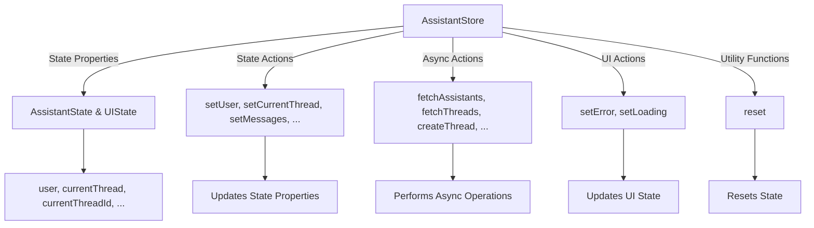

```mermaid
graph TD;
    A[AssistantStore] -->|State Properties| B[AssistantState & UIState]
    A -->|State Actions| C[setUser, setCurrentThread, setMessages, ...]
    A -->|Async Actions| D[fetchAssistants, fetchThreads, createThread, ...]
    A -->|UI Actions| E[setError, setLoading]
    A -->|Utility Functions| F[reset]

    B --> G[user, currentThread, currentThreadId, ...]
    C --> H[Updates State Properties]
    D --> I[Performs Async Operations]
    E --> J[Updates UI State]
    F --> K[Resets State]
```