# Files Involved in "requires_action" Event Flow

```mermaid
graph TD
    %% Client-Side Files
    subgraph "Client-Side"
        streamStore["store/streamStore.ts"]
        documentStore["store/documentStore.ts"]
        useChatStore["store/chatStore.ts"]
        openaiTypes["types/api/openai.ts"]
        streamTypes["types/store/stream.ts"]
        pdfTypes["types/pdf/biopsychsocialassessment.ts"]
        bpsaTemplate["components/dynamicForms/pdf/template/BPSA-template.tsx"]
    end

    %% Server-Side Files
    subgraph "Server-Side"
        streamRoute["app/api/openai/threads/[threadId]/run/stream/route.ts"]
        toolHandlers["lib/services/openai/toolHandlers.ts"]
        toolDefinitions["lib/services/openai/toolDefinitions.ts"]
        pdfGenerator["lib/services/functions/forms/pdfGenerator.tsx"]
        pdfEndpoint["app/api/tools/biopsychsocial-assessment/route.ts"]
        serverOpenai["utils/openai/server.ts"]
        clientOpenai["utils/openai/client.ts"]
        serverSupabase["utils/supabase/server.ts"]
        clientSupabase["utils/supabase/client.ts"]
    end

    %% Dependencies and Relationships
    streamStore --> openaiTypes
    streamStore --> streamTypes
    streamStore --> documentStore
    streamStore --> useChatStore
    
    toolHandlers --> pdfTypes
    toolHandlers --> serverOpenai
    toolHandlers --> serverSupabase
    toolHandlers --> toolDefinitions
    
    pdfGenerator --> pdfTypes
    pdfGenerator --> bpsaTemplate
    pdfGenerator --> documentStore
    
    streamRoute --> serverOpenai
    streamRoute --> serverSupabase
    streamRoute --> toolHandlers
    
    pdfEndpoint --> pdfGenerator
    
    %% External API Calls
    streamRoute --> externalOpenAI["OpenAI API"]
    toolHandlers --> externalOpenAI
    
    %% Database Interactions
    serverSupabase --> supabaseDB["Supabase Database"]
    
    %% Styling
    classDef store fill:#c9daf8,stroke:#6c8ebf,stroke-width:2px
    classDef types fill:#d9d2e9,stroke:#8e7cc3,stroke-width:2px
    classDef components fill:#ead1dc,stroke:#c27ba0,stroke-width:2px
    classDef api fill:#f4cccc,stroke:#d79b9b,stroke-width:2px
    classDef services fill:#d9ead3,stroke:#93c47d,stroke-width:2px
    classDef utils fill:#fff2cc,stroke:#f1c232,stroke-width:2px
    classDef external fill:#e6e6e6,stroke:#999999,stroke-width:2px
    
    class streamStore,documentStore,chatStore store
    class openaiTypes,streamTypes,pdfTypes types
    class bpsaTemplate components
    class streamRoute,pdfEndpoint api
    class toolHandlers,toolDefinitions,pdfGenerator services
    class serverOpenai,clientOpenai,serverSupabase,clientSupabase utils
    class externalOpenAI,supabaseDB external
```

## File Descriptions

### Client-Side Files

- **store/streamStore.ts**: Zustand store that manages streaming state, processes events, and handles tool calls on the client side
- **store/documentStore.ts**: Manages document uploads, storage, and retrieval
- **store/chatStore.ts**: Manages chat state and history
- **types/api/openai.ts**: Type definitions for OpenAI API responses and events
- **types/store/stream.ts**: Type definitions for the stream store state
- **types/pdf/biopsychsocialassessment.ts**: Type definitions for BioPsychSocial Assessment form data
- **components/dynamicForms/pdf/template/BPSA-template.tsx**: React PDF template for BioPsychSocial Assessment

### Server-Side Files

- **app/api/openai/threads/[threadId]/run/stream/route.ts**: API route that handles streaming from OpenAI
- **lib/services/openai/toolHandlers.ts**: Processes tool calls from OpenAI on the server side
- **lib/services/openai/toolDefinitions.ts**: Defines available tools and their schemas
- **lib/services/functions/forms/pdfGenerator.tsx**: Generates PDFs from form data
- **app/api/tools/biopsychsocial-assessment/route.ts**: API endpoint for generating BioPsychSocial Assessment PDFs
- **utils/openai/server.ts**: Server-side OpenAI client utility
- **utils/openai/client.ts**: Client-side OpenAI context provider
- **utils/supabase/server.ts**: Server-side Supabase client utility
- **utils/supabase/client.ts**: Client-side Supabase client utility

### Key Dependencies

- **@react-pdf/renderer**: Used for PDF generation
- **zustand**: State management library
- **OpenAI API**: External API for AI assistant functionality
- **Supabase**: Database and storage provider
